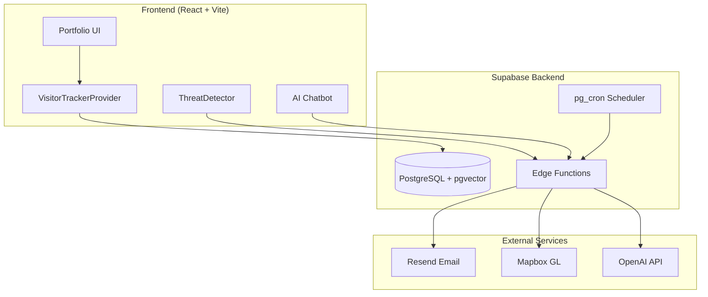

# Ritvik Indupuri's Portfolio

A modern, full-stack portfolio website featuring enterprise-grade security monitoring, AI-powered chatbot, and comprehensive visitor analytics.

**[View Live Demo](https://ritvik-website.netlify.app/)** | **[Technical Documentation](./TECHNICAL_DOCUMENTATION.md)**

---

## About

This portfolio showcases my work in Cloud Security, Cybersecurity, and Artificial Intelligence. Beyond a traditional portfolio, it implements:

- **Real-time visitor analytics** with behavioral classification
- **MITRE ATT&CK threat detection** for authentication security  
- **RAG-powered AI chatbot** for natural language queries
- **Automated email alerts** for visitor engagement and security incidents
- **Interactive 3D security globe** visualizing login attempts worldwide

---

## System Architecture



---

## Tech Stack

### Frontend
| Technology | Purpose |
|------------|---------|
| React 18 + Vite | UI framework with fast HMR |
| TypeScript | Type-safe development |
| Tailwind CSS + shadcn/ui | Styling and components |
| Framer Motion | Animations |
| React Query | Server state management |
| Mapbox GL JS | 3D globe visualization |

### Backend
| Technology | Purpose |
|------------|---------|
| Supabase | PostgreSQL, Auth, Edge Functions |
| pgvector | Vector similarity search for RAG |
| pg_cron | Scheduled tasks |
| Resend | Email delivery |
| OpenAI API | Embeddings and chat responses |

---

## Getting Started

### Prerequisites

- Node.js 18.x or higher
- npm or bun package manager
- Supabase project

### Installation

1. **Clone the repository**
   ```sh
   git clone https://github.com/your-username/portfolio.git
   cd portfolio
   ```

2. **Install dependencies**
   ```sh
   npm install
   ```

3. **Configure environment variables**
   
   Create a `.env.local` file:
   ```env
   VITE_SUPABASE_URL=https://your-project.supabase.co
   VITE_SUPABASE_PUBLISHABLE_KEY=your_supabase_anon_key
   ```

4. **Configure Supabase secrets** (for edge functions)
   
   Add these secrets in your Supabase dashboard:
   - `OPENAI_API_KEY` - For AI chatbot
   - `RESEND_API_KEY` - For email notifications
   - `MAPBOX_PUBLIC_TOKEN` - For security globe

5. **Run database migrations**
   
   Apply the migrations in `supabase/migrations/` to set up tables and RLS policies.

6. **Start development server**
   ```sh
   npm run dev
   ```

7. **Open the app**
   
   Navigate to [http://localhost:5173](http://localhost:5173)

---

## Deployment

### Frontend
Deploy to any static hosting provider:
- Vercel
- Netlify
- GitHub Pages

### Backend
Edge functions deploy automatically via Supabase. Configure the weekly digest cron job:

```sql
SELECT cron.schedule(
  'weekly-portfolio-digest',
  '0 9 * * 1',
  $$SELECT net.http_post(
    url:='https://[project-ref].supabase.co/functions/v1/weekly-digest',
    headers:='{"Authorization": "Bearer [anon-key]"}'::jsonb
  )$$
);
```

---

## Documentation

For detailed technical documentation including:
- Complete system architecture explanations
- Data flow diagrams
- Security implementation details
- RAG chatbot architecture
- Database schema

See **[TECHNICAL_DOCUMENTATION.md](./TECHNICAL_DOCUMENTATION.md)**

---

## License

MIT License - See LICENSE file for details.