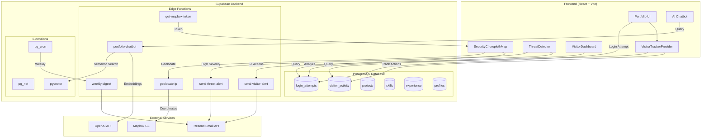
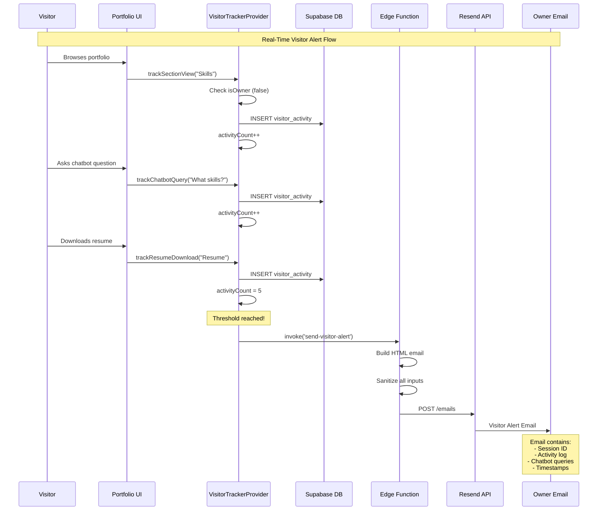
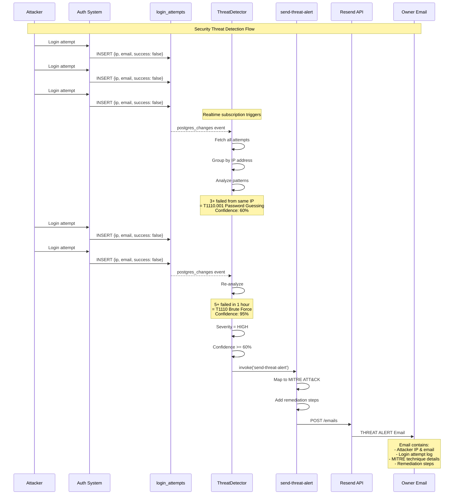
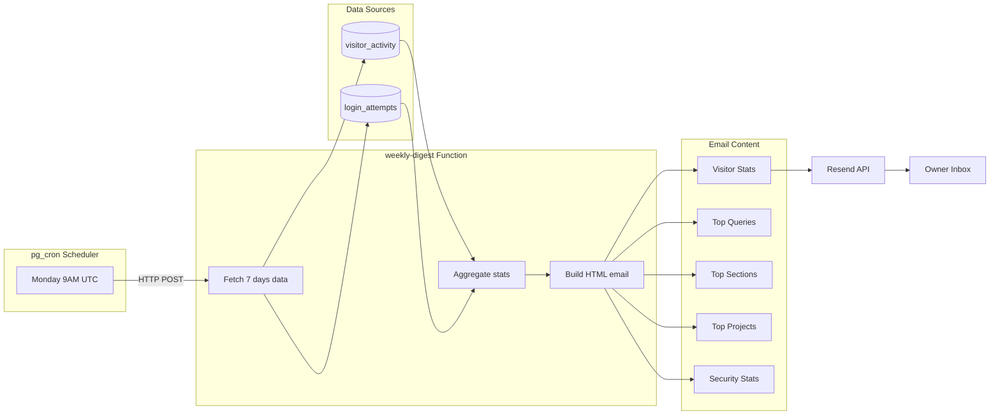

# Ritvik Indupuri's Personal Portfolio Website

**[View Live Demo](https://ritvik-website.netlify.app/)**

---

## About This Project

Welcome to my personal project portfolio! This application showcases my skills and the projects I've built. It's designed to be a clean, fast, and responsive platform where you can learn more about my work in Cloud Security, cybersecurity, and Artificial Intelligence (AI).

Beyond being a portfolio, this site implements **enterprise-grade security monitoring and visitor analytics** — a full demonstration of threat detection, behavioral analysis, and automated alerting systems.

---

## System Architecture



### System Architecture Diagram Explanation

The System Architecture diagram illustrates the complete technical stack and data flow of the portfolio application, organized into three main layers:

**Frontend Layer (React + Vite)**

The frontend consists of six primary components that handle different aspects of the user experience:

- **Portfolio UI**: The main user interface that renders all portfolio sections including the hero, skills, projects, experience, and contact areas. This is the entry point for all visitor interactions.
- **VisitorTrackerProvider**: A React Context Provider that wraps the entire application and monitors visitor behavior. It tracks actions such as section views, chatbot queries, resume downloads, and project clicks. When a visitor is not the authenticated owner, all actions are logged to the database.
- **ThreatDetector**: A security monitoring component that subscribes to real-time database changes for login attempts. It analyzes patterns to detect potential attacks using MITRE ATT&CK framework mappings.
- **VisitorDashboard**: The analytics interface available to the portfolio owner, displaying visitor sessions, activity timelines, and behavioral classifications.
- **SecurityChoroplethMap**: An interactive 3D globe visualization using Mapbox GL that displays geographic locations of login attempts with color-coded markers indicating success or failure patterns.
- **AI Chatbot**: A floating chat widget that allows visitors to ask natural language questions about the portfolio owner's skills, projects, and experience using RAG (Retrieval Augmented Generation).

**Backend Layer (Supabase)**

The backend is powered by Supabase and consists of three subsystems:

- **PostgreSQL Database**: Contains six core tables:
  - `visitor_activity`: Stores all tracked visitor actions with session IDs, activity types, timestamps, and associated data
  - `login_attempts`: Records all authentication attempts with IP addresses, user agents, success/failure status, and failure reasons
  - `projects`: Portfolio project entries with descriptions, technologies, and links
  - `skills`: Technical skills organized by category with proficiency levels
  - `experience`: Work experience entries with descriptions and date ranges
  - `profiles`: User profile information including bio, social links, and resume URLs

- **Edge Functions**: Serverless functions that handle specific backend operations:
  - `send-visitor-alert`: Compiles visitor activity data and sends notification emails when engagement thresholds are reached
  - `send-threat-alert`: Formats and sends security alert emails when threats are detected, including MITRE ATT&CK mappings and remediation steps
  - `weekly-digest`: Aggregates the past seven days of visitor and security data into a comprehensive summary email
  - `geolocate-ip`: Resolves IP addresses to geographic coordinates using external geolocation services
  - `portfolio-chatbot`: Processes natural language queries, generates embeddings, performs semantic search, and returns AI-generated responses
  - `get-mapbox-token`: Securely provides the Mapbox access token to the frontend without exposing it in client-side code

- **Extensions**: PostgreSQL extensions that enable advanced functionality:
  - `pg_cron`: Schedules automated tasks such as the weekly digest email that runs every Monday at 9:00 AM UTC
  - `pg_net`: Enables the database to make HTTP requests to edge functions directly from scheduled jobs
  - `pgvector`: Provides vector similarity search capabilities for the RAG-powered chatbot's semantic search

**External Services Layer**

Three external APIs are integrated into the system:

- **Resend Email API**: Handles all outbound email delivery for visitor alerts, threat notifications, and weekly digests
- **Mapbox GL**: Provides the 3D globe rendering and geocoding services for the security visualization
- **OpenAI API**: Generates text embeddings for semantic search and produces natural language responses for the chatbot

**Data Flow Connections**

The arrows in the diagram represent data flow between components:

- The Portfolio UI forwards user interactions to the VisitorTrackerProvider, which logs them to the `visitor_activity` table
- Login attempts from the authentication system are recorded in the `login_attempts` table
- The ThreatDetector analyzes login attempts and triggers the `send-threat-alert` function when high-severity threats are detected
- The VisitorDashboard queries the `visitor_activity` table to display analytics
- The SecurityChoroplethMap queries login attempts and uses the `geolocate-ip` function to plot locations
- The AI Chatbot sends queries to the `portfolio-chatbot` edge function, which uses OpenAI for embeddings and pgvector for semantic search
- When visitors reach five or more actions, the VisitorTrackerProvider invokes the `send-visitor-alert` function
- All email-sending functions route through the Resend API to deliver notifications
- The pg_cron scheduler triggers the weekly-digest function via HTTP POST using pg_net
- The `get-mapbox-token` function provides the access token to the SecurityChoroplethMap component

---

## Visitor Action to Email Alert Flow



### Visitor Action to Email Alert Flow Explanation

This sequence diagram traces the complete lifecycle of a visitor interaction from initial page view to email notification delivery.

**Participants**

- **Visitor (V)**: An anonymous user browsing the portfolio website
- **Portfolio UI (UI)**: The React frontend that captures user interactions
- **VisitorTrackerProvider (VTP)**: The React Context that manages activity tracking state
- **Supabase DB (DB)**: The PostgreSQL database storing visitor activity records
- **Edge Function (EF)**: The `send-visitor-alert` serverless function
- **Resend API (RS)**: The email delivery service
- **Owner Email (O)**: The portfolio owner's inbox receiving notifications

**Sequence of Events**

1. **Initial Browsing**: When a visitor navigates to the portfolio, the UI component detects section views. Each time a section becomes visible in the viewport (such as scrolling to the Skills section), the UI calls the `trackSectionView` method on the VisitorTrackerProvider.

2. **Owner Check**: The VisitorTrackerProvider first checks if the current user is the authenticated owner. If `isOwner` is true, the tracking is skipped entirely to avoid polluting analytics with the owner's own activity. In this flow, the visitor is not the owner, so tracking proceeds.

3. **Database Insertion**: The VisitorTrackerProvider inserts a new record into the `visitor_activity` table with the session ID, activity type ("section_view"), and activity data (the section name). This happens asynchronously to avoid blocking the UI.

4. **Activity Counter**: After each successful insert, the local activity counter is incremented. This counter is used to determine when the engagement threshold has been reached.

5. **Chatbot Interaction**: When the visitor asks the AI chatbot a question, the UI captures this interaction and calls `trackChatbotQuery` with the full query text. This is particularly valuable because chatbot questions often reveal the visitor's intent and interests.

6. **Resume Download**: If the visitor downloads a resume, this high-intent action is tracked via `trackResumeDownload`. This action, combined with previous activity, pushes the counter to the threshold of 5 actions.

7. **Threshold Trigger**: Once the activity count reaches 5, the VisitorTrackerProvider invokes the `send-visitor-alert` edge function. A flag is set to prevent duplicate alerts for the same session.

8. **Email Construction**: The edge function receives the session ID and retrieves all associated activities from the database. It constructs an HTML email template that includes the session identifier, chronological activity log, all chatbot queries, and timestamps for each action.

9. **Input Sanitization**: Before including any user-provided content (especially chatbot queries which could contain malicious scripts), the edge function sanitizes all inputs using DOMPurify to prevent XSS attacks in the email client.

10. **Email Delivery**: The sanitized HTML email is sent via POST request to the Resend API, which handles the actual delivery to the owner's configured email address.

11. **Owner Notification**: The portfolio owner receives the visitor alert email in their inbox, providing real-time insight into who is visiting and what they're interested in.

---

## Threat Detection to Alert Flow



### Threat Detection to Alert Flow Explanation

This sequence diagram illustrates how the security monitoring system detects and responds to authentication-based attacks in real-time.

**Participants**

- **Attacker (A)**: A malicious actor attempting to gain unauthorized access
- **Auth System (AUTH)**: The Supabase authentication service handling login requests
- **login_attempts (DB)**: The database table storing all authentication attempt records
- **ThreatDetector (TD)**: The React component that analyzes login patterns for threats
- **send-threat-alert (EF)**: The edge function that sends security notifications
- **Resend API (RS)**: The email delivery service
- **Owner Email (O)**: The portfolio owner receiving security alerts

**Sequence of Events**

1. **Failed Login Attempts**: The attacker begins making login attempts with incorrect credentials. Each attempt is processed by the Supabase authentication system.

2. **Attempt Logging**: Regardless of success or failure, every authentication attempt is recorded in the `login_attempts` table. Each record includes the email address used, source IP address, user agent string, success boolean, failure reason (if applicable), and timestamp.

3. **Realtime Subscription**: The ThreatDetector component maintains a Supabase Realtime subscription to the `login_attempts` table. Whenever a new row is inserted or updated, the component receives a `postgres_changes` event.

4. **Data Fetching**: Upon receiving the realtime event, the ThreatDetector fetches all recent login attempts from the database to get a complete picture of authentication activity.

5. **IP Grouping**: The component groups all login attempts by source IP address. This grouping is essential for detecting patterns that indicate coordinated attacks from a single source.

6. **Pattern Analysis**: The threat analysis engine examines the grouped data for known attack patterns. After three failed attempts from the same IP, the system identifies a potential T1110.001 (Password Guessing) technique with 60% confidence.

7. **Continued Attacks**: As the attacker continues with more failed attempts, each new failure triggers another realtime event and re-analysis.

8. **Escalation**: Once five failed attempts occur within a one-hour window from the same IP, the detection escalates to T1110 (Brute Force) with 95% confidence. The severity is marked as HIGH.

9. **Alert Threshold Check**: The ThreatDetector checks if the threat meets the alerting criteria: HIGH severity AND confidence of 60% or greater. Both conditions are met.

10. **Edge Function Invocation**: The ThreatDetector calls the `send-threat-alert` edge function, passing the attacker's email, IP address, complete login attempt history, and detected threat details.

11. **MITRE ATT&CK Mapping**: The edge function enriches the alert with full MITRE ATT&CK framework information including technique ID, technique name, tactic category, severity level, and description.

12. **Remediation Steps**: Based on the detected technique, the function includes specific remediation recommendations such as implementing account lockouts, enabling multi-factor authentication, or blocking the offending IP address.

13. **Email Delivery**: The complete threat alert email is sent via Resend to the owner's inbox.

14. **Owner Notification**: The portfolio owner receives an actionable security alert with all information needed to assess and respond to the threat.

---

## Weekly Digest Flow



### Weekly Digest Flow Explanation

This flowchart shows how the automated weekly summary email is generated and delivered without any manual intervention.

**Components**

**pg_cron Scheduler**
The PostgreSQL pg_cron extension enables scheduling of recurring database tasks. A cron job is configured to execute every Monday at 9:00 AM UTC. The cron expression `0 9 * * 1` specifies: minute 0, hour 9, any day of month, any month, and day 1 (Monday).

**weekly-digest Function**
This edge function performs three sequential operations:
- **Fetch 7 days data**: Queries both the `visitor_activity` and `login_attempts` tables for all records from the past seven days using a date filter on the `created_at` timestamp.
- **Aggregate stats**: Processes the raw data to calculate totals, counts, and groupings. This includes counting unique sessions, summing actions, grouping chatbot queries by frequency, ranking sections by view count, and categorizing login attempts by success/failure.
- **Build HTML email**: Constructs a formatted HTML email using the aggregated statistics, applying consistent styling and organization for readability.

**Data Sources**
- **visitor_activity**: Contains all tracked visitor interactions including page views, section views, chatbot queries, resume actions, and project clicks
- **login_attempts**: Contains all authentication attempts with success/failure status, IP addresses, and timestamps

**Email Content Sections**
The weekly digest email includes five main sections:
- **Visitor Stats**: High-level metrics including total unique visitors (by session count), total actions performed, total chatbot queries, and resume downloads
- **Top Queries**: The most frequently asked chatbot questions, ranked by count, showing what visitors are most interested in
- **Top Sections**: Portfolio sections ranked by view frequency, indicating which parts of the portfolio attract the most attention
- **Top Projects**: Projects ranked by click count (GitHub links, demo links), showing which work samples generate the most interest
- **Security Stats**: Authentication summary including total login attempts, successful vs failed breakdown, unique IP addresses, and flagged suspicious IPs (those with 3+ failed attempts)

**Data Flow**
1. The pg_cron scheduler triggers at the scheduled time by making an HTTP POST request to the edge function endpoint via the pg_net extension
2. The edge function queries both data source tables with a seven-day lookback filter
3. Raw data from both tables is fed into the aggregation logic
4. Aggregated statistics are formatted into the HTML email template
5. Each content section is populated with the relevant metrics
6. The complete email is sent to the Resend API
7. Resend delivers the digest to the owner's inbox

---

## Key Features

- **Personal Portfolio Website**: Showcases your projects, experience, education, and skills.
- **AI Chatbot Integration**: Allows visitors to ask natural-language questions about your skills and projects using RAG (Retrieval Augmented Generation).
- **Dynamic Skills and Projects Tracking**: Automatically updates total skill counts when new entries are added.
- **Documentation System**: Technical documentation editor and viewer directly built into the site.
- **Project Linking**: Owners can add projects and link to their GitHub repositories.
- **Comprehensive Visitor Analytics**: Track every visitor interaction in real-time.
- **MITRE ATT&CK Threat Detection**: Security monitoring with industry-standard threat mapping.
- **Interactive Security Globe**: 3D Mapbox visualization of login attempts worldwide.
- **Automated Email Alerts**: Real-time and weekly digest notifications.

---

## Screenshots and Visual Reference

### Portfolio Landing Page

<p align="center">
  
</p>

**Figure 1: Portfolio Hero Section** — The landing page features a professional profile photo, animated name introduction with gradient text, and quick access buttons for GitHub/LinkedIn profiles and resume downloads. The cosmic particle background creates an engaging visual experience.

---

### Access Control Dialog

<p align="center">
  
</p>

**Figure 2: Access Control Dialog** — Visitors can choose to browse as a guest (view-only) or sign in as the portfolio owner for full edit access. This modal appears on first visit and handles the visitor/owner flow separation.

---

### Owner Dashboard - Visitor Analytics

<p align="center">
  
</p>

**Figure 3: Visitor Analytics Dashboard** — The Owner Dashboard displays real-time visitor statistics including:
- **Session Cards**: Each visitor session shows a unique ID, classification label (e.g., "Engaged Visitor", "Potential Recruiter"), and key metrics
- **Activity Metrics**: Chatbot queries, sections viewed, project clicks, and resume downloads
- **Expandable Timeline**: Click any session to reveal the full chronological activity log with timestamps

---

### Visitor Session Timeline

<p align="center">
  
</p>

**Figure 4: Session Activity Timeline** — Each session can be expanded to show a detailed timeline of visitor actions. The timeline displays:
- Chronological activity entries with relative timestamps ("5 minutes ago")
- Activity type icons (chat bubble for queries, eye for views, download for resumes)
- Captured data such as chatbot questions asked and sections explored

---

### Security Monitoring - Interactive Globe

<p align="center">
  
</p>

**Figure 5: Interactive Security Globe** — The Security tab features a 3D Mapbox globe that visualizes login attempts geographically:
- **Green markers**: Locations with mostly successful logins
- **Red markers**: Suspicious locations with failed attempts or brute force patterns
- **Auto-rotation**: Globe slowly rotates to show global coverage
- **Click interaction**: Clicking a marker reveals detailed login attempt logs for that location

---

### Threat Detection Panel

<p align="center">
  
</p>

**Figure 6: MITRE ATT&CK Threat Detection Panel** — Real-time threat analysis displays:
- **Detected Techniques**: Cards showing MITRE technique ID, name, and tactic
- **Confidence Score**: Visual bar indicating detection confidence (0-100%)
- **Severity Badge**: Color-coded severity levels (Critical, High, Medium, Low)
- **Evidence**: Specific data points that triggered the detection
- **Affected IPs**: List of source IP addresses involved in the attack pattern

---

### Login Attempt Monitor

<p align="center">
  
</p>

**Figure 7: Login Attempt Monitor** — A chronological table showing all authentication attempts with:
- **Email**: The email address used in the attempt
- **IP Address**: Source IP with geolocation data
- **Status**: Success or Failure indicator
- **Failure Reason**: Why the login failed (invalid password, unknown user, etc.)
- **Timestamp**: When the attempt occurred
- **User Agent**: Browser/client information for forensic analysis

---

### Visitor Alert Email

**Figure 8: Visitor Alert Email** — This automated email is sent when a visitor reaches 5 or more tracked actions during their session. The email includes:

- **Header**: "New Visitor Alert" with the portfolio branding and timestamp
- **Session Information**: The unique session ID (e.g., "vs_1718234567890_abc123def") and the visitor's IP address if captured
- **Activity Summary Table**: A structured list showing each action the visitor performed, including:
  - Activity type (section_view, chatbot_query, resume_download, project_click)
  - Associated data (section name, query text, project name)
  - Timestamp for each action
- **Chatbot Queries Section**: If the visitor asked questions, a dedicated section lists all queries with their exact text, providing insight into what information they were seeking
- **Visitor Email**: If the visitor submitted the contact form, their email address is included
- **Footer**: Clean HTML formatting consistent with the portfolio's visual branding

This email enables the portfolio owner to understand visitor intent and engagement patterns in real-time.

---

### Threat Alert Email

**Figure 9: Security Threat Alert Email** — This critical security notification is sent immediately when the threat detector identifies high-severity attacks with sufficient confidence. The email includes:

- **Header**: "SECURITY THREAT DETECTED" with red alert styling and priority indicators
- **Attacker Information Section**:
  - Email address used in the attack attempts
  - Source IP address
  - Geographic location (if resolved)
- **Attack Timeline Table**: Chronological list of all login attempts from the attacker, showing:
  - Timestamp of each attempt
  - Email used
  - Success/Failure status
  - Failure reason for each attempt
- **MITRE ATT&CK Analysis Section**:
  - Technique ID (e.g., T1110)
  - Technique Name (e.g., Brute Force)
  - Tactic Category (e.g., Credential Access)
  - Severity Level with color coding (Critical/High/Medium/Low)
  - Confidence Score percentage (e.g., 95%)
  - Evidence list supporting the detection
- **Remediation Steps Section**: Actionable security recommendations based on the detected technique, such as:
  - "Implement account lockout after N failed attempts"
  - "Consider enabling multi-factor authentication"
  - "Block the source IP address at the firewall level"
  - "Review all recent successful logins for signs of compromise"

This email provides the portfolio owner with all information needed to assess and respond to security threats immediately.

---

### Weekly Digest Email

**Figure 10: Weekly Digest Email** — This comprehensive summary email is automatically generated and sent every Monday at 9:00 AM UTC. The email includes:

- **Header**: "Weekly Portfolio Digest" with the date range covered (e.g., "December 16-22, 2024")
- **Visitor Overview Section**:
  - Total unique visitors (by session count)
  - Total actions performed across all sessions
  - Total chatbot queries received
  - Total resume downloads
- **Top Chatbot Questions Section**: Ranked list of the most frequently asked questions, showing:
  - The question text
  - Number of times asked
  - This helps identify what visitors are most curious about
- **Top Sections Section**: Portfolio sections ranked by view frequency:
  - Section name
  - View count
  - Identifies which parts of the portfolio attract the most attention
- **Top Projects Section**: Projects ranked by engagement:
  - Project name
  - Click count (GitHub links, demo links)
  - Shows which work samples generate the most interest
- **Security Overview Section**:
  - Total login attempts in the past week
  - Successful vs failed breakdown
  - Number of unique IP addresses
  - List of suspicious IPs (those with 3+ failed attempts)
- **Footer**: Clean formatting with links to the owner dashboard for deeper analysis

This weekly email provides a high-level overview of portfolio performance and security status without requiring the owner to log in to the dashboard.

---

### AI Chatbot Interface

<p align="center">
  
</p>

**Figure 11: AI Chatbot Interface** — Floating chatbot widget that allows visitors to ask natural language questions:
- **RAG-Powered Responses**: Uses vector embeddings for semantic search across portfolio content
- **Conversation History**: Maintains context within the session
- **Query Tracking**: All questions are logged for analytics
- **Prompt Injection Detection**: Security layer prevents malicious prompts

---

## Portfolio Analytics System

### Overview

The Owner Dashboard (`/owner-dashboard`) provides a comprehensive analytics suite with two main tabs:

1. **Visitor Analytics** — Track guest behavior and engagement
2. **Security Monitoring** — Monitor login attempts and detect threats

---

## Visitor Tracking System

### How Tracking Works

Visitor tracking is implemented through a **React Context Provider** (`VisitorTrackerProvider.tsx`) that wraps the entire application. This provider:

1. **Generates a Unique Session ID** — Each visitor receives a session ID stored in `sessionStorage`:
   ```typescript
   const getSessionId = (): string => {
     let sessionId = sessionStorage.getItem('visitor_session_id');
     if (!sessionId) {
       sessionId = `vs_${Date.now()}_${Math.random().toString(36).substring(2, 11)}`;
       sessionStorage.setItem('visitor_session_id', sessionId);
     }
     return sessionId;
   };
   ```

2. **Excludes Owner Activity** — The provider accepts an `isOwner` prop and skips tracking for authenticated owners:
   ```typescript
   const trackActivity = useCallback((type: string, data: any = {}) => {
     if (isOwner) return; // Don't track owner activity
     // ... tracking logic
   }, [isOwner]);
   ```

3. **Logs to Supabase** — Every tracked action is inserted into the `visitor_activity` table:
   ```typescript
   supabase
     .from('visitor_activity')
     .insert({
       session_id: sessionIdRef.current,
       activity_type: type,
       activity_data: data
     })
   ```

### Tracked Activity Types

| Activity Type | Description | Data Captured |
|--------------|-------------|---------------|
| `page_view` | Initial page load | `{ page: "/path" }` |
| `section_view` | Scrolled to a section | `{ section: "Skills" }` |
| `chatbot_query` | Asked the AI chatbot | `{ query: "What are your skills?" }` |
| `resume_view` | Viewed a resume | `{ resume_name: "Primary Resume" }` |
| `resume_download` | Downloaded a resume | `{ resume_name: "Primary Resume" }` |
| `project_view` | Expanded project details | `{ project_name: "AI Chatbot" }` |
| `project_click` | Clicked project link (GitHub/Demo) | `{ project_name: "AI Chatbot", url: "..." }` |

### Tracking Hook Usage

Components use the `useVisitorTracker` hook to record activity:

```typescript
import { useVisitorTracker } from "@/components/VisitorTrackerProvider";

const MyComponent = () => {
  const { trackProjectClick, trackSectionView } = useVisitorTracker();
  
  const handleClick = () => {
    trackProjectClick("My Project", "https://github.com/...");
  };
  
  return <button onClick={handleClick}>View Project</button>;
};
```

---

## Visitor Classification

Visitors are automatically categorized based on their behavior patterns. The classification logic (in `VisitorDashboard.tsx`) uses this priority order:

```typescript
const getVisitorType = () => {
  if (session.chatbotQueries > 2) 
    return { label: 'Engaged Visitor', color: 'text-green-400' };
  if (session.resumeDownloads > 0) 
    return { label: 'Potential Recruiter', color: 'text-orange-400' };
  if (session.projectClicks > 2) 
    return { label: 'Project Explorer', color: 'text-blue-400' };
  if (session.sectionsViewed.length > 3) 
    return { label: 'Active Browser', color: 'text-purple-400' };
  return { label: 'New Visitor', color: 'text-muted-foreground' };
};
```

| Visitor Type | Trigger Condition |
|-------------|-------------------|
| **Engaged Visitor** | 3+ chatbot queries |
| **Potential Recruiter** | Downloaded resume at least once |
| **Project Explorer** | Clicked 3+ projects |
| **Active Browser** | Viewed 4+ different sections |
| **New Visitor** | Default (none of the above) |

### Session Timeline

Each session can be expanded to reveal a full **Activity Timeline** showing exactly what the visitor did, in chronological order with timestamps.

---

## Security Monitoring

### Login Attempt Tracking

All authentication attempts are logged to the `login_attempts` table via an edge function (`log-auth-attempt`):

- **Email used** — What email was attempted
- **IP Address** — Source IP of the request
- **User Agent** — Browser/client information
- **Success/Failure** — Whether login succeeded
- **Failure Reason** — Why the login failed (if applicable)
- **Timestamp** — When the attempt occurred

### Interactive Security Globe (Mapbox)

The Security Monitoring tab features an **interactive 3D globe** (`SecurityChoroplethMap.tsx`) that visualizes login attempts geographically:

1. **IP Geolocation** — The `geolocate-ip` edge function resolves IP addresses to coordinates
2. **Mapbox Globe** — Uses `mapbox-gl` with dark theme and fog effects
3. **Color-Coded Markers**:
   - **Green** — More successful logins than failed
   - **Red** — Suspicious (more failed attempts or 3+ failures)
4. **Auto-Rotation** — The globe slowly rotates to show global coverage
5. **Click to Inspect** — Click any marker to see detailed attempt logs for that location

```typescript
const isSuspicious = loc.failedCount > loc.successCount || loc.failedCount >= 3;
// Green for legitimate, red for suspicious
```

---

## MITRE ATT&CK Threat Detection

The `ThreatDetector.tsx` component implements real-time threat detection using the **MITRE ATT&CK framework** — an industry-standard knowledge base of adversary tactics and techniques.

### Detected Techniques

| Technique ID | Name | Detection Logic |
|-------------|------|-----------------|
| **T1110** | Brute Force | 5+ failed attempts from same IP within 1 hour |
| **T1110.001** | Password Guessing | 3+ failed attempts total from same IP |
| **T1110.003** | Password Spraying | Failed attempts across 3+ different accounts |
| **T1078** | Valid Accounts | Successful logins from 3+ different IPs (possible credential sharing) |
| **T1090** | Proxy | Known VPN/Tor exit node detection (placeholder) |
| **T1531** | Account Access Removal | Mass lockout attempts (placeholder) |

### Threat Analysis Process

```typescript
// Group attempts by IP
const ipAttempts: Record<string, LoginAttempt[]> = {};
loginAttempts.forEach(attempt => {
  if (attempt.ip_address) {
    ipAttempts[attempt.ip_address] ??= [];
    ipAttempts[attempt.ip_address].push(attempt);
  }
});

// Detect Brute Force (T1110)
Object.entries(ipAttempts).forEach(([ip, attempts]) => {
  const recentFailed = failedAttempts.filter(a => {
    return (now.getTime() - new Date(a.created_at).getTime()) < 3600000; // 1 hour
  });

  if (recentFailed.length >= 5) {
    threats.push({
      technique: MITRE_TECHNIQUES.T1110,
      confidence: Math.min(0.95, 0.5 + (recentFailed.length * 0.1)),
      evidence: [`${recentFailed.length} failed attempts in last hour`],
      affectedIps: [ip],
      timestamp: recentFailed[0]?.created_at
    });
  }
});
```

### Confidence Scoring

Each threat includes a **confidence score** (0-100%) based on:
- Number of failed attempts
- Time window concentration
- Pattern consistency

Example: 5 failed attempts = 50% + (5 x 10%) = **100% confidence** (capped at 95%)

---

## Automated Email System

Three types of automated emails are sent via **Resend** (edge functions):

### 1. Visitor Alert Email (`send-visitor-alert`)

**Trigger**: Automatically sent when a visitor:
- Performs **5+ actions** during their session, OR
- Leaves the page (via `beforeunload` event) after **3+ actions**

**Contains**:
- Session ID
- IP Address
- Complete activity log with timestamps
- All chatbot queries asked
- Visitor email (if provided via contact form)

```typescript
// Send alert after significant activity
if (activityCountRef.current >= 5 && !alertSentRef.current) {
  sendVisitorAlert();
}

// Or on page unload
window.addEventListener('beforeunload', () => {
  if (activitiesRef.current.length >= 3 && !alertSentRef.current) {
    navigator.sendBeacon(url, data);
  }
});
```

### 2. Threat Alert Email (`send-threat-alert`)

**Trigger**: Automatically sent when the threat detector identifies **high-severity threats** with **60% or greater confidence**.

**Contains**:
- Attacker information (email, IP)
- Complete login attempt history with timestamps
- MITRE ATT&CK technique details:
  - Technique ID and name
  - Tactic category
  - Severity level
  - Confidence score
  - Evidence supporting the detection
  - **Remediation steps** for each technique

```typescript
// In ThreatDetector.tsx
useEffect(() => {
  const highSeverityThreats = detectedThreats.filter(
    t => t.technique.severity === 'high' && t.confidence >= 0.6
  );
  
  if (highSeverityThreats.length > 0) {
    supabase.functions.invoke('send-threat-alert', {
      body: { attacker_email, attacker_ip, login_attempts, threats }
    });
  }
}, [detectedThreats]);
```

### 3. Weekly Digest Email (`weekly-digest`)

**Trigger**: Automated via **pg_cron** job — runs every **Monday at 9:00 AM UTC**.

**Contains**:
- **Visitor Overview**:
  - Total unique visitors
  - Total actions performed
  - Chatbot queries count
  - Resume downloads count
- **Top Chatbot Questions** — Most asked questions with frequency
- **Top Sections** — Most viewed portfolio sections
- **Top Projects** — Most clicked projects
- **Security Overview**:
  - Login attempts (successful/failed)
  - Unique IPs
  - Suspicious IPs (3+ failed attempts)

```sql
-- Cron job configuration
select cron.schedule(
  'weekly-portfolio-digest',
  '0 9 * * 1',  -- Every Monday at 9:00 AM UTC
  $$
  select net.http_post(
    url:='https://[project-ref].supabase.co/functions/v1/weekly-digest',
    headers:='{"Authorization": "Bearer [anon-key]"}'::jsonb,
    body:='{}'::jsonb
  ) as request_id;
  $$
);
```

---

## Database Architecture

### Tables

| Table | Purpose |
|-------|---------|
| `visitor_activity` | Stores all tracked visitor actions |
| `login_attempts` | Logs authentication attempts |
| `profiles` | User profile information |
| `projects` | Portfolio projects |
| `skills` | Technical skills with categories |
| `experience` | Work experience entries |
| `certifications` | Professional certifications |
| `resumes` | Uploaded resume files |
| `user_roles` | Owner vs viewer access control |

### Row-Level Security (RLS)

- **Public Read**: Portfolio content (projects, skills, etc.) is viewable by everyone
- **Owner Write**: Only authenticated owners can create/update/delete content
- **Activity Logging**: Anyone can insert visitor activity and login attempts
- **Owner Analytics**: Only owners can read visitor and security data

---

## Edge Functions

| Function | Purpose |
|----------|---------|
| `send-visitor-alert` | Sends real-time visitor notification emails |
| `send-threat-alert` | Sends security threat alerts with MITRE mapping |
| `weekly-digest` | Compiles and sends weekly analytics summary |
| `geolocate-ip` | Resolves IP addresses to geographic coordinates |
| `get-mapbox-token` | Securely provides Mapbox token to frontend |
| `log-auth-attempt` | Records login attempts with metadata |
| `portfolio-chatbot` | Handles AI chatbot queries with RAG |
| `send-contact-email` | Sends contact form submissions |
| `generate-embeddings` | Creates vector embeddings for semantic search |
| `index-github-content` | Indexes GitHub repos for chatbot context |

---

## Security Controls

- **XSS Prevention**: `DOMPurify` sanitizes all user-facing HTML
- **Input Validation**: Zod schema validation for all forms
- **Rate Limiting**: Chatbot and contact form rate limits
- **CORS**: Restricted to verified domains
- **Leaked Password Protection**: Supabase checks against breach databases
- **Prompt Injection Defense**: Detects manipulation attempts in chatbot
- **JWT Authentication**: Secure token-based auth via Supabase
- **HTML Sanitization**: All email content is sanitized before sending

---

## Tech Stack

* **Frontend**: React, Vite, TypeScript
* **Styling**: Tailwind CSS, shadcn/ui, Framer Motion
* **Backend**: Supabase (PostgreSQL, Edge Functions, Auth)
* **Mapping**: Mapbox GL JS
* **Email**: Resend API
* **AI**: OpenAI API with vector embeddings
* **Scheduling**: pg_cron + pg_net extensions

---

## Getting Started

### Prerequisites

- Node.js 18.x or higher
- npm or bun package manager
- Supabase project (for backend)

### Installation

1. **Clone the repository**:
   ```sh
   git clone https://github.com/your-username/your-repo-name.git
   cd your-repo-name
   ```

2. **Install dependencies**:
   ```sh
   npm install
   ```

3. **Configure environment variables** (`.env.local`):
   ```env
   VITE_SUPABASE_URL="https://your-project.supabase.co"
   VITE_SUPABASE_PUBLISHABLE_KEY="your_supabase_anon_key"
   ```

4. **Run development server**:
   ```sh
   npm run dev
   ```

5. Open [http://localhost:5173](http://localhost:5173)

---

## Deployment

Deploy to any static hosting provider:
- Vercel
- Netlify
- GitHub Pages

Edge functions are deployed automatically via Supabase.

---

## License

MIT License - See LICENSE file for details.
