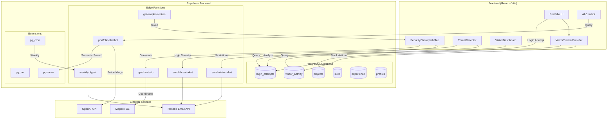
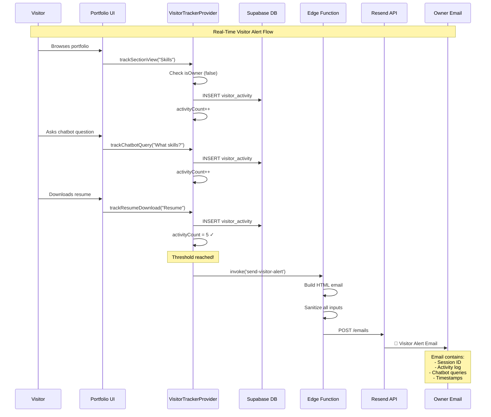
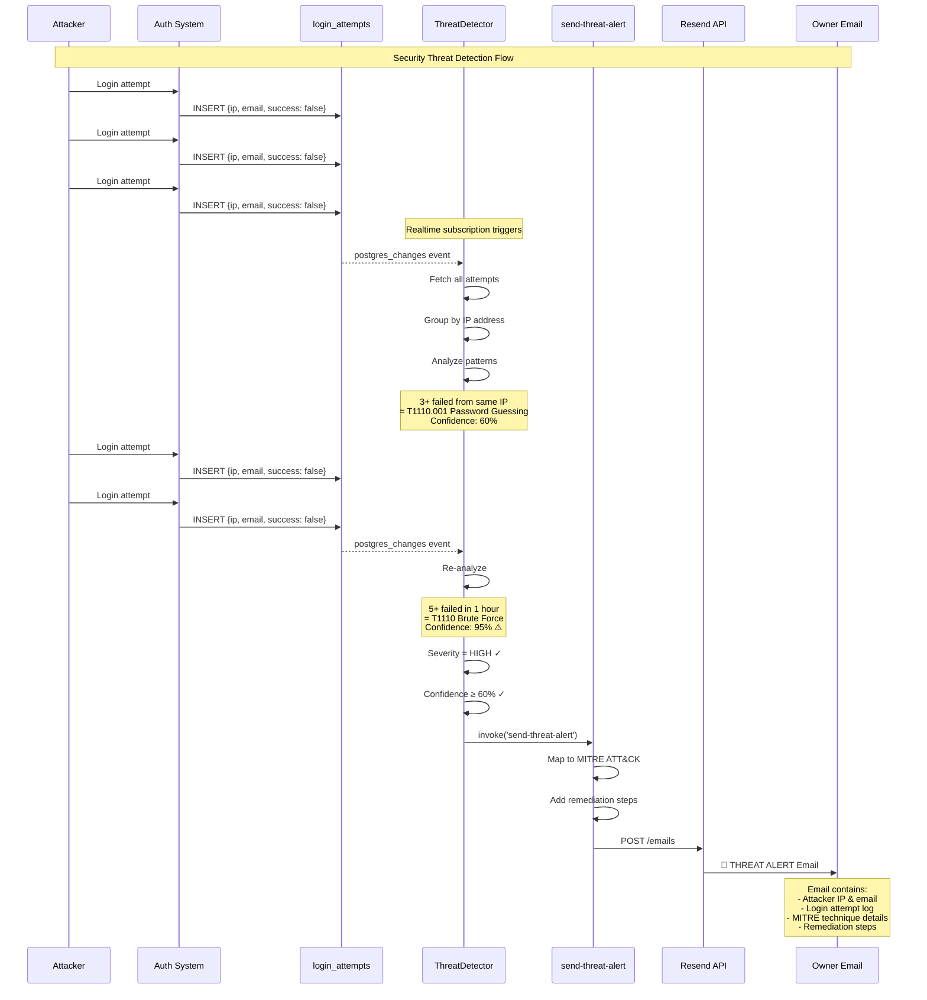
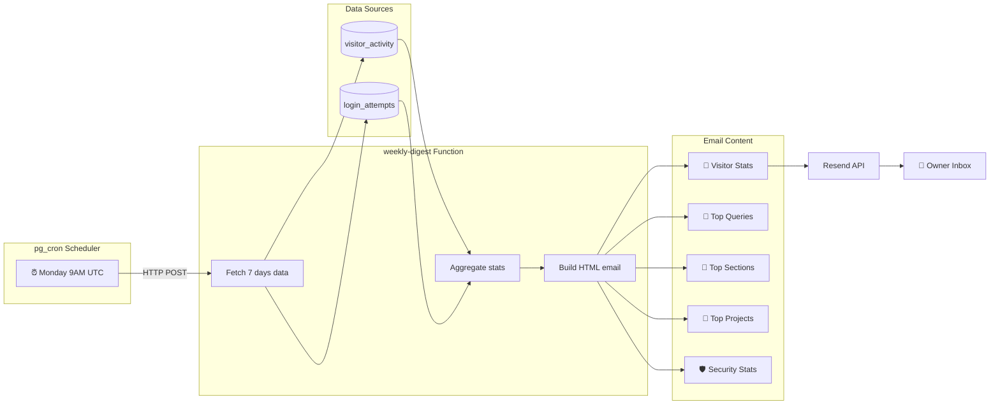

# Ritvik Indupuri's Personal Portfolio Website

**[View Live Demo](https://ritvik-website.netlify.app/)**

---

## About This Project

Welcome to my personal project portfolio! This application showcases my skills and the projects I've built. It's designed to be a clean, fast, and responsive platform where you can learn more about my work in Cloud Security, cybersecurity, and Artificial Intelligence (AI).

Beyond being a portfolio, this site implements **enterprise-grade security monitoring and visitor analytics** — a full demonstration of threat detection, behavioral analysis, and automated alerting systems.

---

## 🏗️ System Architecture



---

## 📧 Visitor Action to Email Alert Flow



---

## 🚨 Threat Detection to Alert Flow



---

## 📅 Weekly Digest Flow



---

## Key Features

- **Personal Portfolio Website**: Showcases your projects, experience, education, and skills.
- **AI Chatbot Integration**: Allows visitors to ask natural-language questions about your skills and projects using RAG (Retrieval Augmented Generation).
- **Dynamic Skills and Projects Tracking**: Automatically updates total skill counts when new entries are added.
- **Documentation System**: Technical documentation editor and viewer directly built into the site.
- **Project Linking**: Owners can add projects and link to their GitHub repositories.
- **Comprehensive Visitor Analytics**: Track every visitor interaction in real-time.
- **MITRE ATT&CK Threat Detection**: Security monitoring with industry-standard threat mapping.
- **Interactive Security Globe**: 3D Mapbox visualization of login attempts worldwide.
- **Automated Email Alerts**: Real-time and weekly digest notifications.

---

## 📸 Screenshots & Visual Reference

### Portfolio Landing Page

<p align="center">
  
</p>

**Figure 1: Portfolio Hero Section** — The landing page features a professional profile photo, animated name introduction with gradient text, and quick access buttons for GitHub/LinkedIn profiles and resume downloads. The cosmic particle background creates an engaging visual experience.

---

### Access Control Dialog

<p align="center">
  
</p>

**Figure 2: Access Control Dialog** — Visitors can choose to browse as a guest (view-only) or sign in as the portfolio owner for full edit access. This modal appears on first visit and handles the visitor/owner flow separation.

---

### Owner Dashboard - Visitor Analytics

<p align="center">
  
</p>

**Figure 3: Visitor Analytics Dashboard** — The Owner Dashboard displays real-time visitor statistics including:
- **Session Cards**: Each visitor session shows a unique ID, classification label (e.g., "Engaged Visitor", "Potential Recruiter"), and key metrics
- **Activity Metrics**: Chatbot queries, sections viewed, project clicks, and resume downloads
- **Expandable Timeline**: Click any session to reveal the full chronological activity log with timestamps

---

### Visitor Session Timeline

<p align="center">
  
</p>

**Figure 4: Session Activity Timeline** — Each session can be expanded to show a detailed timeline of visitor actions. The timeline displays:
- Chronological activity entries with relative timestamps ("5 minutes ago")
- Activity type icons (chat bubble for queries, eye for views, download for resumes)
- Captured data such as chatbot questions asked and sections explored

---

### Security Monitoring - Interactive Globe

<p align="center">
  
</p>

**Figure 5: Interactive Security Globe** — The Security tab features a 3D Mapbox globe that visualizes login attempts geographically:
- 🟢 **Green markers**: Locations with mostly successful logins
- 🔴 **Red markers**: Suspicious locations with failed attempts or brute force patterns
- **Auto-rotation**: Globe slowly rotates to show global coverage
- **Click interaction**: Clicking a marker reveals detailed login attempt logs for that location

---

### Threat Detection Panel

<p align="center">
  
</p>

**Figure 6: MITRE ATT&CK Threat Detection Panel** — Real-time threat analysis displays:
- **Detected Techniques**: Cards showing MITRE technique ID, name, and tactic
- **Confidence Score**: Visual bar indicating detection confidence (0-100%)
- **Severity Badge**: Color-coded severity levels (Critical, High, Medium, Low)
- **Evidence**: Specific data points that triggered the detection
- **Affected IPs**: List of source IP addresses involved in the attack pattern

---

### Login Attempt Monitor

<p align="center">
  
</p>

**Figure 7: Login Attempt Monitor** — A chronological table showing all authentication attempts with:
- **Email**: The email address used in the attempt
- **IP Address**: Source IP with geolocation data
- **Status**: Success ✓ or Failure ✗ indicator
- **Failure Reason**: Why the login failed (invalid password, unknown user, etc.)
- **Timestamp**: When the attempt occurred
- **User Agent**: Browser/client information for forensic analysis

---

### Visitor Alert Email

<p align="center">
  
</p>

**Figure 8: Visitor Alert Email** — Automated email sent when a visitor reaches 5+ actions. Contains:
- Session identification (ID, IP address)
- Complete activity log with timestamps
- All chatbot queries the visitor asked
- Visitor email if provided via contact form
- Clean HTML formatting with the portfolio branding

---

### Threat Alert Email

<p align="center">
  
</p>

**Figure 9: Security Threat Alert Email** — Critical security notification sent when threats are detected:
- **Attacker Information**: Email and IP address involved
- **Attack Timeline**: Chronological list of login attempts with outcomes
- **MITRE ATT&CK Details**: Full technique breakdown including:
  - Technique ID (e.g., T1110)
  - Technique Name (e.g., Brute Force)
  - Tactic Category (e.g., Credential Access)
  - Severity Level with color coding
  - Confidence percentage
  - Supporting evidence
- **Remediation Steps**: Actionable security recommendations

---

### Weekly Digest Email

<p align="center">
  
</p>

**Figure 10: Weekly Digest Email** — Comprehensive weekly summary delivered every Monday at 9:00 AM UTC:
- **Visitor Statistics**: Total visitors, actions, queries, downloads
- **Top Chatbot Questions**: Most frequently asked questions with counts
- **Popular Sections**: Which portfolio sections received the most views
- **Top Projects**: Most clicked projects with interaction counts
- **Security Overview**: Login attempt summary, unique IPs, suspicious activity flags

---

### AI Chatbot Interface

<p align="center">
  
</p>

**Figure 11: AI Chatbot Interface** — Floating chatbot widget that allows visitors to ask natural language questions:
- **RAG-Powered Responses**: Uses vector embeddings for semantic search across portfolio content
- **Conversation History**: Maintains context within the session
- **Query Tracking**: All questions are logged for analytics
- **Prompt Injection Detection**: Security layer prevents malicious prompts

---

> **📝 Note for Repository Maintainers**: 
> 
> To add your own screenshots, create a `docs/screenshots/` folder and add the following images:
> - `portfolio-hero.png` — Landing page hero section
> - `access-dialog.png` — Guest/Owner access modal
> - `visitor-dashboard.png` — Full visitor analytics view
> - `session-timeline.png` — Expanded session with activity timeline
> - `security-globe.png` — 3D Mapbox globe with login markers
> - `threat-detector.png` — MITRE ATT&CK threat cards
> - `login-monitor.png` — Login attempts table
> - `email-visitor-alert.png` — Visitor notification email
> - `email-threat-alert.png` — Security alert email
> - `email-weekly-digest.png` — Weekly summary email
> - `chatbot-interface.png` — AI chatbot widget
>
> Recommended screenshot dimensions: 1200px width for full-page shots, 800px for focused components.

---

## 📊 Portfolio Analytics System

### Overview

The Owner Dashboard (`/owner-dashboard`) provides a comprehensive analytics suite with two main tabs:

1. **Visitor Analytics** — Track guest behavior and engagement
2. **Security Monitoring** — Monitor login attempts and detect threats

---

## 👥 Visitor Tracking System

### How Tracking Works

Visitor tracking is implemented through a **React Context Provider** (`VisitorTrackerProvider.tsx`) that wraps the entire application. This provider:

1. **Generates a Unique Session ID** — Each visitor receives a session ID stored in `sessionStorage`:
   ```typescript
   const getSessionId = (): string => {
     let sessionId = sessionStorage.getItem('visitor_session_id');
     if (!sessionId) {
       sessionId = `vs_${Date.now()}_${Math.random().toString(36).substring(2, 11)}`;
       sessionStorage.setItem('visitor_session_id', sessionId);
     }
     return sessionId;
   };
   ```

2. **Excludes Owner Activity** — The provider accepts an `isOwner` prop and skips tracking for authenticated owners:
   ```typescript
   const trackActivity = useCallback((type: string, data: any = {}) => {
     if (isOwner) return; // Don't track owner activity
     // ... tracking logic
   }, [isOwner]);
   ```

3. **Logs to Supabase** — Every tracked action is inserted into the `visitor_activity` table:
   ```typescript
   supabase
     .from('visitor_activity')
     .insert({
       session_id: sessionIdRef.current,
       activity_type: type,
       activity_data: data
     })
   ```

### Tracked Activity Types

| Activity Type | Description | Data Captured |
|--------------|-------------|---------------|
| `page_view` | Initial page load | `{ page: "/path" }` |
| `section_view` | Scrolled to a section | `{ section: "Skills" }` |
| `chatbot_query` | Asked the AI chatbot | `{ query: "What are your skills?" }` |
| `resume_view` | Viewed a resume | `{ resume_name: "Primary Resume" }` |
| `resume_download` | Downloaded a resume | `{ resume_name: "Primary Resume" }` |
| `project_view` | Expanded project details | `{ project_name: "AI Chatbot" }` |
| `project_click` | Clicked project link (GitHub/Demo) | `{ project_name: "AI Chatbot", url: "..." }` |

### Tracking Hook Usage

Components use the `useVisitorTracker` hook to record activity:

```typescript
import { useVisitorTracker } from "@/components/VisitorTrackerProvider";

const MyComponent = () => {
  const { trackProjectClick, trackSectionView } = useVisitorTracker();
  
  const handleClick = () => {
    trackProjectClick("My Project", "https://github.com/...");
  };
  
  return <button onClick={handleClick}>View Project</button>;
};
```

---

## 🏷️ Visitor Classification

Visitors are automatically categorized based on their behavior patterns. The classification logic (in `VisitorDashboard.tsx`) uses this priority order:

```typescript
const getVisitorType = () => {
  if (session.chatbotQueries > 2) 
    return { label: 'Engaged Visitor', color: 'text-green-400' };
  if (session.resumeDownloads > 0) 
    return { label: 'Potential Recruiter', color: 'text-orange-400' };
  if (session.projectClicks > 2) 
    return { label: 'Project Explorer', color: 'text-blue-400' };
  if (session.sectionsViewed.length > 3) 
    return { label: 'Active Browser', color: 'text-purple-400' };
  return { label: 'New Visitor', color: 'text-muted-foreground' };
};
```

| Visitor Type | Trigger Condition |
|-------------|-------------------|
| **Engaged Visitor** | 3+ chatbot queries |
| **Potential Recruiter** | Downloaded resume at least once |
| **Project Explorer** | Clicked 3+ projects |
| **Active Browser** | Viewed 4+ different sections |
| **New Visitor** | Default (none of the above) |

### Session Timeline

Each session can be expanded to reveal a full **Activity Timeline** showing exactly what the visitor did, in chronological order with timestamps.

---

## 🛡️ Security Monitoring

### Login Attempt Tracking

All authentication attempts are logged to the `login_attempts` table via an edge function (`log-auth-attempt`):

- **Email used** — What email was attempted
- **IP Address** — Source IP of the request
- **User Agent** — Browser/client information
- **Success/Failure** — Whether login succeeded
- **Failure Reason** — Why the login failed (if applicable)
- **Timestamp** — When the attempt occurred

### Interactive Security Globe (Mapbox)

The Security Monitoring tab features an **interactive 3D globe** (`SecurityChoroplethMap.tsx`) that visualizes login attempts geographically:

1. **IP Geolocation** — The `geolocate-ip` edge function resolves IP addresses to coordinates
2. **Mapbox Globe** — Uses `mapbox-gl` with dark theme and fog effects
3. **Color-Coded Markers**:
   - 🟢 **Green** — More successful logins than failed
   - 🔴 **Red** — Suspicious (more failed attempts or 3+ failures)
4. **Auto-Rotation** — The globe slowly rotates to show global coverage
5. **Click to Inspect** — Click any marker to see detailed attempt logs for that location

```typescript
const isSuspicious = loc.failedCount > loc.successCount || loc.failedCount >= 3;
// Green for legitimate, red for suspicious
```

---

## 🎯 MITRE ATT&CK Threat Detection

The `ThreatDetector.tsx` component implements real-time threat detection using the **MITRE ATT&CK framework** — an industry-standard knowledge base of adversary tactics and techniques.

### Detected Techniques

| Technique ID | Name | Detection Logic |
|-------------|------|-----------------|
| **T1110** | Brute Force | 5+ failed attempts from same IP within 1 hour |
| **T1110.001** | Password Guessing | 3+ failed attempts total from same IP |
| **T1110.003** | Password Spraying | Failed attempts across 3+ different accounts |
| **T1078** | Valid Accounts | Successful logins from 3+ different IPs (possible credential sharing) |
| **T1090** | Proxy | Known VPN/Tor exit node detection (placeholder) |
| **T1531** | Account Access Removal | Mass lockout attempts (placeholder) |

### Threat Analysis Process

```typescript
// Group attempts by IP
const ipAttempts: Record<string, LoginAttempt[]> = {};
loginAttempts.forEach(attempt => {
  if (attempt.ip_address) {
    ipAttempts[attempt.ip_address] ??= [];
    ipAttempts[attempt.ip_address].push(attempt);
  }
});

// Detect Brute Force (T1110)
Object.entries(ipAttempts).forEach(([ip, attempts]) => {
  const recentFailed = failedAttempts.filter(a => {
    return (now.getTime() - new Date(a.created_at).getTime()) < 3600000; // 1 hour
  });

  if (recentFailed.length >= 5) {
    threats.push({
      technique: MITRE_TECHNIQUES.T1110,
      confidence: Math.min(0.95, 0.5 + (recentFailed.length * 0.1)),
      evidence: [`${recentFailed.length} failed attempts in last hour`],
      affectedIps: [ip],
      timestamp: recentFailed[0]?.created_at
    });
  }
});
```

### Confidence Scoring

Each threat includes a **confidence score** (0-100%) based on:
- Number of failed attempts
- Time window concentration
- Pattern consistency

Example: 5 failed attempts = 50% + (5 × 10%) = **100% confidence** (capped at 95%)

---

## 📧 Automated Email System

Three types of automated emails are sent via **Resend** (edge functions):

### 1. Visitor Alert Email (`send-visitor-alert`)

**Trigger**: Automatically sent when a visitor:
- Performs **5+ actions** during their session, OR
- Leaves the page (via `beforeunload` event) after **3+ actions**

**Contains**:
- Session ID
- IP Address
- Complete activity log with timestamps
- All chatbot queries asked
- Visitor email (if provided via contact form)

```typescript
// Send alert after significant activity
if (activityCountRef.current >= 5 && !alertSentRef.current) {
  sendVisitorAlert();
}

// Or on page unload
window.addEventListener('beforeunload', () => {
  if (activitiesRef.current.length >= 3 && !alertSentRef.current) {
    navigator.sendBeacon(url, data);
  }
});
```

### 2. Threat Alert Email (`send-threat-alert`)

**Trigger**: Automatically sent when the threat detector identifies **high-severity threats** with **≥60% confidence**.

**Contains**:
- Attacker information (email, IP)
- Complete login attempt history with timestamps
- MITRE ATT&CK technique details:
  - Technique ID and name
  - Tactic category
  - Severity level
  - Confidence score
  - Evidence supporting the detection
  - **Remediation steps** for each technique

```typescript
// In ThreatDetector.tsx
useEffect(() => {
  const highSeverityThreats = detectedThreats.filter(
    t => t.technique.severity === 'high' && t.confidence >= 0.6
  );
  
  if (highSeverityThreats.length > 0) {
    supabase.functions.invoke('send-threat-alert', {
      body: { attacker_email, attacker_ip, login_attempts, threats }
    });
  }
}, [detectedThreats]);
```

### 3. Weekly Digest Email (`weekly-digest`)

**Trigger**: Automated via **pg_cron** job — runs every **Monday at 9:00 AM UTC**.

**Contains**:
- **Visitor Overview**:
  - Total unique visitors
  - Total actions performed
  - Chatbot queries count
  - Resume downloads count
- **Top Chatbot Questions** — Most asked questions with frequency
- **Top Sections** — Most viewed portfolio sections
- **Top Projects** — Most clicked projects
- **Security Overview**:
  - Login attempts (successful/failed)
  - Unique IPs
  - Suspicious IPs (3+ failed attempts)

```sql
-- Cron job configuration
select cron.schedule(
  'weekly-portfolio-digest',
  '0 9 * * 1',  -- Every Monday at 9:00 AM UTC
  $$
  select net.http_post(
    url:='https://[project-ref].supabase.co/functions/v1/weekly-digest',
    headers:='{"Authorization": "Bearer [anon-key]"}'::jsonb,
    body:='{}'::jsonb
  ) as request_id;
  $$
);
```

---

## 🗄️ Database Architecture

### Tables

| Table | Purpose |
|-------|---------|
| `visitor_activity` | Stores all tracked visitor actions |
| `login_attempts` | Logs authentication attempts |
| `profiles` | User profile information |
| `projects` | Portfolio projects |
| `skills` | Technical skills with categories |
| `experience` | Work experience entries |
| `certifications` | Professional certifications |
| `resumes` | Uploaded resume files |
| `user_roles` | Owner vs viewer access control |

### Row-Level Security (RLS)

- **Public Read**: Portfolio content (projects, skills, etc.) is viewable by everyone
- **Owner Write**: Only authenticated owners can create/update/delete content
- **Activity Logging**: Anyone can insert visitor activity and login attempts
- **Owner Analytics**: Only owners can read visitor and security data

---

## 🔧 Edge Functions

| Function | Purpose |
|----------|---------|
| `send-visitor-alert` | Sends real-time visitor notification emails |
| `send-threat-alert` | Sends security threat alerts with MITRE mapping |
| `weekly-digest` | Compiles and sends weekly analytics summary |
| `geolocate-ip` | Resolves IP addresses to geographic coordinates |
| `get-mapbox-token` | Securely provides Mapbox token to frontend |
| `log-auth-attempt` | Records login attempts with metadata |
| `portfolio-chatbot` | Handles AI chatbot queries with RAG |
| `send-contact-email` | Sends contact form submissions |
| `generate-embeddings` | Creates vector embeddings for semantic search |
| `index-github-content` | Indexes GitHub repos for chatbot context |

---

## 🔐 Security Controls

- **XSS Prevention**: `DOMPurify` sanitizes all user-facing HTML
- **Input Validation**: Zod schema validation for all forms
- **Rate Limiting**: Chatbot and contact form rate limits
- **CORS**: Restricted to verified domains
- **Leaked Password Protection**: Supabase checks against breach databases
- **Prompt Injection Defense**: Detects manipulation attempts in chatbot
- **JWT Authentication**: Secure token-based auth via Supabase
- **HTML Sanitization**: All email content is sanitized before sending

---

## Tech Stack

* **Frontend**: React, Vite, TypeScript
* **Styling**: Tailwind CSS, shadcn/ui, Framer Motion
* **Backend**: Supabase (PostgreSQL, Edge Functions, Auth)
* **Mapping**: Mapbox GL JS
* **Email**: Resend API
* **AI**: OpenAI API with vector embeddings
* **Scheduling**: pg_cron + pg_net extensions

---

## Getting Started

### Prerequisites

- Node.js 18.x or higher
- npm or bun package manager
- Supabase project (for backend)

### Installation

1. **Clone the repository**:
   ```sh
   git clone https://github.com/your-username/your-repo-name.git
   cd your-repo-name
   ```

2. **Install dependencies**:
   ```sh
   npm install
   ```

3. **Configure environment variables** (`.env.local`):
   ```env
   VITE_SUPABASE_URL="https://your-project.supabase.co"
   VITE_SUPABASE_PUBLISHABLE_KEY="your_supabase_anon_key"
   ```

4. **Run development server**:
   ```sh
   npm run dev
   ```

5. Open [http://localhost:5173](http://localhost:5173)

---

## Deployment

Deploy to any static hosting provider:
- Vercel
- Netlify
- GitHub Pages

Edge functions are deployed automatically via Supabase.

---

## License

MIT License - See LICENSE file for details.
