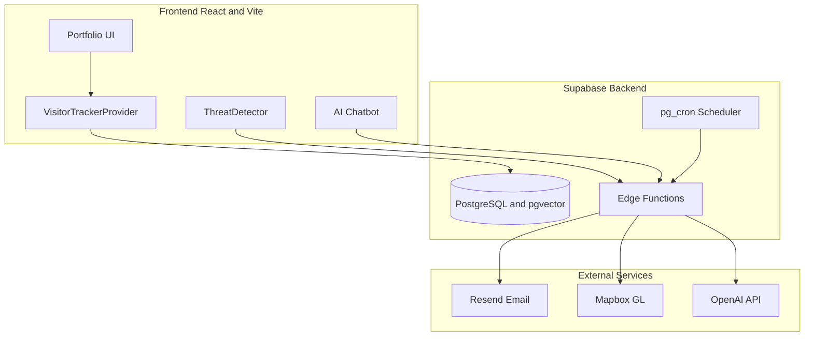

# Ritvik Indupuri's Portfolio

A modern, full-stack portfolio website featuring enterprise-grade security monitoring, AI-powered chatbot, and comprehensive visitor analytics.

**[View Live Demo](https://ritvik-website.netlify.app/)** | **[Technical Documentation](./TECHNICAL_DOCUMENTATION.md)** | **[Security Architecture Report (PDF)](./Portfolio%20Security%20Architecture%20and%20Threat%20Mitigation%20Report%20(1).pdf)**

---

## About

This portfolio showcases my work in Cloud Security, Cybersecurity, and Artificial Intelligence. Beyond a traditional portfolio, it implements:

- **Real-time visitor analytics** with behavioral classification
- **MITRE ATT&CK threat detection** for authentication security  
- **RAG-powered AI chatbot** for natural language queries
- **AI security risk scoring** powered by Google Gemini 2.5 Pro with historical tracking
- **Automated email alerts** for visitor engagement and security incidents
- **Interactive 3D security globe** visualizing login attempts worldwide

---

## User Experience

### For Guests (Public Visitors)

All visitors can explore the full portfolio content without authentication:

| Section | Description |
|---------|-------------|
| **Hero & About** | Introduction, bio, and education details |
| **Experience** | Professional work history with descriptions |
| **Projects** | Featured projects with GitHub links and demos |
| **Skills** | Technical skills organized by category |
| **ML/LLM Showcases** | Machine learning and AI project portfolios |
| **Certifications** | Professional certifications and credentials |
| **Documentation** | Technical writeups and guides |
| **AI Chatbot** | RAG-powered assistant to answer questions about my background |
| **Contact Form** | Send messages directly via email |
| **Resume Download** | Access to downloadable resume |

### For Owner (Authenticated)

After logging in, the portfolio owner has access to an analytics dashboard with:

| Feature | Description |
|---------|-------------|
| **Visitor Analytics** | Real-time tracking of page views, unique visitors, and session duration |
| **Section Duration Tracking** | Measures how long visitors spend on each portfolio section using IntersectionObserver |
| **Behavioral Classification** | AI-based visitor intent detection (recruiter, developer, student, etc.) |
| **Geographic Mapping** | Interactive 3D globe showing visitor and login attempt locations |
| **AI Risk Scoring** | LLM-powered security assessment using Google Gemini 2.5 Pro with 0-100 risk score |
| **Risk Score History** | Historical trend tracking with interactive line chart, trend indicators, and week-over-week comparison |
| **Login Attempt Monitor** | Security log of authentication attempts with IP geolocation |
| **MITRE ATT&CK Threat Detection** | Automated detection of brute force, password spraying, and credential stuffing |
| **Resume Analytics** | Track resume views and downloads with referrer data |
| **Chatbot Query Analysis** | Review questions asked to the AI assistant |
| **Content Management** | Edit portfolio content (projects, skills, experience, etc.) |

### Email Alerts (Owner)

The owner receives automated email notifications for:

- **New Visitor Alerts** - When a new unique visitor lands on the portfolio
- **Contact Form Submissions** - Immediate notification of messages
- **Security Threat Alerts** - High-severity login anomalies (brute force, credential attacks)
- **Weekly Digest** - Summary of visitor activity, popular content, AI risk score trends, and security events

---

## System Architecture

The architecture follows a three-tier design with clear separation of concerns:

- **Frontend Layer**: React components handle the UI, visitor tracking, threat detection, and AI chatbot interface
- **Backend Layer**: Supabase provides PostgreSQL with pgvector for semantic search, Edge Functions for serverless logic, and pg_cron for scheduled tasks
- **External Services**: Resend handles email delivery, Mapbox powers the 3D security globe, and OpenAI provides embeddings and chat responses



---

## Tech Stack

### Frontend
| Technology | Purpose |
|------------|---------|
| React 18 + Vite | UI framework with fast HMR |
| TypeScript | Type-safe development |
| Tailwind CSS + shadcn/ui | Styling and components |
| Framer Motion | Animations |
| React Query | Server state management |
| Mapbox GL JS | 3D globe visualization |

### Backend
| Technology | Purpose |
|------------|---------|
| Supabase | PostgreSQL, Auth, Edge Functions |
| pgvector | Vector similarity search for RAG |
| pg_cron | Scheduled tasks |
| Resend | Email delivery |
| OpenAI API | Embeddings and chat responses |

---

## Getting Started

### Prerequisites

- Node.js 18.x or higher
- npm or bun package manager
- Supabase project

### Installation

1. **Clone the repository**
   ```sh
   git clone https://github.com/your-username/portfolio.git
   cd portfolio
   ```

2. **Install dependencies**
   ```sh
   npm install
   ```

3. **Configure environment variables**
   
   Create a `.env.local` file:
   ```env
   VITE_SUPABASE_URL=https://your-project.supabase.co
   VITE_SUPABASE_PUBLISHABLE_KEY=your_supabase_anon_key
   ```

4. **Configure Supabase secrets** (for edge functions)
   
   Add these secrets in your Supabase dashboard:
   - `OPENAI_API_KEY` - For AI chatbot
   - `RESEND_API_KEY` - For email notifications
   - `MAPBOX_PUBLIC_TOKEN` - For security globe

5. **Run database migrations**
   
   Apply the migrations in `supabase/migrations/` to set up tables and RLS policies.

6. **Start development server**
   ```sh
   npm run dev
   ```

7. **Open the app**
   
   Navigate to [http://localhost:5173](http://localhost:5173)

---

## Deployment

### Frontend
Deploy to any static hosting provider:
- Vercel
- Netlify
- GitHub Pages

### Backend
Edge functions deploy automatically via Supabase. Configure the weekly digest cron job:

```sql
SELECT cron.schedule(
  'weekly-portfolio-digest',
  '0 9 * * 1',
  $$SELECT net.http_post(
    url:='https://[project-ref].supabase.co/functions/v1/weekly-digest',
    headers:='{"Authorization": "Bearer [anon-key]"}'::jsonb
  )$$
);
```

---

## Documentation

For detailed technical documentation including:
- Complete system architecture explanations
- Data flow diagrams
- Security implementation details
- RAG chatbot architecture
- Database schema

See **[TECHNICAL_DOCUMENTATION.md](./TECHNICAL_DOCUMENTATION.md)**

### Security Architecture Report

For an in-depth analysis of the portfolio's security architecture and threat mitigation strategies, see the comprehensive security report:

📄 **[Portfolio Security Architecture and Threat Mitigation Report (PDF)](./Portfolio%20Security%20Architecture%20and%20Threat%20Mitigation%20Report%20(1).pdf)**

This document covers 10 identified threats and mitigations including:
- Unauthorized owner access prevention (JWT-based RBAC)
- Cross-Site Scripting (XSS) protection via DOMPurify sanitization
- Password policy enforcement with leaked password protection
- Rate limiting and abuse prevention (30/hr chatbot, 5/hr contact)
- Prompt injection detection and chatbot data isolation
- Security headers (CSP, X-Frame-Options, CORS)
- Session handling and race condition fixes
- Input validation with Zod schema enforcement
- Chatbot data exposure prevention via RLS
- Development server hardening

---

## License

MIT License - See LICENSE file for details.