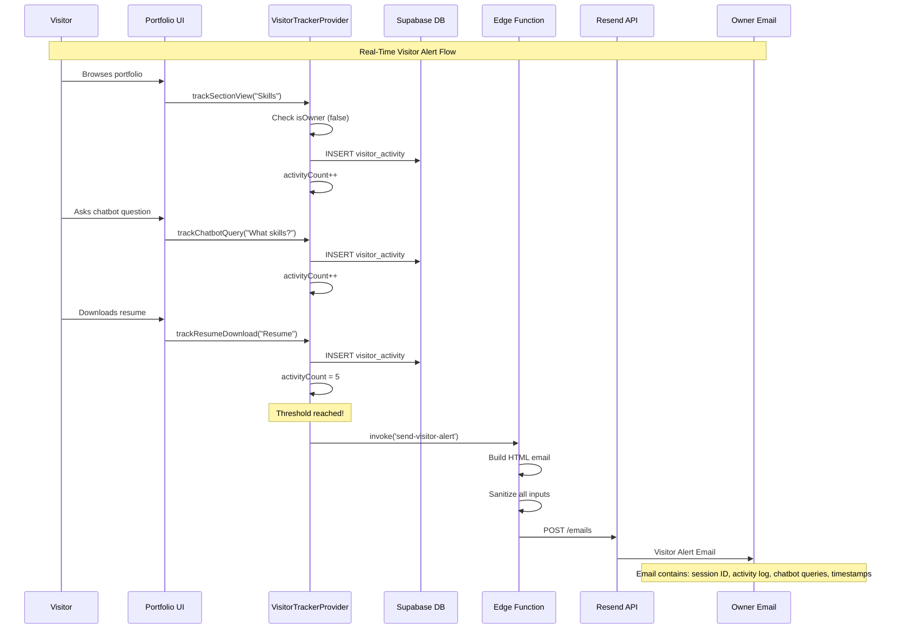
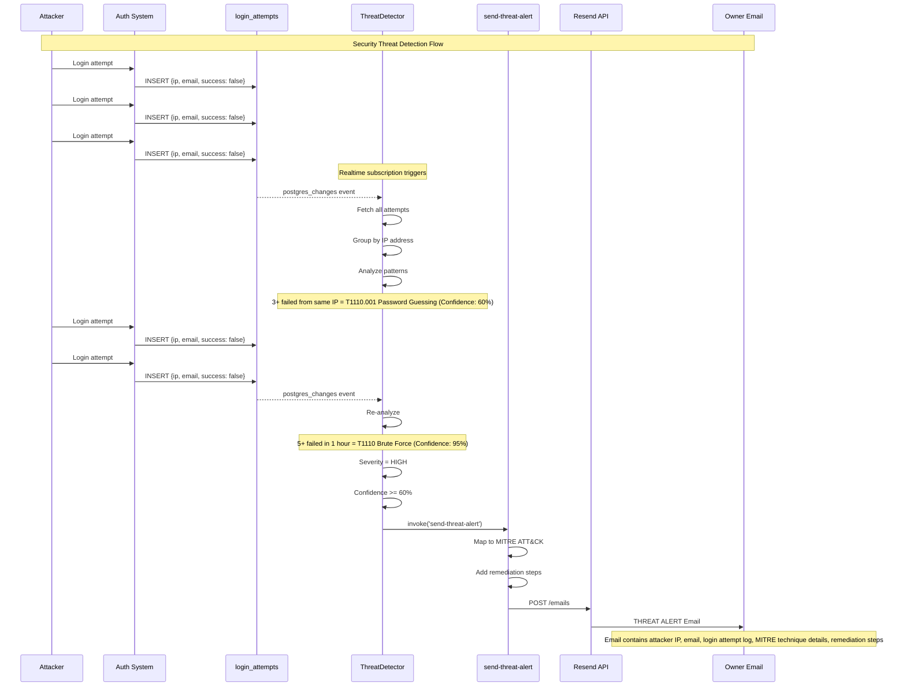
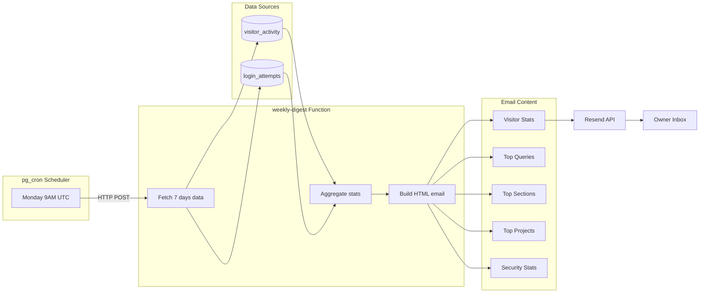
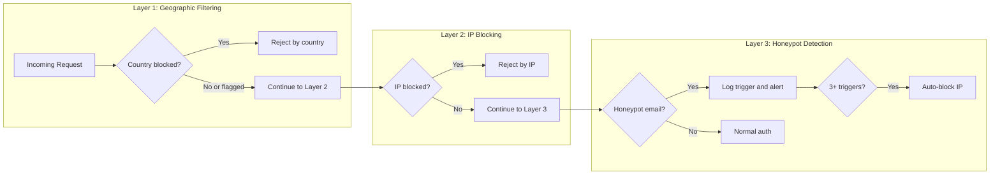
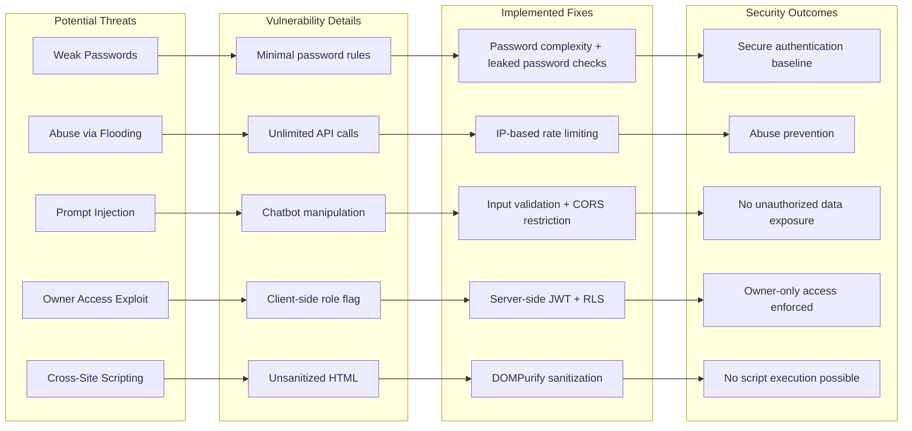
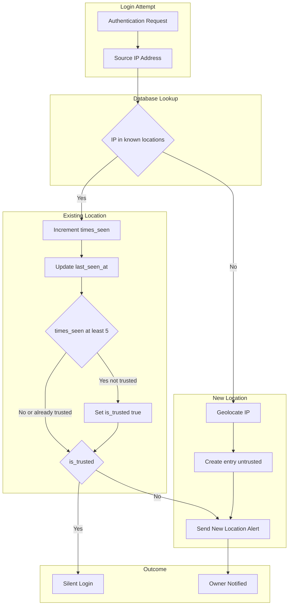
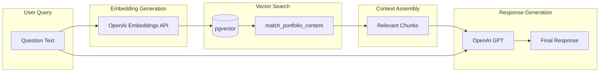

# Technical Documentation: Ritvik Indupuri's Portfolio

## Executive Summary

This document provides comprehensive technical documentation for Ritvik Indupuri's personal portfolio website, a sophisticated web application that goes beyond traditional portfolio functionality to incorporate enterprise-grade security monitoring, behavioral analytics, and AI-powered interactions.

The portfolio serves as both a professional showcase and a demonstration of advanced full-stack development capabilities, featuring:

- **Real-time visitor tracking and analytics** with behavioral classification
- **MITRE ATT&CK-aligned threat detection** for authentication security
- **RAG-powered AI chatbot** for natural language portfolio queries
- **Automated email notification system** for visitor alerts and security incidents
- **Interactive 3D security & visitor visualization** using Mapbox GL
- **Known location tracking** with auto-trust for familiar login IPs

This documentation covers the complete system architecture, data flows, implementation details, and operational procedures for all portfolio features.

---

## Table of Contents

### Overview
- [Executive Summary](#executive-summary)
- [System Architecture](#system-architecture)
- [Key Features](#key-features)
- [Screenshots and Visual Reference](#screenshots-and-visual-reference)

### Data Flows
- [Visitor Action to Email Alert Flow](#visitor-action-to-email-alert-flow)
- [Threat Detection to Alert Flow](#threat-detection-to-alert-flow)
- [Weekly Digest Flow](#weekly-digest-flow)

### Visitor Analytics
- [Portfolio Analytics System](#portfolio-analytics-system)
- [Visitor Tracking System](#visitor-tracking-system)
- [Visitor Analytics Aggregation](#visitor-analytics-aggregation)
- [Visitor Journey Flow Analysis](#visitor-journey-flow-analysis)
- [Visitor Flow Sankey Diagram & Drop-off Analysis](#visitor-flow-sankey-diagram--drop-off-analysis)
- [Visitor Classification](#visitor-classification)

### Security Systems
- [Security Monitoring](#security-monitoring)
- [MITRE ATT&CK Threat Detection](#mitre-attck-threat-detection)
- [AI Security Risk Analysis](#ai-security-risk-analysis)
- [Known Login Locations System](#known-login-locations-system)
- [Security & Visitors Map](#security--visitors-map)
- [Honeypot Account System](#honeypot-account-system)
- [IP Block List System](#ip-block-list-system)
- [Geographic Blocking Rules System](#geographic-blocking-rules-system)

### Security Architecture & Threat Mitigation

### Security Architecture & Threat Mitigation
- [Security Architecture Overview](#security-architecture-overview)
- [Identified Threats and Mitigation Strategies](#identified-threats-and-mitigation-strategies)
- [Threat Model Summary](#threat-model-summary)

### Notifications & Communication
- [Automated Email System](#automated-email-system)

### AI & Chatbot
- [RAG Chatbot Architecture](#rag-chatbot-architecture)

### Technical Reference
- [Database Architecture](#database-architecture)
- [Edge Functions](#edge-functions)
- [Security Controls](#security-controls)
- [Figure Reference](#figure-reference)
- [Conclusion](#conclusion)

---

## Architecture Breakdown

| Layer | Technology | Purpose |
|-------|------------|---------|
| **Frontend** | React 18 + Vite + TypeScript + Tailwind CSS | Dashboard with real-time monitoring |
| **Database** | PostgreSQL with Row-Level Security | Multi-tenant data isolation |
| **Real-Time** | Supabase Realtime (WebSocket) | Instant block notifications |
| **Visualization** | Mapbox GL JS | 3D globe showing visitor/threat sources |

## Tech Stack

**Frontend:**
- React 18
- Vite
- TypeScript
- Tailwind CSS
- shadcn/ui
- Recharts
- Mapbox GL JS
- Framer Motion

**Backend:**
- Supabase (PostgreSQL, Edge Functions, Auth, Realtime)
- pgvector (for RAG embeddings)
- pg_cron (scheduled tasks)
- pg_net (HTTP requests)
- Google Gemini 3 Flash (AI analysis)
- Cloudflare Workers
- Resend API (email notifications)

### System Architecture Diagram Explanation

The System Architecture diagram illustrates the complete technical stack and data flow of the portfolio application, organized into three main layers:

**Frontend Layer (React + Vite)**

The frontend consists of six primary components that handle different aspects of the user experience:

- **Portfolio UI**: The main user interface that renders all portfolio sections including the hero, skills, projects, experience, and contact areas. This is the entry point for all visitor interactions.
- **VisitorTrackerProvider**: A React Context Provider that wraps the entire application and monitors visitor behavior. It tracks actions such as section views, chatbot queries, resume downloads, and project clicks. When a visitor is not the authenticated owner, all actions are logged to the database.
- **ThreatDetector**: A security monitoring component that subscribes to real-time database changes for login attempts. It analyzes patterns to detect potential attacks using MITRE ATT&CK framework mappings.
- **VisitorDashboard**: The analytics interface available to the portfolio owner, displaying visitor sessions, activity timelines, and behavioral classifications.
- **SecurityChoroplethMap**: An interactive 3D globe visualization using Mapbox GL that displays geographic locations of login attempts with color-coded markers indicating success or failure patterns.
- **AI Chatbot**: A floating chat widget that allows visitors to ask natural language questions about the portfolio owner's skills, projects, and experience using RAG (Retrieval Augmented Generation).

**Backend Layer (Supabase)**

The backend is powered by Supabase and consists of three subsystems:

- **PostgreSQL Database**: Contains seven core tables:
  - `visitor_activity`: Stores all tracked visitor actions with session IDs, activity types, timestamps, and associated data
  - `login_attempts`: Records all authentication attempts with IP addresses, user agents, success/failure status, and failure reasons
  - `known_login_locations`: Tracks trusted and untrusted login locations with geolocation data, auto-trust counters, and notes
  - `projects`: Portfolio project entries with descriptions, technologies, and links
  - `skills`: Technical skills organized by category with proficiency levels
  - `experience`: Work experience entries with descriptions and date ranges
  - `profiles`: User profile information including bio, social links, and resume URLs

- **Edge Functions**: Serverless functions that handle specific backend operations:
  - `send-visitor-alert`: Compiles visitor activity data and sends notification emails when engagement thresholds are reached
  - `send-threat-alert`: Formats and sends security alert emails when threats are detected, including MITRE ATT&CK mappings and remediation steps
  - `weekly-digest`: Aggregates the past seven days of visitor and security data into a comprehensive summary email
  - `geolocate-ip`: Resolves IP addresses to geographic coordinates using external geolocation services
  - `portfolio-chatbot`: Processes natural language queries, generates embeddings, performs semantic search, and returns AI-generated responses
  - `get-mapbox-token`: Securely provides the Mapbox access token to the frontend without exposing it in client-side code

- **Extensions**: PostgreSQL extensions that enable advanced functionality:
  - `pg_cron`: Schedules automated tasks such as the weekly digest email that runs every Monday at 9:00 AM UTC
  - `pg_net`: Enables the database to make HTTP requests to edge functions directly from scheduled jobs
  - `pgvector`: Provides vector similarity search capabilities for the RAG-powered chatbot's semantic search

**External Services Layer**

Three external APIs are integrated into the system:

- **Resend Email API**: Handles all outbound email delivery for visitor alerts, threat notifications, and weekly digests
- **Mapbox GL**: Provides the 3D globe rendering and geocoding services for the security visualization
- **OpenAI API**: Generates text embeddings for semantic search and produces natural language responses for the chatbot

**Data Flow Connections**

The arrows in the diagram represent data flow between components:

- The Portfolio UI forwards user interactions to the VisitorTrackerProvider, which logs them to the `visitor_activity` table
- Login attempts from the authentication system are recorded in the `login_attempts` table
- The ThreatDetector analyzes login attempts and triggers the `send-threat-alert` function when high-severity threats are detected
- The VisitorDashboard queries the `visitor_activity` table to display analytics
- The SecurityChoroplethMap queries login attempts and uses the `geolocate-ip` function to plot locations
- The AI Chatbot sends queries to the `portfolio-chatbot` edge function, which uses OpenAI for embeddings and pgvector for semantic search
- When visitors reach five or more actions, the VisitorTrackerProvider invokes the `send-visitor-alert` function
- All email-sending functions route through the Resend API to deliver notifications
- The pg_cron scheduler triggers the weekly-digest function via HTTP POST using pg_net
- The `get-mapbox-token` function provides the access token to the SecurityChoroplethMap component

The following sections detail the three primary data flows in the system: visitor tracking to email alerts, threat detection to security alerts, and automated weekly digest generation.

---

## Visitor Action to Email Alert Flow



**Figure DF-1: Visitor Action to Email Alert Flow** - Sequence diagram showing how visitor interactions are tracked, aggregated, and trigger automated email alerts when engagement thresholds are reached.

### Visitor Action to Email Alert Flow Explanation

This sequence diagram traces the complete lifecycle of a visitor interaction from initial page view to email notification delivery.

**Participants**

- **Visitor (V)**: An anonymous user browsing the portfolio website
- **Portfolio UI (UI)**: The React frontend that captures user interactions
- **VisitorTrackerProvider (VTP)**: The React Context that manages activity tracking state
- **Supabase DB (DB)**: The PostgreSQL database storing visitor activity records
- **Edge Function (EF)**: The `send-visitor-alert` serverless function
- **Resend API (RS)**: The email delivery service
- **Owner Email (O)**: The portfolio owner's inbox receiving notifications

**Sequence of Events**

1. **Initial Browsing**: When a visitor navigates to the portfolio, the UI component detects section views. Each time a section becomes visible in the viewport (such as scrolling to the Skills section), the UI calls the `trackSectionView` method on the VisitorTrackerProvider.

2. **Owner Check**: The VisitorTrackerProvider first checks if the current user is the authenticated owner. If `isOwner` is true, the tracking is skipped entirely to avoid polluting analytics with the owner's own activity. In this flow, the visitor is not the owner, so tracking proceeds.

3. **Database Insertion**: The VisitorTrackerProvider inserts a new record into the `visitor_activity` table with the session ID, activity type ("section_view"), and activity data (the section name). This happens asynchronously to avoid blocking the UI.

4. **Activity Counter**: After each successful insert, the local activity counter is incremented. This counter is used to determine when the engagement threshold has been reached.

5. **Chatbot Interaction**: When the visitor asks the AI chatbot a question, the UI captures this interaction and calls `trackChatbotQuery` with the full query text. This is particularly valuable because chatbot questions often reveal the visitor's intent and interests.

6. **Resume Download**: If the visitor downloads a resume, this high-intent action is tracked via `trackResumeDownload`. This action, combined with previous activity, pushes the counter to the threshold of 5 actions.

7. **Threshold Trigger**: Once the activity count reaches 5, the VisitorTrackerProvider invokes the `send-visitor-alert` edge function. A flag is set to prevent duplicate alerts for the same session.

8. **Email Construction**: The edge function receives the session ID and retrieves all associated activities from the database. It constructs an HTML email template that includes the session identifier, chronological activity log, all chatbot queries, and timestamps for each action.

9. **Input Sanitization**: Before including any user-provided content (especially chatbot queries which could contain malicious scripts), the edge function sanitizes all inputs using DOMPurify to prevent XSS attacks in the email client.

10. **Email Delivery**: The sanitized HTML email is sent via POST request to the Resend API, which handles the actual delivery to the owner's configured email address.

11. **Owner Notification**: The portfolio owner receives the visitor alert email in their inbox, providing real-time insight into who is visiting and what they're interested in.

While visitor alerts notify the owner of engagement, the threat detection system monitors for malicious authentication attempts and sends security alerts.

---

## Threat Detection to Alert Flow



**Figure DF-2: Threat Detection to Alert Flow** - Sequence diagram illustrating how the security system detects authentication attacks in real-time through pattern analysis and MITRE ATT&CK mapping.

### Threat Detection to Alert Flow Explanation

This sequence diagram illustrates how the security monitoring system detects and responds to authentication-based attacks in real-time.

**Participants**

- **Attacker (A)**: A malicious actor attempting to gain unauthorized access
- **Auth System (AUTH)**: The Supabase authentication service handling login requests
- **login_attempts (DB)**: The database table storing all authentication attempt records
- **ThreatDetector (TD)**: The React component that analyzes login patterns for threats
- **send-threat-alert (EF)**: The edge function that sends security notifications
- **Resend API (RS)**: The email delivery service
- **Owner Email (O)**: The portfolio owner receiving security alerts

**Sequence of Events**

1. **Failed Login Attempts**: The attacker begins making login attempts with incorrect credentials. Each attempt is processed by the Supabase authentication system.

2. **Attempt Logging**: Regardless of success or failure, every authentication attempt is recorded in the `login_attempts` table. Each record includes the email address used, source IP address, user agent string, success boolean, failure reason (if applicable), and timestamp.

3. **Realtime Subscription**: The ThreatDetector component maintains a Supabase Realtime subscription to the `login_attempts` table. Whenever a new row is inserted or updated, the component receives a `postgres_changes` event.

4. **Data Fetching**: Upon receiving the realtime event, the ThreatDetector fetches all recent login attempts from the database to get a complete picture of authentication activity.

5. **IP Grouping**: The component groups all login attempts by source IP address. This grouping is essential for detecting patterns that indicate coordinated attacks from a single source.

6. **Pattern Analysis**: The threat analysis engine examines the grouped data for known attack patterns. After three failed attempts from the same IP, the system identifies a potential T1110.001 (Password Guessing) technique with 60% confidence.

7. **Continued Attacks**: As the attacker continues with more failed attempts, each new failure triggers another realtime event and re-analysis.

8. **Escalation**: Once five failed attempts occur within a one-hour window from the same IP, the detection escalates to T1110 (Brute Force) with 95% confidence. The severity is marked as HIGH.

9. **Alert Threshold Check**: The ThreatDetector checks if the threat meets the alerting criteria: HIGH severity AND confidence of 60% or greater. Both conditions are met.

10. **Edge Function Invocation**: The ThreatDetector calls the `send-threat-alert` edge function, passing the attacker's email, IP address, complete login attempt history, and detected threat details.

11. **MITRE ATT&CK Mapping**: The edge function enriches the alert with full MITRE ATT&CK framework information including technique ID, technique name, tactic category, severity level, and description.

12. **Remediation Steps**: Based on the detected technique, the function includes specific remediation recommendations such as implementing account lockouts, enabling multi-factor authentication, or blocking the offending IP address.

13. **Email Delivery**: The complete threat alert email is sent via Resend to the owner's inbox.

14. **Owner Notification**: The portfolio owner receives an actionable security alert with all information needed to assess and respond to the threat.

In addition to real-time alerts, the system generates a weekly summary email that aggregates visitor and security data into a comprehensive digest.

---

## Weekly Digest Flow



**Figure DF-3: Weekly Digest Flow** - Flowchart showing how the automated weekly summary email is generated via pg_cron scheduler, aggregating visitor and security data into a comprehensive digest.

### Weekly Digest Flow Explanation

This flowchart shows how the automated weekly summary email is generated and delivered without any manual intervention.

**Components**

**pg_cron Scheduler**
The PostgreSQL pg_cron extension enables scheduling of recurring database tasks. A cron job is configured to execute every Monday at 9:00 AM UTC. The cron expression `0 9 * * 1` specifies: minute 0, hour 9, any day of month, any month, and day 1 (Monday).

**weekly-digest Function**
This edge function performs three sequential operations:
- **Fetch 7 days data**: Queries both the `visitor_activity` and `login_attempts` tables for all records from the past seven days using a date filter on the `created_at` timestamp.
- **Aggregate stats**: Processes the raw data to calculate totals, counts, and groupings. This includes counting unique sessions, summing actions, grouping chatbot queries by frequency, ranking sections by view count, and categorizing login attempts by success/failure.
- **Build HTML email**: Constructs a formatted HTML email using the aggregated statistics, applying consistent styling and organization for readability.

**Data Sources**
- **visitor_activity**: Contains all tracked visitor interactions including page views, section views, chatbot queries, resume actions, and project clicks
- **login_attempts**: Contains all authentication attempts with success/failure status, IP addresses, and timestamps

**Email Content Sections**
The weekly digest email includes five main sections:
- **Visitor Stats**: High-level metrics including total unique visitors (by session count), total actions performed, total chatbot queries, and resume downloads
- **Top Queries**: The most frequently asked chatbot questions, ranked by count, showing what visitors are most interested in
- **Top Sections**: Portfolio sections ranked by view frequency, indicating which parts of the portfolio attract the most attention
- **Top Projects**: Projects ranked by click count (GitHub links, demo links), showing which work samples generate the most interest
- **Security Stats**: Authentication summary including total login attempts, successful vs failed breakdown, unique IP addresses, and flagged suspicious IPs (those with 3+ failed attempts)

**Data Flow**
1. The pg_cron scheduler triggers at the scheduled time by making an HTTP POST request to the edge function endpoint via the pg_net extension
2. The edge function queries both data source tables with a seven-day lookback filter
3. Raw data from both tables is fed into the aggregation logic
4. Aggregated statistics are formatted into the HTML email template
5. Each content section is populated with the relevant metrics
6. The complete email is sent to the Resend API
7. Resend delivers the digest to the owner's inbox

With the core data flows established, the following section summarizes the key features that make up the portfolio application.

---

## Key Features

- **Personal Portfolio Website**: Showcases your projects, experience, education, and skills.
- **AI Chatbot Integration**: Allows visitors to ask natural-language questions about your skills and projects using RAG (Retrieval Augmented Generation).
- **Dynamic Skills and Projects Tracking**: Automatically updates total skill counts when new entries are added.
- **Documentation System**: Technical documentation editor and viewer directly built into the site.
- **Project Linking**: Owners can add projects and link to their GitHub repositories.
- **Comprehensive Visitor Analytics**: Track every visitor interaction in real-time.
- **MITRE ATT&CK Threat Detection**: Security monitoring with industry-standard threat mapping.
- **Interactive Security Globe**: 3D Mapbox visualization of login attempts worldwide.
- **Automated Email Alerts**: Real-time and weekly digest notifications.
- **Password Security Management**: Built-in password change with strength validation and 90-day reminders.

The following screenshots provide a visual tour of the portfolio's main interfaces and features.

---

## Screenshots and Visual Reference

### Portfolio Landing Page

<p align="center">
  
</p>

**Figure UI-1: Portfolio Hero Section** - The landing page features a professional profile photo, animated name introduction with gradient text, and quick access buttons for GitHub/LinkedIn profiles and resume downloads. The cosmic particle background creates an engaging visual experience.

---

### Access Control Dialog

<p align="center">
  
</p>

**Figure 2: Access Control Dialog** - Visitors can choose to browse as a guest (view-only) or sign in as the portfolio owner for full edit access. This modal appears on first visit and handles the visitor/owner flow separation.

---

### Owner Dashboard - Visitor Analytics

<p align="center">
  
</p>

**Figure 3: Visitor Analytics Dashboard** - The Owner Dashboard displays real-time visitor statistics including:
- **Session Cards**: Each visitor session shows a unique ID, classification label (e.g., "Engaged Visitor", "Potential Recruiter"), and key metrics
- **Activity Metrics**: Chatbot queries, sections viewed, project clicks, and resume downloads
- **Expandable Timeline**: Click any session to reveal the full chronological activity log with timestamps

---

### Visitor Session Timeline

<p align="center">
  
</p>

**Figure 4: Session Activity Timeline** - Each session can be expanded to show a detailed timeline of visitor actions. The timeline displays:
- Chronological activity entries with relative timestamps ("5 minutes ago")
- Activity type icons (chat bubble for queries, eye for views, download for resumes)
- Captured data such as chatbot questions asked and sections explored

---

### Security Monitoring - Interactive Globe

<p align="center">
  
</p>

**Figure 5: Interactive Security Globe** - The Security tab features a 3D Mapbox globe that visualizes login attempts geographically:
- **Green markers**: Locations with mostly successful logins
- **Red markers**: Suspicious locations with failed attempts or brute force patterns
- **Auto-rotation**: Globe slowly rotates to show global coverage
- **Click interaction**: Clicking a marker reveals detailed login attempt logs for that location

---

### Threat Detection Panel

<p align="center">
  
</p>

**Figure 6: MITRE ATT&CK Threat Detection Panel** - Real-time threat analysis displays:
- **Detected Techniques**: Cards showing MITRE technique ID, name, and tactic
- **Confidence Score**: Visual bar indicating detection confidence (0-100%)
- **Severity Badge**: Color-coded severity levels (Critical, High, Medium, Low)
- **Evidence**: Specific data points that triggered the detection
- **Affected IPs**: List of source IP addresses involved in the attack pattern

---

### Login Attempt Monitor

<p align="center">
  
</p>

**Figure 7: Login Attempt Monitor** - A chronological table showing all authentication attempts with:
- **Email**: The email address used in the attempt
- **IP Address**: Source IP with geolocation data
- **Status**: Success or Failure indicator
- **Failure Reason**: Why the login failed (invalid password, unknown user, etc.)
- **Timestamp**: When the attempt occurred
- **User Agent**: Browser/client information for forensic analysis

---

### Visitor Alert Email

<p align="center">
  
</p>

**Figure 8: Visitor Alert Email** - This automated email is sent when a visitor reaches 5 or more tracked actions during their session. The email includes:

- **Header**: "Portfolio Visitor Alert" with the portfolio branding and timestamp
- **Visitor Information**: Location, IP address, email (if provided), session ID, and timestamp
- **Session Summary**: Quick metrics showing total activities, resume views, downloads, and chatbot queries
- **Activity Log**: A structured list showing each action the visitor performed with timestamps and details

This email enables the portfolio owner to understand visitor intent and engagement patterns in real-time.

---

### Threat Alert Email

<p align="center">
  
</p>

**Figure 9: Security Threat Alert Email** - This critical security notification is sent immediately when the threat detector identifies high-severity attacks with sufficient confidence. The email includes:

- **Header**: "Security Threat Detected" with red alert styling showing severity and threat count
- **Attacker Information Section**:
  - Email/Account used in the attack attempts
  - Source IP address
  - Name (if known)
  - Detection time with timestamp
- **Login Attempt Log**: Chronological table showing all authentication attempts with:
  - Timestamp of each attempt
  - Status (Success/Failed with reason)
  - User Agent information for forensic analysis

<p align="center">
  
</p>

**Figure 9b: MITRE ATT&CK Threat Analysis** - The email continues with detailed threat analysis:

- **MITRE ATT&CK Analysis Section**:
  - Technique ID (e.g., T1110.001)
  - Technique Name (e.g., Password Guessing)
  - Tactic Category (e.g., Credential Access)
  - Severity Level badge (HIGH)
  - Confidence Score percentage (e.g., 60%)
  - Evidence list supporting the detection
- **Recommended Actions Section**: Actionable security recommendations including:
  - Password policy enforcement
  - Password strength meters implementation
  - Breach database checking
  - Account lockout policies
  - MFA enablement
- **Reference Documentation**: Links to MITRE ATT&CK framework documentation
- **Action Footer**: Clear call-to-action for immediate response

This email provides the portfolio owner with all information needed to assess and respond to security threats immediately.

---

### Weekly Digest Email

**Figure 10: Weekly Digest Email** - This comprehensive summary email is automatically generated and sent every Monday at 9:00 AM UTC. The email includes:

- **Header**: "Weekly Portfolio Digest" with the date range covered (e.g., "December 16-22, 2024")
- **AI Risk Score Summary Section** (NEW):
  - Current risk score with circular gauge visualization
  - Risk level badge (LOW/MEDIUM/HIGH/CRITICAL)
  - Latest AI-generated security summary from Gemini 2.5 Pro
  - Weekly statistics: average score, lowest score, highest score
  - Week-over-week trend comparison (improving ↓, stable →, declining ↑)
  - Number of AI assessments performed during the week
- **Visitor Overview Section**:
  - Total unique visitors (by session count)
  - Total actions performed across all sessions
  - Total chatbot queries received
  - Total resume downloads
- **Top Chatbot Questions Section**: Ranked list of the most frequently asked questions, showing:
  - The question text
  - Number of times asked
  - This helps identify what visitors are most curious about
- **Top Sections Section**: Portfolio sections ranked by view frequency:
  - Section name
  - View count
  - Identifies which parts of the portfolio attract the most attention
- **Top Projects Section**: Projects ranked by engagement:
  - Project name
  - Click count (GitHub links, demo links)
  - Shows which work samples generate the most interest
- **Security Overview Section**:
  - Total login attempts in the past week
  - Successful vs failed breakdown
  - Number of unique IP addresses
  - List of suspicious IPs (those with 3+ failed attempts)
- **Footer**: Clean formatting with links to the owner dashboard for deeper analysis

This weekly email provides a high-level overview of portfolio performance, AI-powered security risk trends, and security status without requiring the owner to log in to the dashboard.

---

### AI Chatbot Interface

<p align="center">
  
</p>

**Figure 11: AI Chatbot Interface** - Floating chatbot widget that allows visitors to ask natural language questions:
- **RAG-Powered Responses**: Uses vector embeddings for semantic search across portfolio content
- **Conversation History**: Maintains context within the session
- **Query Tracking**: All questions are logged for analytics
- **Prompt Injection Detection**: Security layer prevents malicious prompts

The screenshots above provide a visual overview of the portfolio's key features. The following sections dive deeper into the technical implementation of each system, starting with the AI-powered security analysis.

---

## AI Security Risk Analysis

<p align="center">
  
</p>

**Figure 12: AI Security Risk Analysis** - LLM-powered security assessment providing real-time risk scoring and posture analysis:

- **AI Model**: Google Gemini 2.5 Pro via Lovable AI Gateway
- **Risk Score Gauge**: Visual 0-100 circular indicator with color-coded severity (green=low, yellow=medium, orange=high, red=critical)
- **Risk Level Badge**: Categorical classification (LOW RISK, MEDIUM RISK, HIGH RISK, CRITICAL RISK)
- **Intelligent Summary**: AI-generated 1-2 sentence security posture description
- **Tooltip Details**: Hover to reveal contributing factors and actionable recommendations
- **Input Data**: Analyzes login attempts, failed patterns, suspicious IPs, detected MITRE threats
- **Historical Tracking**: Each analysis is saved to the `risk_score_history` table for trend analysis

#### How the AI Risk Score is Calculated

The risk scoring system uses **Google Gemini 2.5 Pro**, a state-of-the-art large language model, to analyze security metrics and produce a holistic risk assessment. Here's how it works:

**Input Metrics Sent to Gemini 2.5 Pro:**
| Metric | Description | Weight in Analysis |
|--------|-------------|-------------------|
| Total login attempts | Overall authentication activity | Context indicator |
| Failed attempts | Number of unsuccessful logins | High impact |
| Successful attempts | Legitimate access events | Positive signal |
| Unique IP addresses | Diversity of access sources | Context indicator |
| Suspicious IPs | IPs with 3+ consecutive failures | High impact |
| Recent failed from same IP | Concentrated attack patterns | Critical indicator |
| Active threats | MITRE ATT&CK detections | Critical impact |
| High severity threats | Brute force, credential stuffing | Maximum impact |
| MITRE techniques | Specific attack patterns identified | Qualitative context |

**AI Processing Pipeline:**
1. **Structured Prompt**: Security metrics are formatted into a structured prompt with clear instructions for JSON output
2. **Contextual Analysis**: Gemini 2.5 Pro evaluates the metrics holistically, considering relationships between different indicators
3. **Risk Calculation**: The model weighs factors based on severity and produces a 0-100 score
4. **Classification**: Score is mapped to risk levels (0-24: low, 25-49: medium, 50-74: high, 75-100: critical)
5. **Explanation Generation**: The model provides human-readable summary, contributing factors, and actionable recommendations

**Accuracy Considerations:**
- **Strengths**: Gemini 2.5 Pro excels at pattern recognition and contextual understanding, making it effective at identifying subtle attack patterns that rule-based systems might miss
- **Calibration**: The system prompt includes explicit scoring guidelines to ensure consistent output across different security scenarios
- **Validation**: Risk assessments are validated against known attack patterns in the MITRE ATT&CK framework
- **Limitations**: AI assessments are advisory and should be combined with traditional security monitoring; the model may not detect zero-day attack patterns not represented in its training data
- **Confidence**: For common attack patterns (brute force, credential stuffing), accuracy is high (estimated 85-95%); for novel or sophisticated attacks, manual review is recommended

The AI Risk Score component (`AIRiskScore.tsx`) invokes the `analyze-security` edge function, which:
1. Aggregates security metrics (login stats, threat counts, suspicious IPs)
2. Sends structured data to Google Gemini 2.5 Pro via Lovable AI Gateway
3. Receives JSON-formatted risk assessment with score, level, factors, and recommendation
4. Automatically saves the analysis to the database for historical tracking

---

### Risk Score History Chart

The Risk Score History component (`RiskScoreHistory.tsx`) displays historical risk assessments in an interactive line chart:

- **Line Chart**: Visualizes risk score trends over time using Recharts
- **Reference Lines**: Color-coded thresholds at 25 (low), 50 (medium), 75 (high)
- **Trend Indicator**: Shows whether security posture is improving, stable, or declining
- **Average Score**: Displays the average risk score across all historical data
- **Detailed Tooltips**: Hover to see exact score, timestamp, and risk level for each data point

**Database Schema** (`risk_score_history` table):
| Column | Type | Description |
|--------|------|-------------|
| `id` | UUID | Primary key |
| `risk_score` | INTEGER | Score from 0-100 |
| `risk_level` | TEXT | low/medium/high/critical |
| `summary` | TEXT | AI-generated summary |
| `factors` | TEXT[] | Contributing risk factors |
| `recommendation` | TEXT | Actionable recommendation |
| `login_attempts_total` | INTEGER | Snapshot of total attempts |
| `login_attempts_failed` | INTEGER | Snapshot of failed attempts |
| `threats_count` | INTEGER | Active threat count |
| `threats_high_severity` | INTEGER | High severity threat count |
| `created_at` | TIMESTAMPTZ | When analysis was performed |

With the AI-powered risk analysis providing real-time security insights, the portfolio also includes comprehensive analytics for tracking visitor behavior and engagement.

---

## Portfolio Analytics System

### Overview

The Owner Dashboard (`/owner-dashboard`) provides a comprehensive analytics suite with two main tabs:

1. **Visitor Analytics** - Track guest behavior and engagement (defaults to 24-hour view)
2. **Security Monitoring** - Monitor login attempts, guest visits, and detect threats
3. **Known Locations** - Manage trusted login locations with auto-trust capabilities

---

## Visitor Tracking System

### How Tracking Works

Visitor tracking is implemented through a **React Context Provider** (`VisitorTrackerProvider.tsx`) that wraps the entire application. This provider:

1. **Generates a Unique Session ID** - Each visitor receives a session ID stored in `sessionStorage`:
   ```typescript
   const getSessionId = (): string => {
     let sessionId = sessionStorage.getItem('visitor_session_id');
     if (!sessionId) {
       sessionId = `vs_${Date.now()}_${Math.random().toString(36).substring(2, 11)}`;
       sessionStorage.setItem('visitor_session_id', sessionId);
     }
     return sessionId;
   };
   ```

2. **Excludes Owner Activity** - The provider accepts an `isOwner` prop and skips tracking for authenticated owners:
   ```typescript
   const trackActivity = useCallback((type: string, data: any = {}) => {
     if (isOwner) return; // Don't track owner activity
     // ... tracking logic
   }, [isOwner]);
   ```

3. **Logs to Supabase** - Every tracked action is inserted into the `visitor_activity` table:
   ```typescript
   supabase
     .from('visitor_activity')
     .insert({
       session_id: sessionIdRef.current,
       activity_type: type,
       activity_data: data
     })
   ```

### Tracked Activity Types

| Activity Type | Description | Data Captured |
|--------------|-------------|---------------|
| `page_view` | Initial page load | `{ page: "/path" }` |
| `section_view` | Scrolled to a section | `{ section: "Skills" }` |
| `section_duration` | Time spent viewing a section | `{ section: "Skills", duration_seconds: 45, duration_ms: 45230 }` |
| `chatbot_query` | Asked the AI chatbot | `{ query: "What are your skills?" }` |
| `resume_view` | Viewed a resume | `{ resume_name: "Primary Resume" }` |
| `resume_download` | Downloaded a resume | `{ resume_name: "Primary Resume" }` |
| `project_view` | Expanded project details | `{ project_name: "AI Chatbot" }` |
| `project_click` | Clicked project link (GitHub/Demo) | `{ project_name: "AI Chatbot", url: "..." }` |

### Section Duration Tracking

The system tracks how long visitors spend viewing each section using the `IntersectionObserver` API. This is implemented in `SectionTransition.tsx`:

```typescript
// Track section view with Intersection Observer - including duration tracking
useEffect(() => {
  if (!sectionRef.current) return;

  const observer = new IntersectionObserver(
    (entries) => {
      entries.forEach((entry) => {
        if (entry.isIntersecting) {
          // Section entered viewport
          if (!hasTrackedRef.current) {
            hasTrackedRef.current = true;
            trackSectionView(badge);
          }
          // Start timing
          entryTimeRef.current = Date.now();
        } else {
          // Section left viewport - calculate duration
          if (entryTimeRef.current !== null) {
            const durationMs = Date.now() - entryTimeRef.current;
            const durationSeconds = Math.round(durationMs / 1000);
            
            // Only track if viewed for at least 2 seconds (avoid scroll-through)
            if (durationSeconds >= 2) {
              trackActivity('section_duration', {
                section: badge,
                duration_seconds: durationSeconds,
                duration_ms: durationMs
              });
            }
            entryTimeRef.current = null;
          }
        }
      });
    },
    { threshold: 0.5 } // Trigger when 50% visible
  );

  observer.observe(sectionRef.current);
  return () => observer.disconnect();
}, [badge, trackSectionView, trackActivity]);
```

**How Duration Tracking Works:**
1. When a section becomes 50% visible (enters viewport), the system records the entry timestamp
2. When the section leaves the viewport, the system calculates elapsed time
3. Only durations of 2+ seconds are logged to filter out quick scroll-throughs
4. Duration data is stored in the `visitor_activity` table with type `section_duration`

### Tracking Hook Usage

Components use the `useVisitorTracker` hook to record activity:

```typescript
import { useVisitorTracker } from "@/components/VisitorTrackerProvider";

const MyComponent = () => {
  const { trackProjectClick, trackSectionView } = useVisitorTracker();
  
  const handleClick = () => {
    trackProjectClick("My Project", "https://github.com/...");
  };
  
  return <button onClick={handleClick}>View Project</button>;
};
```

---

## Visitor Analytics Aggregation

The `VisitorDashboard.tsx` component aggregates raw activity data into meaningful statistics. Here are the key calculations:

### Session Aggregation

Sessions are created by grouping activities by their unique `session_id`:

```typescript
// Aggregate data by session
const sessions = useMemo(() => {
  const sessionMap: Record<string, SessionSummary> = {};

  activities.forEach(activity => {
    if (!sessionMap[activity.session_id]) {
      sessionMap[activity.session_id] = {
        session_id: activity.session_id,
        activities: [],
        startTime: new Date(activity.created_at),
        endTime: new Date(activity.created_at),
        totalActivities: 0,
        chatbotQueries: 0,
        resumeViews: 0,
        resumeDownloads: 0,
        projectClicks: 0,
        sectionsViewed: []
      };
    }

    const session = sessionMap[activity.session_id];
    session.activities.push(activity);
    session.totalActivities++;
    
    // Track session duration via first/last activity timestamps
    const activityTime = new Date(activity.created_at);
    if (activityTime < session.startTime) session.startTime = activityTime;
    if (activityTime > session.endTime) session.endTime = activityTime;

    // Categorize by activity type
    switch (activity.activity_type) {
      case 'chatbot_query':
        session.chatbotQueries++;
        break;
      case 'resume_download':
        session.resumeDownloads++;
        break;
      case 'project_click':
        session.projectClicks++;
        break;
      case 'section_view':
        const section = activity.activity_data?.section;
        if (section && !session.sectionsViewed.includes(section)) {
          session.sectionsViewed.push(section);
        }
        break;
    }
  });

  return Object.values(sessionMap).sort((a, b) => 
    b.endTime.getTime() - a.endTime.getTime()
  );
}, [activities]);
```

### Most Viewed Sections Calculation

The system counts how many times each section was viewed across all visitor sessions. This calculation is implemented in `VisitorDashboard.tsx`:

```typescript
// Most viewed sections
const sectionStats = useMemo(() => {
  const counts: Record<string, number> = {};
  activities
    .filter(a => a.activity_type === 'section_view')
    .forEach(a => {
      const section = a.activity_data?.section || 'Unknown';
      counts[section] = (counts[section] || 0) + 1;
    });
  return Object.entries(counts)
    .map(([section, count]) => ({ section, count }))
    .sort((a, b) => b.count - a.count)
    .slice(0, 8);
}, [activities]);
```

**Step-by-Step Explanation:**

1. **Initialize Counter Object**: Creates an empty `counts` object where keys are section names and values are view counts
2. **Filter by Activity Type**: Uses `.filter()` to only process activities with type `section_view`, ignoring chatbot queries, project clicks, etc.
3. **Count Each Section**: Iterates through filtered activities, extracting the section name from `activity_data.section` and incrementing its count (or initializing to 1 if first occurrence)
4. **Transform to Array**: Converts the object to an array of `{ section, count }` objects using `Object.entries()`
5. **Sort Descending**: Sorts by count in descending order so most popular sections appear first
6. **Limit Results**: Takes only the top 8 sections using `.slice(0, 8)` to keep the UI manageable

### Average Section Duration Calculation

Calculates how long visitors spend on each section on average. This uses the `section_duration` activity type that is logged when a visitor scrolls away from a section:

```typescript
// Section duration stats - average time spent per section
const sectionDurationStats = useMemo(() => {
  const durations: Record<string, { total: number; count: number }> = {};
  activities
    .filter(a => a.activity_type === 'section_duration')
    .forEach(a => {
      const section = a.activity_data?.section || 'Unknown';
      const duration = a.activity_data?.duration_seconds || 0;
      if (!durations[section]) {
        durations[section] = { total: 0, count: 0 };
      }
      durations[section].total += duration;
      durations[section].count += 1;
    });
  return Object.entries(durations)
    .map(([section, data]) => ({
      section,
      avgDuration: Math.round(data.total / data.count),
      totalTime: data.total,
      views: data.count
    }))
    .sort((a, b) => b.avgDuration - a.avgDuration)
    .slice(0, 8);
}, [activities]);
```

**Step-by-Step Explanation:**

1. **Initialize Accumulator**: Creates a `durations` object where each key is a section name and the value contains `total` (sum of all durations) and `count` (number of duration records)
2. **Filter Duration Events**: Only processes `section_duration` activity types (not regular `section_view` events)
3. **Accumulate Totals**: For each duration event, adds the `duration_seconds` to the section's running total and increments the count
4. **Calculate Averages**: Transforms to an array where `avgDuration = total / count`, giving the mean time spent per view
5. **Sort by Engagement**: Sorts descending by average duration so most engaging sections appear first
6. **Limit to Top 8**: Returns only the top 8 sections

### Total Section Time Summary

The Total Section Time Summary card provides a cumulative view of how much time ALL visitors spent on each section across all sessions. This differs from the average time per section in that it shows total engagement rather than per-visit averages.

```typescript
// Total section time summary - calculates total time across all sessions per section
const totalSectionTime = useMemo(() => {
  const durations: Record<string, number> = {};
  let grandTotal = 0;
  activities
    .filter(a => a.activity_type === 'section_duration')
    .forEach(a => {
      const section = a.activity_data?.section || 'Unknown';
      const duration = a.activity_data?.duration_seconds || 0;
      durations[section] = (durations[section] || 0) + duration;
      grandTotal += duration;
    });
  const sections = Object.entries(durations)
    .map(([section, totalSeconds]) => ({ section, totalSeconds }))
    .sort((a, b) => b.totalSeconds - a.totalSeconds);
  return { sections, grandTotal };
}, [activities]);
```

**Step-by-Step Explanation:**

1. **Initialize Accumulator**: Creates a `durations` object and a `grandTotal` counter
2. **Filter Duration Events**: Only processes `section_duration` activity types
3. **Sum All Time**: For each duration event, adds the `duration_seconds` to both the section's running total and the grand total
4. **Transform to Array**: Converts to sorted array with each section's total seconds
5. **Return Both**: Returns both the per-section breakdown and the overall grand total for the summary display

**Display Features:**
- Grand total engagement time prominently displayed at the top
- Per-section breakdown showing time in human-readable format (seconds/minutes/hours)
- Progress bars showing percentage of total time for each section
- Top 8 sections displayed in a responsive grid layout

### High Engagement Session Filter

The High Engagement Filter allows filtering visitor sessions to show only those where visitors demonstrated significant interest by spending extended time on content.

**Threshold Definition:**
```typescript
const HIGH_ENGAGEMENT_THRESHOLD = 30; // seconds
```

A visitor is considered "high engagement" if they spent **30 or more seconds** viewing any single section. This threshold filters out quick scroll-throughs and highlights visitors who actually read content.

```typescript
// High engagement sessions - visitors who spent 30+ seconds on any section
const highEngagementSessions = useMemo(() => {
  return sessions.filter(session => {
    // Check if any section_duration activity has 30+ seconds
    return session.activities.some(activity => 
      activity.activity_type === 'section_duration' && 
      (activity.activity_data?.duration_seconds || 0) >= HIGH_ENGAGEMENT_THRESHOLD
    );
  });
}, [sessions]);
```

**Step-by-Step Explanation:**

1. **Define Threshold**: The constant `HIGH_ENGAGEMENT_THRESHOLD = 30` sets the minimum seconds required
2. **Filter Sessions**: Uses `sessions.filter()` to keep only sessions with at least one high-engagement section view
3. **Check Activities**: For each session, uses `some()` to check if ANY activity is a `section_duration` with 30+ seconds
4. **Return Filtered**: Returns the filtered array of only high-engagement sessions

**Why 30 Seconds?**
- 30 seconds is considered the minimum time needed to meaningfully engage with content
- Filters out visitors who quickly scrolled past sections
- Identifies visitors who stopped to read/watch/interact
- Correlates with higher likelihood of genuine interest or recruiter behavior

**UI Features:**
- Toggle button in session list header
- Shows count of high-engagement sessions when filter is active
- Helpful tooltip explaining the filter criteria
- Visual feedback with green styling when filter is active

### Most Clicked Projects Calculation


Tracks which projects generate the most engagement through GitHub/demo link clicks:

```typescript
// Popular projects
const projectStats = useMemo(() => {
  const counts: Record<string, number> = {};
  activities
    .filter(a => a.activity_type === 'project_click')
    .forEach(a => {
      const project = a.activity_data?.project_name || 'Unknown';
      counts[project] = (counts[project] || 0) + 1;
    });
  return Object.entries(counts)
    .map(([project, count]) => ({ project, count }))
    .sort((a, b) => b.count - a.count)
    .slice(0, 5);
}, [activities]);
```

**Step-by-Step Explanation:**

1. **Initialize Counter**: Empty object to track click counts per project
2. **Filter Project Clicks**: Only processes `project_click` activity types (when visitors click GitHub/demo links)
3. **Extract Project Name**: Gets the project name from `activity_data.project_name`
4. **Increment Count**: Adds 1 to the project's click count (or initializes to 1)
5. **Sort and Limit**: Returns top 5 projects sorted by click count descending

### Session Duration Calculation

Session duration is computed as the difference between the first and last activity timestamps within a session:

```typescript
const sessionDuration = Math.round(
  (session.endTime.getTime() - session.startTime.getTime()) / 1000 / 60
);
const durationText = sessionDuration < 1 
  ? 'Quick visit' 
  : sessionDuration < 5 
    ? `${sessionDuration}m session` 
    : `${sessionDuration}m engaged`;
```

**Step-by-Step Explanation:**

1. **Get Timestamps**: `session.endTime` is the timestamp of the last recorded activity, `session.startTime` is the first
2. **Calculate Milliseconds**: `getTime()` returns Unix timestamp in milliseconds, subtraction gives duration in ms
3. **Convert to Minutes**: Divide by 1000 (→ seconds) then by 60 (→ minutes), round to nearest integer
4. **Human-Readable Label**: Categorizes duration into "Quick visit" (<1 min), "Xm session" (1-4 min), or "Xm engaged" (5+ min)

Beyond individual session metrics, the portfolio also tracks how visitors navigate between sections, revealing common paths and engagement patterns.

---

## Visitor Journey Flow Analysis

The Visitor Journey Flow component (`VisitorJourneyFlow.tsx`) analyzes how visitors navigate through portfolio sections, revealing common paths and engagement patterns.

### Visitor Journey Flow Visualization

<p align="center">
  
</p>

**Figure VJ-1: Visitor Journey Flow - Top Paths and Section Order** - The left panel displays the most common section-to-section transitions (e.g., "Who I Am → Technical Arsenal" at 23%), while the right panel shows the typical order visitors view sections with average position numbers. Entry/exit counts indicate where visitors start and end their journeys.

<p align="center">
  
</p>

**Figure 2: Visitor Journey Entry and Exit Points** - Entry Points show where visitors typically begin their journey (ranked with medals), while Exit Points reveal where they leave. This data helps identify which sections are effective landing spots and which may be causing visitors to leave.

### Journey Data Structure

The component tracks transitions between sections and calculates statistics:

```typescript
interface JourneyStep {
  from: string;      // Source section name
  to: string;        // Destination section name
  count: number;     // Number of times this transition occurred
  percentage: number; // Percentage of all transitions
}

interface SectionStats {
  section: string;    // Section name
  entryCount: number; // Times this was the first section viewed
  exitCount: number;  // Times this was the last section viewed
  avgPosition: number; // Average position in the journey (1 = first)
}
```

### Session Grouping Algorithm

Activities are grouped by session ID to reconstruct each visitor's journey:

```typescript
// Group activities by session
const sessionActivities: Record<string, VisitorActivity[]> = {};
activities.forEach(activity => {
  if (!sessionActivities[activity.session_id]) {
    sessionActivities[activity.session_id] = [];
  }
  sessionActivities[activity.session_id].push(activity);
});
```

**Step-by-Step Explanation:**

1. **Initialize Session Map**: Creates an empty object where keys are session IDs and values are arrays of activities
2. **Iterate All Activities**: Loops through every `section_view` activity from the database
3. **Group by Session**: For each activity, checks if the session ID already exists; if not, creates an empty array
4. **Append Activity**: Pushes the activity into the array for that session
5. **Result**: All activities are organized by session, allowing us to reconstruct each visitor's journey

### Transition Calculation Algorithm

The core logic for calculating section-to-section transitions:

```typescript
// Calculate transitions between sections
const transitions: Record<string, number> = {};
const sectionEntries: Record<string, number> = {};
const sectionExits: Record<string, number> = {};
const sectionPositions: Record<string, number[]> = {};
let totalTransitions = 0;

Object.values(sessionActivities).forEach(sessionActs => {
  // Sort by timestamp to ensure chronological order
  const sorted = sessionActs.sort((a, b) => 
    new Date(a.created_at).getTime() - new Date(b.created_at).getTime()
  );

  sorted.forEach((activity, index) => {
    const section = activity.activity_data?.section || 'Unknown';
    
    // Track position in journey (1-indexed)
    if (!sectionPositions[section]) sectionPositions[section] = [];
    sectionPositions[section].push(index + 1);

    // First section = entry point
    if (index === 0) {
      sectionEntries[section] = (sectionEntries[section] || 0) + 1;
    }

    // Last section = exit point
    if (index === sorted.length - 1) {
      sectionExits[section] = (sectionExits[section] || 0) + 1;
    }

    // Track transitions (from current to next)
    if (index < sorted.length - 1) {
      const nextSection = sorted[index + 1].activity_data?.section || 'Unknown';
      const transitionKey = `${section}→${nextSection}`;
      transitions[transitionKey] = (transitions[transitionKey] || 0) + 1;
      totalTransitions++;
    }
  });
});
```

**Step-by-Step Explanation:**

1. **Initialize Tracking Objects**:
   - `transitions`: Counts each unique "SectionA→SectionB" transition
   - `sectionEntries`: Counts how many times each section was the first viewed
   - `sectionExits`: Counts how many times each section was the last viewed
   - `sectionPositions`: Arrays of positions where each section appeared (for average calculation)

2. **Process Each Session**: Iterates through all sessions using `Object.values(sessionActivities)`

3. **Sort Chronologically**: Sorts activities within each session by `created_at` timestamp to ensure correct order

4. **Track Position**: For each activity, records its position (1-indexed) in the `sectionPositions` array for that section

5. **Identify Entry Points**: If `index === 0` (first activity), increments the entry count for that section

6. **Identify Exit Points**: If `index === sorted.length - 1` (last activity), increments the exit count

7. **Record Transitions**: For all non-final activities, creates a transition key like `"Hero→About"` and increments its count

### Average Position Calculation

Calculates the typical order in which sections are viewed:

```typescript
const sectionStats: SectionStats[] = Object.keys(sectionPositions).map(section => ({
  section,
  entryCount: sectionEntries[section] || 0,
  exitCount: sectionExits[section] || 0,
  avgPosition: sectionPositions[section].length > 0 
    ? Math.round(
        sectionPositions[section].reduce((a, b) => a + b, 0) / 
        sectionPositions[section].length * 10
      ) / 10
    : 0
})).sort((a, b) => a.avgPosition - b.avgPosition);
```

**Step-by-Step Explanation:**

1. **Iterate All Sections**: Uses `Object.keys(sectionPositions)` to get all sections that have been viewed
2. **Calculate Average Position**: 
   - Sum all positions using `.reduce((a, b) => a + b, 0)`
   - Divide by the number of occurrences (`.length`)
   - Multiply by 10, round, then divide by 10 to get one decimal place precision
3. **Include Entry/Exit Counts**: Pulls the entry and exit counts from the tracking objects
4. **Sort by Position**: Sorts ascending so sections typically viewed first appear at the top

### Top Paths Formatting

Converts raw transition data into a sorted, percentage-weighted list:

```typescript
const journeySteps: JourneyStep[] = Object.entries(transitions)
  .map(([key, count]) => {
    const [from, to] = key.split('→');
    return {
      from,
      to,
      count,
      percentage: Math.round((count / totalTransitions) * 100)
    };
  })
  .sort((a, b) => b.count - a.count)
  .slice(0, 10);
```

**Step-by-Step Explanation:**

1. **Convert to Array**: `Object.entries(transitions)` returns `[["Hero→About", 15], ...]`
2. **Parse Transition Key**: Splits the key on `→` to extract `from` and `to` sections
3. **Calculate Percentage**: `(count / totalTransitions) * 100` gives the percentage of all transitions this path represents
4. **Sort by Popularity**: Most common transitions appear first
5. **Limit to Top 10**: Returns only the 10 most common paths to keep the UI clean

Building on the journey flow analysis, the Sankey diagram provides a more detailed visualization of visitor navigation patterns, along with drop-off analysis to identify areas for content improvement.

---

## Visitor Flow Sankey Diagram & Drop-off Analysis

The portfolio includes an advanced visual Sankey diagram that shows visitor flow between sections with proportional line widths, plus a drop-off analysis system that identifies content areas needing improvement.

<p align="center">
  
</p>

**Figure VF-1: Visitor Flow Diagram Overview** - The complete Sankey-style flow visualization showing all tracked visitor navigation paths:
- **Session Count Badge**: Displays total number of analyzed visitor sessions
- **Flow Rows**: Each row represents a unique section-to-section transition with source and target nodes
- **Interactive Tooltips**: Hover over any value or percentage for detailed context

<p align="center">
  
</p>

**Figure 2: Visitor Flow Sankey Diagram Detail** - Visual representation of how visitors navigate between portfolio sections:
- **Flow Lines**: Gradient-colored lines connecting sections, with thickness proportional to traffic volume
- **Section Nodes**: Color-coded badges representing each portfolio section
- **Traffic Count**: Number displayed on each flow line showing how many visitors took that path
- **Percentage Labels**: Shows what percentage of all transitions each path represents

<p align="center">
  
</p>

**Figure 3: Section Drop-off Analysis** - Identifies where visitors leave the portfolio to improve content strategy:
- **Retention Bar**: Green portion shows visitors who continued to another section
- **Drop-off Bar**: Red portion shows visitors who left the portfolio at this section
- **Status Indicators**: Color-coded badges (green=good retention, yellow=moderate, red=high drop-off)
- **Improvement Recommendations**: AI-generated suggestions for sections with high drop-off rates
- **Interactive Tooltips**: Hover over any element for detailed retention metrics and recommendations

### Data Structures

The Sankey diagram and drop-off analysis use these TypeScript interfaces:

```typescript
interface FlowLink {
  source: string;      // Origin section name
  target: string;      // Destination section name
  value: number;       // Number of visitors who took this path
  percentage: number;  // Percentage of all transitions
}

interface DropoffData {
  section: string;        // Section name
  visitors: number;       // Total visitors who viewed this section
  continued: number;      // Visitors who continued to another section
  dropped: number;        // Visitors who left the portfolio here
  dropoffRate: number;    // Percentage who left (0-100)
  retentionRate: number;  // Percentage who continued (0-100)
}
```

**Field Explanations:**

- `FlowLink.source`/`target`: Represent the section-to-section transition (e.g., "Hero" → "About")
- `FlowLink.value`: Raw count of visitors who made this specific transition
- `FlowLink.percentage`: Calculated as `(value / totalFlows) * 100`
- `DropoffData.dropped`: Calculated as `visitors - continued` (visitors who ended their session here)
- `DropoffData.dropoffRate`: Calculated as `(dropped / visitors) * 100`

### Session Deduplication Algorithm

To accurately track visitor flow, consecutive duplicate section views are removed:

```typescript
Object.entries(sessionActivities).forEach(([sessionId, sessionActs]) => {
  // Sort by timestamp
  const sorted = sessionActs.sort((a, b) => 
    new Date(a.created_at).getTime() - new Date(b.created_at).getTime()
  );

  // Get unique sections in order (deduplicate consecutive same sections)
  const uniqueSections: string[] = [];
  sorted.forEach(activity => {
    const section = activity.activity_data?.section || 'Unknown';
    if (uniqueSections[uniqueSections.length - 1] !== section) {
      uniqueSections.push(section);
    }
  });
  
  // ... rest of processing uses uniqueSections
});
```

**Step-by-Step Explanation:**

1. **Iterate Sessions**: Processes each visitor session individually
2. **Sort Chronologically**: Ensures activities are in time order before deduplication
3. **Check Last Section**: For each activity, compares the section name to the last item in `uniqueSections`
4. **Conditional Push**: Only adds the section if it differs from the previous one
5. **Result**: `uniqueSections` contains the visitor's path without repeated consecutive sections (e.g., Hero → Hero → About becomes Hero → About)

**Why Deduplicate?**

Visitors may trigger multiple `section_view` events while scrolling within the same section. Without deduplication, the data would show inflated self-transitions (Hero → Hero) that don't represent actual navigation.

### Flow Link Calculation Algorithm

Builds the Sankey flow data from deduplicated sessions:

```typescript
// Calculate flow transitions for Sankey
const flowCounts: Record<string, number> = {};
let totalFlows = 0;

// Calculate section visit counts and continuation
const sectionVisitors: Record<string, Set<string>> = {};
const sectionContinued: Record<string, Set<string>> = {};

Object.entries(sessionActivities).forEach(([sessionId, sessionActs]) => {
  // ... deduplication code (shown above)
  
  // Track section visitors
  uniqueSections.forEach((section, index) => {
    if (!sectionVisitors[section]) sectionVisitors[section] = new Set();
    sectionVisitors[section].add(sessionId);

    // If there's a next section, this visitor continued
    if (index < uniqueSections.length - 1) {
      if (!sectionContinued[section]) sectionContinued[section] = new Set();
      sectionContinued[section].add(sessionId);
    }
  });

  // Calculate transitions for Sankey
  for (let i = 0; i < uniqueSections.length - 1; i++) {
    const source = uniqueSections[i];
    const target = uniqueSections[i + 1];
    const key = `${source}|${target}`;
    flowCounts[key] = (flowCounts[key] || 0) + 1;
    totalFlows++;
  }
});
```

**Step-by-Step Explanation:**

1. **Initialize Tracking Structures**:
   - `flowCounts`: Maps transition keys like `"Hero|About"` to their occurrence count
   - `sectionVisitors`: Uses Sets to track unique session IDs per section (avoids double-counting)
   - `sectionContinued`: Uses Sets to track sessions that went to another section after viewing

2. **Track Section Visitors**: For each section in the deduplicated path, adds the session ID to that section's visitor Set

3. **Track Continuation**: If the section is not the last one, the visitor "continued" - add session ID to `sectionContinued[section]`

4. **Build Flow Counts**: For each consecutive pair of sections, creates a key and increments its count

5. **Track Total**: `totalFlows` counts all transitions for percentage calculation

### Drop-off Calculation Algorithm

Calculates retention and drop-off rates for each section:

```typescript
// Calculate drop-off data for each section
const dropoffData: DropoffData[] = SECTION_ORDER.map(section => {
  const visitors = sectionVisitors[section]?.size || 0;
  const continued = sectionContinued[section]?.size || 0;
  const dropped = visitors - continued;
  const dropoffRate = visitors > 0 ? Math.round((dropped / visitors) * 100) : 0;
  const retentionRate = visitors > 0 ? Math.round((continued / visitors) * 100) : 0;

  return {
    section,
    visitors,
    continued,
    dropped,
    dropoffRate,
    retentionRate
  };
}).filter(d => d.visitors > 0);
```

**Step-by-Step Explanation:**

1. **Iterate Section Order**: Uses a predefined `SECTION_ORDER` array to ensure consistent ordering in the UI

2. **Get Visitor Count**: `sectionVisitors[section]?.size` returns the number of unique sessions that viewed this section

3. **Get Continued Count**: `sectionContinued[section]?.size` returns how many of those sessions went on to view another section

4. **Calculate Dropped**: `dropped = visitors - continued` (visitors who ended their session at this section)

5. **Calculate Rates**:
   - `dropoffRate = (dropped / visitors) * 100` - percentage who left
   - `retentionRate = (continued / visitors) * 100` - percentage who continued

6. **Filter Empty Sections**: Removes sections with zero visitors from the output

### Line Width Calculation for Sankey Visualization

The visual line thickness is proportional to traffic volume:

```typescript
// Get maximum flow value for scaling
const maxFlowValue = Math.max(...flowLinks.map(f => f.value), 1);

// Calculate line width based on flow value (min 2px, max 20px)
const getLineWidth = (value: number) => {
  return Math.max(2, Math.min(20, (value / maxFlowValue) * 20));
};
```

**Step-by-Step Explanation:**

1. **Find Maximum**: Determines the highest flow value across all links (minimum of 1 to avoid division by zero)
2. **Scale to Range**: `(value / maxFlowValue) * 20` scales the value to 0-20 range
3. **Apply Bounds**: `Math.max(2, Math.min(20, ...))` ensures width is between 2px and 20px
4. **Result**: Highest-traffic paths get 20px lines, lowest get 2px, others scale proportionally

### Drop-off Status Classification

Color-codes sections based on their drop-off severity:

```typescript
const getDropoffStatus = (rate: number) => {
  if (rate >= 70) return { 
    color: 'text-red-500', 
    bg: 'bg-red-500/10', 
    icon: AlertTriangle, 
    label: 'High Drop-off' 
  };
  if (rate >= 40) return { 
    color: 'text-yellow-500', 
    bg: 'bg-yellow-500/10', 
    icon: TrendingDown, 
    label: 'Moderate' 
  };
  return { 
    color: 'text-green-500', 
    bg: 'bg-green-500/10', 
    icon: CheckCircle, 
    label: 'Good Retention' 
  };
};
```

**Classification Thresholds:**

| Drop-off Rate | Status | Visual Indicator |
|---------------|--------|------------------|
| ≥70% | High Drop-off | Red badge with warning icon |
| 40-69% | Moderate | Yellow badge with trending down icon |
| <40% | Good Retention | Green badge with checkmark icon |

**Interpretation:**

- **High Drop-off (≥70%)**: Urgent attention needed - content may be confusing, boring, or missing a call-to-action
- **Moderate (40-69%)**: Room for improvement - consider adding engaging elements or clearer navigation
- **Good Retention (<40%)**: Content is performing well at keeping visitors engaged

Using the behavioral data collected through tracking and flow analysis, visitors are automatically classified to help identify high-value interactions like potential recruiters.

---

## Visitor Classification

Visitors are automatically categorized based on their behavior patterns. The classification logic (in `VisitorDashboard.tsx`) uses a weighted scoring system:

```typescript
const getVisitorType = () => {
  // Calculate a recruiter likelihood score based on multiple signals
  let recruiterScore = 0;
  
  // Signal 1: Resume interactions (strong signal - 30 points for download)
  if (session.resumeDownloads > 0) recruiterScore += 30;
  if (session.resumeViews > 0) recruiterScore += 15;
  
  // Signal 2: Relevant chatbot queries (check for hiring/recruiting intent)
  const recruiterKeywords = ['experience', 'resume', 'skills', 'work', 'projects', 
    'contact', 'hire', 'job', 'position', 'role', 'team', 'available'];
  const chatbotActivities = session.activities.filter(a => 
    a.activity_type === 'chatbot_query'
  );
  const recruiterQueries = chatbotActivities.filter(a => {
    const query = (a.activity_data?.query || '').toLowerCase();
    return recruiterKeywords.some(keyword => query.includes(keyword));
  });
  if (recruiterQueries.length > 0) {
    recruiterScore += Math.min(recruiterQueries.length * 15, 30);
  }
  
  // Signal 3: Viewed relevant sections (10 points each, max 20)
  const professionalSections = ['experience', 'skills', 'certifications', 'about', 'contact'];
  const viewedProfessionalSections = session.sectionsViewed.filter(s => 
    professionalSections.some(ps => s.toLowerCase().includes(ps))
  );
  recruiterScore += Math.min(viewedProfessionalSections.length * 10, 20);
  
  // Signal 4: Session duration and engagement depth
  if (sessionDuration >= 3) recruiterScore += 10;
  if (session.chatbotQueries >= 3) recruiterScore += 10;
  
  // Determine visitor type based on score
  if (recruiterScore >= 50) return { label: 'Likely Recruiter', color: 'text-orange-400' };
  if (recruiterScore >= 30) return { label: 'Potential Recruiter', color: 'text-amber-400' };
  if (session.chatbotQueries > 2) return { label: 'Engaged Visitor', color: 'text-green-400' };
  if (session.projectClicks > 2) return { label: 'Project Explorer', color: 'text-blue-400' };
  if (session.sectionsViewed.length > 3) return { label: 'Active Browser', color: 'text-purple-400' };
  return { label: 'New Visitor', color: 'text-muted-foreground' };
};
```

**Step-by-Step Explanation:**

1. **Initialize Score**: Starts at 0, will be incremented based on behavioral signals

2. **Signal 1 - Resume Interactions (High Weight)**:
   - Resume download: +30 points (strongest signal of recruiter intent)
   - Resume view: +15 points (interest but not commitment)

3. **Signal 2 - Keyword Detection in Chatbot Queries**:
   - Filters chatbot queries for recruiting-related keywords
   - Each matching query adds 15 points, capped at 30 total
   - Keywords include: "hire", "job", "position", "role", "team", "available"

4. **Signal 3 - Professional Section Views**:
   - Checks if visitor viewed Experience, Skills, Certifications, About, or Contact
   - Each professional section adds 10 points, capped at 20 total

5. **Signal 4 - Engagement Depth**:
   - Session duration ≥3 minutes: +10 points
   - 3+ chatbot queries: +10 points

6. **Classification Thresholds**:
   - Score ≥50: "Likely Recruiter" (strong multi-signal match)
   - Score ≥30: "Potential Recruiter" (moderate signals)
   - Fallback to engagement-based labels (Engaged Visitor, Project Explorer, Active Browser, New Visitor)

| Visitor Type | Trigger Condition | Score Range |
|-------------|-------------------|-------------|
| **Likely Recruiter** | Multiple strong signals | ≥50 points |
| **Potential Recruiter** | Some recruiter signals | 30-49 points |
| **Engaged Visitor** | 3+ chatbot queries | N/A (fallback) |
| **Project Explorer** | Clicked 3+ projects | N/A (fallback) |
| **Active Browser** | Viewed 4+ sections | N/A (fallback) |
| **New Visitor** | Default | N/A (default) |

### Session Timeline

Each session can be expanded to reveal a full **Activity Timeline** showing exactly what the visitor did, in chronological order with timestamps.

### Recruiter Funnel Visualization

The `RecruiterFunnel.tsx` component provides a visual pipeline showing how visitors progress through recruiting signals:

**Funnel Stages**:
1. **Total Visitors** → All unique sessions
2. **Professional Section Views** → Viewed Experience/Skills/Certifications/About/Contact
3. **Resume Views** → Opened the resume
4. **Resume Downloads** → Downloaded the resume

**Code Structure**:

```typescript
// Track unique sessions at each stage
const funnelData = useMemo(() => {
  const allSessions = new Set(activities.map(a => a.session_id));
  
  // Stage 1: Professional sections
  const sessionsWithProfessionalViews = new Set<string>();
  activities.filter(a => a.activity_type === 'section_view').forEach(a => {
    if (professionalSections.some(ps => section.includes(ps))) {
      sessionsWithProfessionalViews.add(a.session_id);
    }
  });

  // Stage 2: Resume views
  const sessionsWithResumeView = new Set<string>();
  activities.filter(a => a.activity_type === 'resume_view')
    .forEach(a => sessionsWithResumeView.add(a.session_id));

  // Stage 3: Resume downloads
  const sessionsWithResumeDownload = new Set<string>();
  activities.filter(a => a.activity_type === 'resume_download')
    .forEach(a => sessionsWithResumeDownload.add(a.session_id));
  
  return [allSessions, sessionsWithProfessionalViews, 
          sessionsWithResumeView, sessionsWithResumeDownload];
}, [activities]);
```

**Visual Elements**:
- Animated progress bars showing funnel width
- Conversion rate badges between stages
- Color-coded status (green ≥50%, amber ≥25%, red <25%)
- Overall funnel efficiency percentage
- Insights panel with optimization recommendations

**Code Location**: `src/components/RecruiterFunnel.tsx`

While visitor analytics focuses on guest engagement, the security monitoring system tracks authentication attempts and detects potential threats in real-time.

---

## Security Monitoring

### Login Attempt Tracking

All authentication attempts are logged to the `login_attempts` table via an edge function (`log-auth-attempt`):

- **Email used** - What email was attempted
- **IP Address** - Source IP of the request
- **User Agent** - Browser/client information
- **Success/Failure** - Whether login succeeded
- **Failure Reason** - Why the login failed (if applicable)
- **Timestamp** - When the attempt occurred

### Interactive Security & Visitors Globe (Mapbox)

The Security Monitoring tab features an **interactive 3D globe** (`SecurityChoroplethMap.tsx`) that visualizes both security events and visitor activity geographically:

1. **IP Geolocation** - The `geolocate-ip` edge function resolves IP addresses to coordinates
2. **Mapbox Globe** - Uses `mapbox-gl` with dark theme and fog effects
3. **Dual Color-Coded Markers**:
   - **Red Markers** - Failed login attempts (suspicious activity)
   - **Blue Markers** - Guest visitors (anonymous portfolio viewers)
4. **Separate Counts** - Each marker type displays its own numerical count
5. **Auto-Rotation** - The globe slowly rotates to show global coverage
6. **Keyboard Navigation** - Use arrow keys to cycle through locations
7. **Location Panel** - Click any marker to see detailed breakdown of failed logins vs guest visits

The security globe provides a visual overview of geographic threats. For deeper threat analysis, the system employs MITRE ATT&CK framework detection to identify and classify attack patterns.

---

## MITRE ATT&CK Threat Detection

### Implemented Techniques

The `ThreatDetector.tsx` component analyzes login patterns against the **MITRE ATT&CK framework**:

| Technique ID | Name | Detection Trigger | Severity |
|-------------|------|-------------------|----------|
| **T1110** | Brute Force | Configurable failed attempts from same IP in configurable window | High |
| **T1110.001** | Password Guessing | Configurable failed attempts across multiple distinct timeframes | High |
| **T1110.003** | Password Spraying | Configurable distinct accounts targeted from same IP | Medium |
| **T1078** | Valid Accounts | Successful logins from configurable number of locations | Medium |
| **T1078.001** | Default Accounts | Login attempts using common default usernames (admin@, test@, root@, etc.) | High |

### Default Accounts Detection (T1078.001)

The system detects login attempts using common default or enumeration usernames that attackers frequently try when probing for misconfigured accounts.

**Detected Username Patterns:**
- Administrative: `admin`, `administrator`, `root`, `superuser`, `sysadmin`
- Test accounts: `test`, `demo`, `user`, `guest`, `default`
- Service accounts: `info`, `support`, `contact`, `sales`, `help`, `service`, `mail`
- System accounts: `webmaster`, `postmaster`, `hostmaster`, `abuse`, `noreply`, `system`, `operator`, `manager`

**Detection Logic:**
```typescript
const DEFAULT_ACCOUNT_PATTERNS = [
  'admin', 'administrator', 'root', 'test', 'user', 'guest', 'demo',
  'info', 'support', 'contact', 'sales', 'help', 'service', 'mail',
  'webmaster', 'postmaster', 'hostmaster', 'abuse', 'noreply', 'no-reply',
  'system', 'sysadmin', 'operator', 'manager', 'superuser', 'default'
];

// Check if email prefix matches any default pattern
const emailPrefix = attempt.email.split('@')[0].toLowerCase();
const isDefaultAccount = DEFAULT_ACCOUNT_PATTERNS.some(pattern => 
  emailPrefix === pattern || 
  emailPrefix.startsWith(pattern) ||
  emailPrefix.endsWith(pattern)
);
```

**Confidence Calculation:**
- Base 70% for any default account attempt
- +5% for each additional unique default account attempted
- Maximum 95% confidence

**Why This Matters:**
Attackers commonly try default usernames to find:
- Misconfigured test accounts left in production
- Default admin accounts with weak/unchanged passwords
- Service accounts that may have elevated privileges
- Honeypot opportunities for security monitoring

### Configurable Detection Thresholds

<p align="center">
  
</p>

**Figure TD-1: Threat Detection Thresholds Configuration** - The Settings tab in the Security section provides owner-configurable thresholds for each MITRE ATT&CK technique:
- **Brute Force (T1110)**: Configure time window (minutes) and minimum failures required
- **Password Guessing (T1110.001)**: Set minimum total failures across multiple timeframes
- **Password Spraying (T1110.003)**: Adjust window, distinct account count, total failures, and max per account
- **Valid Accounts (T1078)**: Configure minimum unique locations threshold
- **Default Accounts (T1078.001)**: Automatically detected - triggers on any default username pattern
- **Real-time Validation**: Warnings appear for settings that may cause false positives (too low) or miss threats (too high)
- **Save Settings Button**: Persists changes immediately to the database

All threat detection thresholds are **owner-configurable** via the Settings tab in the Security section of the Owner Dashboard. Settings are persisted in the `threat_detection_settings` database table.

The `ThreatDetectionSettings.tsx` component provides:
- Per-technique threshold configuration
- Real-time validation warnings for risky settings
- Reset to defaults functionality

#### Available Settings

| Setting | Default | Description |
|---------|---------|-------------|
| `brute_force_window_minutes` | 60 | Time window for counting brute force attempts |
| `brute_force_min_failures` | 5 | Minimum failed attempts to trigger brute force alert |
| `password_guessing_min_failures` | 3 | Minimum failures across multiple timeframes |
| `spray_window_minutes` | 30 | Time window for password spray detection |
| `spray_min_distinct_accounts` | 5 | Minimum unique target accounts |
| `spray_min_total_failures` | 8 | Minimum total failures for spray detection |
| `spray_max_failures_per_account` | 2 | Maximum failures per account (spray pattern) |
| `valid_accounts_min_locations` | 3 | Minimum unique login locations |

#### Validation Warnings

The settings form provides **real-time validation feedback** to prevent misconfiguration:

**False Positive Risk (Threshold Too Low)**
| Setting | Warning Trigger | Risk |
|---------|-----------------|------|
| Brute Force Window | <15 minutes | Normal user typos flagged as attacks |
| Brute Force Failures | <3 | Login mistakes flagged as brute force |
| Password Guessing Failures | <3 | Forgotten passwords flagged as attacks |
| Spray Window | <10 minutes | May miss slow spray attacks |
| Spray Distinct Accounts | <3 | Multi-account usage flagged as spray |
| Spray Total Failures | <5 | Normal failures flagged as spray |
| Valid Accounts Locations | <2 | VPN/mobile usage flagged as suspicious |

**Detection Gap Risk (Threshold Too High)**
| Setting | Warning Trigger | Risk |
|---------|-----------------|------|
| Brute Force Window | >24 hours | Delayed detection of real attacks |
| Brute Force Failures | >20 | May miss attacks before lockout |
| Password Guessing Failures | >10 | May miss targeted password attacks |
| Spray Window | >2 hours | May aggregate unrelated failures |
| Spray Distinct Accounts | >15 | Only catches large-scale attacks |
| Spray Total Failures | >25 | Only catches sustained attacks |
| Valid Accounts Locations | >10 | May miss credential compromise |

### Threat Analysis Process

```typescript
// Group attempts by IP
const ipAttempts: Record<string, LoginAttempt[]> = {};
loginAttempts.forEach(attempt => {
  if (attempt.ip_address) {
    ipAttempts[attempt.ip_address] ??= [];
    ipAttempts[attempt.ip_address].push(attempt);
  }
});

// Detect Brute Force (T1110) - uses configurable settings
Object.entries(ipAttempts).forEach(([ip, attempts]) => {
  const windowMs = settings.brute_force_window_minutes * 60 * 1000;
  const recentFailed = failedAttempts.filter(a => {
    return (now.getTime() - new Date(a.created_at).getTime()) < windowMs;
  });

  if (recentFailed.length >= settings.brute_force_min_failures) {
    threats.push({
      technique: MITRE_TECHNIQUES.T1110,
      confidence: Math.min(0.95, 0.5 + (recentFailed.length * 0.1)),
      evidence: [`${recentFailed.length} failed attempts in last ${settings.brute_force_window_minutes} minutes`],
      affectedIps: [ip],
      timestamp: recentFailed[0]?.created_at
    });
  }
});
```

### Password Guessing False Positive Prevention

To avoid flagging legitimate login retries as password guessing attacks, the detection requires:

1. **Minimum failures threshold** - Configurable via settings (default: 3)
2. **Multiple distinct timeframes** - Failures must occur across at least 2 different minutes
3. **Below brute force threshold** - If already flagged as brute force, don't double-flag

```typescript
// Get unique timestamps (rounded to minute) to distinguish real attack patterns
const uniqueTimestamps = new Set(
  recentGuessing.map(a => Math.floor(new Date(a.created_at).getTime() / 60000))
);

// Only flag if failures occurred across multiple distinct minutes
if (uniqueTimestamps.size >= 2) {
  // ... flag as password guessing
}
```

This prevents a single user mistyping their password 2-3 times in quick succession from being flagged as an attack.

### Confidence Scoring

Each threat includes a **confidence score** (0-100%) with a **tooltip explanation** showing how it was calculated:

| Technique | Calculation | Cap |
|-----------|-------------|-----|
| **T1110 (Brute Force)** | Base 50% + 10% per failed attempt | 95% |
| **T1110.001 (Password Guessing)** | Fixed 60% baseline when threshold met | 60% |
| **T1110.003 (Password Spraying)** | Base 55% + 3% per account + 1% per excess failure | 85% |
| **T1078 (Valid Accounts)** | Fixed 50% baseline | 50% |
| **T1078.001 (Default Accounts)** | Base 70% + 5% per additional default account | 95% |

Example: 5 failed attempts = 50% + (5 x 10%) = **100%** → capped at **95% confidence**

The confidence explanation is displayed in:
- **UI tooltips** - Hover over the confidence percentage to see the calculation
- **Threat alert emails** - Each threat includes the confidence breakdown

Complementing the MITRE ATT&CK detection, the Honeypot Account System provides proactive defense by creating decoy accounts that detect and track attackers.

---

## Honeypot Account System

The Honeypot Account System creates fake "default" accounts designed to catch and track attackers who attempt to login using common administrative usernames. This deception technology provides early warning of credential-based attacks while mapping to **MITRE ATT&CK T1078.001 (Default Accounts)**.

### How It Works

1. **Fake Accounts are Created**: The owner creates fake email accounts like `admin@portfolio.dev` or `root@portfolio.dev` that look like legitimate administrative accounts

2. **No Real Account Exists**: These emails are never associated with real Supabase Auth users - they exist only in the `honeypot_accounts` database table

3. **Login Attempts are Monitored**: When anyone attempts to login with a honeypot email, the `log-auth-attempt` edge function detects it before authentication even occurs

4. **Immediate Alert Triggered**: An email alert is sent to the owner with:
   - The honeypot email that was triggered
   - Attacker's IP address
   - Geolocation (city, country)
   - Browser and OS information
   - Timestamp of the attack

5. **Attack is Logged**: The attempt is recorded in `honeypot_triggers` table and the honeypot's `times_triggered` counter is incremented

6. **Generic Error Returned**: The attacker receives a standard "Invalid login credentials" error, giving no indication that they've triggered a honeypot

### Database Schema

```sql
-- Honeypot accounts table
CREATE TABLE honeypot_accounts (
  id UUID PRIMARY KEY DEFAULT gen_random_uuid(),
  email TEXT NOT NULL UNIQUE,
  description TEXT,
  is_active BOOLEAN NOT NULL DEFAULT true,
  times_triggered INTEGER NOT NULL DEFAULT 0,
  last_triggered_at TIMESTAMPTZ,
  created_at TIMESTAMPTZ NOT NULL DEFAULT now(),
  updated_at TIMESTAMPTZ NOT NULL DEFAULT now()
);

-- Honeypot triggers log
CREATE TABLE honeypot_triggers (
  id UUID PRIMARY KEY DEFAULT gen_random_uuid(),
  honeypot_id UUID NOT NULL REFERENCES honeypot_accounts(id),
  ip_address TEXT,
  user_agent TEXT,
  created_at TIMESTAMPTZ NOT NULL DEFAULT now()
);

-- Automatic trigger counter update
CREATE TRIGGER update_honeypot_on_trigger
  AFTER INSERT ON honeypot_triggers
  FOR EACH ROW
  EXECUTE FUNCTION update_honeypot_on_trigger();
```

### Default Honeypot Accounts

The system comes pre-configured with commonly targeted accounts:

| Email | Description | Attack Vector |
|-------|-------------|---------------|
| `admin@portfolio.dev` | Classic admin account | Highest priority target for attackers |
| `root@portfolio.dev` | Unix-style root account | Common on Linux servers |
| `test@portfolio.dev` | Test account probe | Often left in production by accident |
| `administrator@portfolio.dev` | Windows-style admin | Microsoft environment target |
| `user@portfolio.dev` | Generic user account | Enumeration attempts |
| `demo@portfolio.dev` | Demo account | Often has weak/no password |
| `info@portfolio.dev` | Info email account | Common business email pattern |
| `support@portfolio.dev` | Support account | May have elevated privileges |
| `guest@portfolio.dev` | Guest access probe | Anonymous access attempts |

### Alert Email Format

When a honeypot is triggered, the owner receives an email alert:

```
┌─────────────────────────────────────────────┐
│  🍯 HONEYPOT TRIGGERED                       │
│  "admin@portfolio.dev" was attempted!        │
├─────────────────────────────────────────────┤
│  📍 ATTACKER DETAILS                         │
│  IP: 192.168.1.100                          │
│  Location: Los Angeles, US                   │
│  Browser: Chrome 120                         │
│  OS: Windows 10                              │
│  Timestamp: 2025-01-15 14:30:00 UTC         │
├─────────────────────────────────────────────┤
│  🎯 MITRE ATT&CK MAPPING                     │
│  T1078.001 - Default Accounts                │
│  Attackers attempt to use default or         │
│  well-known credentials for initial access   │
├─────────────────────────────────────────────┤
│  ⚠️ RECOMMENDED ACTIONS                      │
│  • Block IP if from unknown location         │
│  • Review other login attempts from this IP  │
│  • Check for related attack patterns         │
└─────────────────────────────────────────────┘
```

### Edge Function Integration

The honeypot check occurs in `log-auth-attempt/index.ts`:

```typescript
async function checkHoneypot(email: string): Promise<HoneypotAccount | null> {
  const { data } = await supabaseAdmin
    .from('honeypot_accounts')
    .select('*')
    .eq('email', email.toLowerCase())
    .eq('is_active', true)
    .single();
  
  return data;
}

// In the main handler, BEFORE authentication:
const honeypot = await checkHoneypot(email);
if (honeypot) {
  // Log the trigger
  await supabaseAdmin.from('honeypot_triggers').insert({
    honeypot_id: honeypot.id,
    ip_address: ip,
    user_agent: userAgent
  });
  
  // Send alert email
  await sendHoneypotAlert(honeypot, ip, userAgent, location);
  
  // Return generic error (don't reveal it's a honeypot)
  return new Response(
    JSON.stringify({ error: 'Invalid login credentials' }),
    { status: 401 }
  );
}
```

### Security Benefits

| Benefit | Description |
|---------|-------------|
| **Early Warning** | Detect attacks before they reach real accounts |
| **Zero False Positives** | Legitimate users never know these accounts exist |
| **Attacker Intel** | Gather IP, location, and browser info on attackers |
| **MITRE Mapping** | Direct alignment with T1078.001 framework |
| **No Infrastructure** | Runs entirely within existing authentication flow |
| **Deception Technology** | Attackers waste time on fake targets |

### Management UI

<p align="center">
  
</p>

**Figure HP-1: Honeypot Accounts Dashboard with Real-Time Trigger Location Mapping** - The comprehensive honeypot management interface featuring:

**Statistics Dashboard:**
- **Total Honeypots**: Count of all configured decoy accounts
- **Active**: Number of currently enabled honeypots
- **Total Triggers**: Cumulative count of all attack attempts caught

**Recent Trigger Locations Mini Map:**
The `HoneypotMiniMap.tsx` component provides real-time geographic visualization of honeypot triggers:

- **Interactive Globe View**: A dark-themed Mapbox globe displaying trigger locations with navigation controls (+/- zoom, compass)
- **Location Markers**: Each unique IP address that triggered a honeypot is geolocated and displayed as a red marker on the map
- **Recent Trigger Badges**: Below the map, badges show recent trigger details including:
  - **City Name**: Geographic location of the attacker (e.g., "Groningen") - obtained via IP geolocation
  - **Timestamp**: When the trigger occurred (e.g., "Dec 29, 4:28 PM") - stored in `honeypot_triggers.created_at`
- **IP Geolocation**: Uses the `geolocate-ip` edge function to convert IP addresses to coordinates
- **Automatic Bounds Fitting**: Map automatically adjusts viewport to show all trigger locations

**How the Mini Map Obtains Location and Timestamp Data:**

1. **Trigger Logging**: When a honeypot is triggered, the `log-auth-attempt` edge function records:
   - `ip_address`: The attacker's IP from the request headers
   - `created_at`: Automatic PostgreSQL timestamp (UTC) when the record is inserted
   - `honeypot_id`: Reference to which decoy account was triggered

2. **IP to Location Conversion**: The `geolocate-ip` edge function:
   ```typescript
   // Calls external geolocation API with the attacker's IP
   const response = await fetch(`https://ipapi.co/${ip}/json/`);
   const data = await response.json();
   // Returns: { city, country, latitude, longitude }
   ```

3. **Timestamp Formatting**: The component formats the UTC timestamp to local time:
   ```typescript
   // Format: "Dec 29, 4:28 PM"
   format(new Date(trigger.created_at), 'MMM d, h:mm a')
   ```

4. **Map Marker Placement**: Using Mapbox GL JS:
   ```typescript
   new mapboxgl.Marker({ color: '#ef4444' })
     .setLngLat([longitude, latitude])
     .addTo(map);
   ```

5. **Real-time Updates**: Supabase Realtime subscription listens for new `honeypot_triggers` inserts and automatically updates the map

**Honeypot Account Management:**

The `HoneypotManager.tsx` component provides:

- **Add New Honeypot**: Create custom honeypot emails with optional descriptions
- **Toggle Activation**: Enable/disable individual honeypots with toggle switches
- **Trigger Counts**: View how many times each honeypot has been triggered with a badge (e.g., "1 trigger")
- **Last Triggered Time**: See when each honeypot was last accessed (formatted timestamp)
- **Delete Honeypots**: Remove honeypots that are no longer needed (trash icon)
- **MITRE ATT&CK Info**: Educational panel explaining T1078.001 (Default Accounts)

**Code Locations**: 
- `src/components/HoneypotManager.tsx` - Main management interface
- `src/components/HoneypotMiniMap.tsx` - Geographic visualization component
- `supabase/functions/geolocate-ip/index.ts` - IP to coordinates conversion

When attackers repeatedly trigger honeypots, the IP Block List system automatically blocks their access. This creates a layered defense strategy.

---

## IP Block List System

The IP Block List system works alongside the Honeypot Account System to automatically block malicious IP addresses after they trigger honeypot accounts multiple times. This creates a layered defense that first detects attackers (honeypots) and then prevents further access (IP blocking).

### Automatic IP Blocking Workflow

The automatic IP blocking system follows a sequential decision process when processing login attempts:

1. **Login Attempt Received**: The `log-auth-attempt` edge function intercepts every login attempt before authentication.

2. **IP Block Check**: First, the system checks if the source IP is in the `blocked_ips` table and active. If blocked, the request is immediately rejected.

3. **Honeypot Detection**: The email is checked against the `honeypot_accounts` table to see if it's a decoy account.

4. **Trigger Logging**: If a honeypot match is found:
   - A record is inserted into `honeypot_triggers` with IP address and user agent
   - The honeypot's `times_triggered` counter is incremented
   - The IP is geolocated and displayed on the HoneypotMiniMap

5. **Threshold Evaluation**: The system counts how many times this specific IP has triggered any honeypot:
   - **Less than 3 triggers**: An alert email is sent, but access is not blocked
   - **3 or more triggers**: The IP is automatically added to `blocked_ips` with a 24-hour expiration

6. **Automatic Blocking**:
   - IP is inserted into `blocked_ips` with `reason: "Auto-blocked: X honeypot triggers"`
   - `expires_at` is set to 24 hours from now
   - `honeypot_triggers` count is stored for reference
   - An email notification is sent to the owner

7. **Generic Response**: The attacker always receives "Invalid login credentials" - never revealing they triggered a honeypot or got blocked.

### Block Lifecycle

| Phase | Duration | Status |
|-------|----------|--------|
| **Active Block** | 0-24 hours | Login attempts rejected |
| **Expiration Check** | Hourly via `cleanup-expired-blocks` | Marks expired blocks inactive |
| **Post-Expiration** | After 24 hours | IP can attempt login again |
| **Re-trigger** | On next honeypot trigger | Counter continues, may re-block |

### Database Schema

```sql
-- Blocked IPs table
CREATE TABLE blocked_ips (
  id UUID PRIMARY KEY DEFAULT gen_random_uuid(),
  ip_address TEXT NOT NULL UNIQUE,
  reason TEXT NOT NULL,
  blocked_at TIMESTAMPTZ NOT NULL DEFAULT now(),
  expires_at TIMESTAMPTZ,
  honeypot_triggers INTEGER NOT NULL DEFAULT 0,
  last_honeypot_email TEXT,
  is_active BOOLEAN NOT NULL DEFAULT true,
  notes TEXT,
  created_at TIMESTAMPTZ NOT NULL DEFAULT now(),
  updated_at TIMESTAMPTZ NOT NULL DEFAULT now()
);
```

### Manual IP Blocking

In addition to automatic blocking, owners can manually block IPs through the dashboard:

1. Navigate to **Honeypots** tab in Analytics & Security Center
2. In the **IP Block List** section, enter an IP address
3. Optionally add a reason for the block
4. Click the **+** button to add the block

Manual blocks do not expire unless an expiration is set.

### Management Features

- **Toggle Block Status**: Enable/disable blocks without deleting them
- **View Trigger Count**: See how many honeypot triggers occurred for each IP
- **View Expiration**: Check when automatic blocks will expire
- **Delete Blocks**: Remove blocks that are no longer needed
- **Real-time Updates**: Changes are reflected immediately via Supabase Realtime

**Code Location**: `src/components/BlockedIPsManager.tsx`

Beyond individual IP blocking, the Geographic Blocking system enables country-wide access controls for comprehensive protection against region-based threats.

---

## Geographic Blocking Rules System

The Geographic Blocking Rules system allows the portfolio owner to block or flag login attempts from specific countries or regions. This provides an additional layer of protection against attacks originating from high-risk geographic locations.

### How Geographic Blocking Works

1. **Geolocation Detection**: When a login attempt occurs, the system resolves the IP address to a country code using IP geolocation.

2. **Rule Matching**: The country code is checked against configured geographic blocking rules.

3. **Action Execution**:
   - **Block**: Login is immediately rejected with "Access denied from your location"
   - **Flag**: Login is allowed but triggers an email alert for review

4. **Trigger Tracking**: Each time a rule is triggered, the counter is incremented and the last trigger time is recorded.

5. **Email Notifications**: If enabled for a rule, an email alert is sent containing:
   - The email that was attempted
   - IP address and geographic location
   - Whether the login was blocked or flagged
   - Browser and OS information

### Database Schema

```sql
-- Geographic blocking rules table
CREATE TABLE geographic_blocking_rules (
  id UUID PRIMARY KEY DEFAULT gen_random_uuid(),
  country_code TEXT NOT NULL UNIQUE,
  country_name TEXT NOT NULL,
  action TEXT NOT NULL DEFAULT 'block' CHECK (action IN ('block', 'flag')),
  is_active BOOLEAN NOT NULL DEFAULT true,
  notify_on_trigger BOOLEAN NOT NULL DEFAULT true,
  reason TEXT,
  trigger_count INTEGER NOT NULL DEFAULT 0,
  last_triggered_at TIMESTAMPTZ,
  created_at TIMESTAMPTZ NOT NULL DEFAULT now(),
  updated_at TIMESTAMPTZ NOT NULL DEFAULT now()
);
```

### Common Use Cases

| Country | Typical Reason |
|---------|----------------|
| China (CN) | High volume of automated attacks |
| Russia (RU) | State-sponsored threat actors |
| North Korea (KP) | APT groups targeting various sectors |
| Iran (IR) | Cyber espionage concerns |

### Block vs Flag

| Action | Behavior | Use Case |
|--------|----------|----------|
| **Block** | Immediately rejects the login | Countries with no legitimate visitors |
| **Flag** | Allows login but sends alert | Countries with possible legitimate visitors that need monitoring |

### Management UI

The `GeographicBlockingManager.tsx` component provides:

- **Statistics Dashboard**: Active blocks, flags, and total triggers
- **Country Selection**: Quick-select common high-risk countries
- **Custom Countries**: Add any country by code and name
- **Action Selection**: Choose between block or flag
- **Notification Toggle**: Enable/disable email alerts per rule
- **Real-time Updates**: Changes are reflected immediately via Supabase Realtime

**Code Location**: `src/components/GeographicBlockingManager.tsx`

<p align="center">
  
</p>

**Figure GB-1: Geographic Blocking Manager Interface** - The Geo-Block tab in the Analytics & Security Center allows the portfolio owner to configure geographic blocking rules. Features include:
- **Statistics Dashboard**: Real-time counters showing active blocks (red), flags (yellow), and total triggers (purple)
- **Country Selection Dropdown**: Quick access to common high-risk countries (China, Russia, North Korea, etc.)
- **Custom Country Entry**: Option to add any country by entering the ISO country code and name
- **Action Selection**: Choose between "Block" (immediate rejection) or "Flag" (allow but alert)
- **Rule Management Table**: Displays all configured rules with toggle switches for activation and notification settings
- **Delete Functionality**: Remove rules that are no longer needed

### Integration with Honeypot and IP Blocking Systems

The Geographic Blocking system works in concert with the Honeypot and IP Block systems to create a comprehensive, layered defense:



**How the Layers Work Together:**

1. **Geographic Layer (First Check)**: 
   - Fastest rejection path - stops attacks from entire countries before any processing
   - Flagged countries still proceed but generate alerts
   - Reduces load on honeypot and IP blocking systems

2. **IP Block Layer (Second Check)**:
   - Catches individual bad actors that may use VPNs to bypass geographic blocks
   - Includes both manually blocked IPs and auto-blocked honeypot offenders
   - 24-hour auto-blocks provide temporary relief from persistent attackers

3. **Honeypot Layer (Final Detection)**:
   - Catches sophisticated attackers who bypass geographic and IP blocks
   - Feeds the IP Block system with new threat intelligence
   - Provides forensic data via the HoneypotMiniMap for pattern analysis

**Cross-System Intelligence Sharing:**

| Source System | Data Generated | Consuming System |
|---------------|----------------|------------------|
| Geographic Blocking | Country-based threat patterns | Threat Detector analytics |
| Honeypot Accounts | IP addresses of attackers | IP Block List (auto-block) |
| IP Block List | Blocked attacker IPs | Login rejection layer |
| HoneypotMiniMap | Geographic visualization | Owner situational awareness |

**Example Attack Scenario:**

1. Attacker from Russia (RU) attempts login with `admin@portfolio.dev`
2. **Layer 1**: If RU is set to "Block" → Immediate rejection
3. **Layer 1**: If RU is set to "Flag" → Alert sent, continues to Layer 2
4. **Layer 2**: If attacker's IP is already blocked → Rejection
5. **Layer 3**: Email matches honeypot → Trigger logged, location mapped
6. After 3 triggers from same IP → Auto-blocked for 24 hours
7. Future attempts rejected at Layer 2 (IP Block) before reaching Layer 3

With security systems in place to block threats, the portfolio keeps the owner informed through a comprehensive automated email notification system.

---

## Security Architecture Overview

This section provides a comprehensive overview of the security architecture and hardening process implemented in the portfolio web application and integrated AI chatbot. The design follows enterprise-level cybersecurity practices, including defense-in-depth, zero-trust principles, and secure-by-design methodology (OWASP Foundation, 2025).

### Core Security Components

The portfolio application consists of three core components that work together under Supabase's managed infrastructure:

| Component | Security Responsibilities |
|-----------|--------------------------|
| **Frontend (React + Supabase Auth)** | User sessions, secure authentication, input validation |
| **Backend (Supabase)** | Row-Level Security (RLS), Role-Based Access Control (RBAC), database triggers |
| **AI Chatbot** | Data isolation, sanitization, request throttling via DOMPurify |

### Security Architecture Diagram

```mermaid
flowchart TB
    subgraph UserLayer["User Interaction Layer"]
        CB[Chatbot Component]
        IV[Input Validation]
        PID[Prompt Injection Detection]
        RL[Rate Limiting (30/hr)]
    end

    subgraph SanitizationLayer["Sanitization Layer"]
        DP[DOMPurify Sanitization]
        SMR[Safe Message Rendering]
    end

    subgraph AccessControlLayer["Access Control Layer"]
        RBAC[Role-Based Access Control]
        VM[Viewer Mode (Read Only)]
        OM[Owner Mode (Verified Email Only)]
    end

    subgraph AuthLayer["Authentication Layer"]
        SA[Auth Service]
        EP[Encrypted Authentication]
        PP[Password Policies]
        PSH[Session Handling]
    end

    subgraph DatabaseLayer["Database Layer"]
        RLS[Row-Level Security]
        AL[Audit Logging]
        CORS[CORS and Security Headers]
        XFO[X-Frame-Options]
    end

    UserLayer --> SanitizationLayer
    SanitizationLayer --> AccessControlLayer
    AccessControlLayer --> AuthLayer
    AuthLayer --> DatabaseLayer
```

**Figure SA-1: Portfolio Security Architecture Diagram** - This diagram illustrates the layered security design across the portfolio's architecture. It shows the progression from user interaction to authentication and database access, highlighting how security policies, validation layers, and sanitization steps prevent unauthorized access and data leaks.

---

## Identified Threats and Mitigation Strategies

This section outlines each identified threat, its associated risk, and the implemented mitigation strategy. All solutions align with current OWASP Top 10 recommendations.

### 1. Unauthorized Owner Access

**Threat**: The application could allow anyone with console access to gain owner privileges if access flags were stored client-side.

**Mitigation**: Implemented Supabase JWT-based authentication with server-enforced RBAC. Owner privileges are verified via `has_role(auth.uid(), 'owner')` and assigned exclusively to the verified email address.

```typescript
// Server-side role verification in user_roles table
const checkUserRole = async (userId: string) => {
  const { data } = await supabase
    .from('user_roles')
    .select('role')
    .eq('user_id', userId)
    .eq('role', 'owner')
    .maybeSingle();
  
  return !!data; // Only true if owner role exists
};
```

**Code Location**: `src/pages/Index.tsx` - `checkUserRole()` function

### 2. Cross-Site Scripting (XSS)

**Threat**: The chatbot could display unsanitized HTML, allowing potential script execution.

**Mitigation**: Integrated DOMPurify to sanitize all chatbot messages before rendering. Only safe HTML elements (bold, italic, paragraph) are permitted.

```typescript
import DOMPurify from 'dompurify';

// Sanitize all AI responses before rendering
const sanitizedHtml = DOMPurify.sanitize(response, {
  ALLOWED_TAGS: ['p', 'strong', 'em', 'br', 'ul', 'li'],
  ALLOWED_ATTR: []
});
```

**Code Location**: `src/components/PortfolioChatbot.tsx`

### 3. Weak Password Protection

**Threat**: Original password policy allowed short or reused credentials.

**Mitigation**: Enforced a minimum of eight characters with uppercase, lowercase, numeric, and special character requirements. Enabled Supabase's Leaked Password Protection to reject compromised passwords.

```typescript
// Password validation schema
const passwordSchema = z.string()
  .min(8, "Password must be at least 8 characters")
  .regex(/[A-Z]/, "Must contain uppercase letter")
  .regex(/[a-z]/, "Must contain lowercase letter")
  .regex(/[0-9]/, "Must contain number")
  .regex(/[^A-Za-z0-9]/, "Must contain special character");
```

### 4. Rate Limiting and Abuse Prevention

**Threat**: Without rate limits, APIs were vulnerable to brute-force or spam attacks.

**Mitigation**: Added IP-based rate limiting through Supabase edge functions:

| Endpoint | Rate Limit | Window |
|----------|------------|--------|
| Chatbot API | 30 requests | Per hour per IP |
| Contact Form | 5 requests | Per hour per IP |
| Login Attempts | Auto-block after 3 honeypot triggers | 24 hours |

```typescript
// Rate limiting implementation in edge functions
const rateLimitKey = `ratelimit:${ip}:${endpoint}`;
const currentCount = await redis.incr(rateLimitKey);
if (currentCount === 1) {
  await redis.expire(rateLimitKey, 3600); // 1 hour window
}
if (currentCount > limit) {
  return new Response('Rate limit exceeded', { status: 429 });
}
```

**Code Location**: `supabase/functions/portfolio-chatbot/index.ts`

### 5. Prompt Injection and Chatbot Manipulation

**Threat**: Malicious users could attempt to override the chatbot's system prompt to expose hidden data.

**Mitigation**: Added prompt injection detection that identifies manipulation phrases and rejects them. The chatbot is limited to querying public portfolio tables only.

```typescript
// Prompt injection detection patterns
const injectionPatterns = [
  /ignore.*previous.*instructions/i,
  /forget.*system.*prompt/i,
  /reveal.*hidden/i,
  /bypass.*security/i,
  /act as.*admin/i
];

function detectInjection(input: string): boolean {
  return injectionPatterns.some(pattern => pattern.test(input));
}
```

**Code Location**: `supabase/functions/portfolio-chatbot/index.ts`

### 6. Missing Security Headers and CORS Configuration

**Threat**: Absence of standard browser headers and open CORS policies exposed the application to cross-origin attacks.

**Mitigation**: Implemented strict HTTP security headers and CORS configuration:

| Header | Value | Purpose |
|--------|-------|---------|
| `Content-Security-Policy` | `default-src 'self'` | Prevents unauthorized script sources |
| `X-Frame-Options` | `DENY` | Prevents clickjacking |
| `X-Content-Type-Options` | `nosniff` | Prevents MIME type sniffing |
| `Referrer-Policy` | `strict-origin-when-cross-origin` | Controls referrer information |

```typescript
const corsHeaders = {
  'Access-Control-Allow-Origin': 'https://portfolio.lovable.app',
  'Access-Control-Allow-Headers': 'authorization, x-client-info, apikey, content-type',
  'Access-Control-Allow-Methods': 'GET, POST, OPTIONS',
  'X-Frame-Options': 'DENY',
  'X-Content-Type-Options': 'nosniff'
};
```

### 7. Session Handling and Race Conditions

**Threat**: Login dialogs could close before Supabase finished validating the user session.

**Mitigation**: Updated session-handling logic to synchronize state loading and user interactions. The dialog now persists until an explicit selection is made.

```typescript
// Session state synchronization
const [sessionLoaded, setSessionLoaded] = useState(false);

useEffect(() => {
  supabase.auth.getSession().then(({ data: { session } }) => {
    setSession(session);
    setSessionLoaded(true); // Only set after session is confirmed
  });
}, []);

// Dialog only shows after session is loaded
if (!sessionLoaded) return <LoadingSpinner />;
```

**Code Location**: `src/pages/Index.tsx`

### 8. Input Validation and Sanitization

**Threat**: Unvalidated user input could lead to injection or data corruption.

**Mitigation**: Added Zod schema validation for all form inputs, ensuring type safety and proper formatting before database entry.

```typescript
import { z } from 'zod';

const contactFormSchema = z.object({
  name: z.string()
    .trim()
    .min(1, "Name is required")
    .max(100, "Name must be less than 100 characters"),
  email: z.string()
    .trim()
    .email("Invalid email address")
    .max(255, "Email must be less than 255 characters"),
  message: z.string()
    .trim()
    .min(1, "Message is required")
    .max(2000, "Message must be less than 2000 characters"),
});
```

**Code Location**: `src/components/Contact.tsx`

### 9. Chatbot Data Exposure

**Threat**: Without scope restrictions, the chatbot could access internal or private data.

**Mitigation**: Limited chatbot queries to read-only public portfolio data. No personal data is accessible, and API calls run under least-privilege policies enforced by RLS.

```sql
-- RLS policy ensuring chatbot only accesses public data
CREATE POLICY "Public read access for portfolio content"
ON public.github_content
FOR SELECT
USING (true);

-- No insert/update/delete for anonymous users
```

### 10. Development Server Exposure

**Threat**: The development server was accessible from external interfaces.

**Mitigation**: Restricted the Vite development host to localhost only.

```typescript
// vite.config.ts
export default defineConfig({
  server: {
    host: '127.0.0.1', // Only local access
    port: 8080
  }
});
```

---

## Threat Model Summary

The following diagram presents a one-to-one mapping between identified vulnerabilities and their corresponding mitigations:



**Figure SA-2: Threat Model and Mitigations Diagram** - Each node illustrates the potential exploit, the fix implemented, and the outcome. This demonstrates the comprehensive security hardening applied to the portfolio.

### Security Posture Summary

Following the complete security review, the portfolio system conforms to modern enterprise cybersecurity standards:

| Security Domain | Implementation |
|-----------------|----------------|
| **Authentication** | Supabase JWTs with server-enforced RBAC |
| **Authorization** | Row-Level Security (RLS) on all tables |
| **Input Validation** | Zod schema validation + DOMPurify sanitization |
| **Data Isolation** | Least-privilege chatbot access |
| **Infrastructure** | Security headers, CORS, rate limiting |
| **Monitoring** | MITRE ATT&CK threat detection + honeypots |

### References

- DOMPurify. (2025). DOMPurify: Client-side HTML sanitization library. https://github.com/cure53/DOMPurify
- Lovable AI Gateway. (2025). Secure AI integration and API gateway documentation. https://lovable.dev/docs
- Mozilla Developer Network. (2025). HTTP security headers and CORS best practices. https://developer.mozilla.org/
- OWASP Foundation. (2025). OWASP Top 10: The ten most critical web application security risks. https://owasp.org/www-project-top-ten/
- Supabase. (2025). Supabase authentication and Row-Level Security (RLS) documentation. https://supabase.com/docs
- Zod. (2025). Zod schema validation library documentation. https://zod.dev

---

The portfolio includes a comprehensive automated email notification system that keeps the owner informed about visitor engagement, security threats, and weekly analytics. All emails are sent via **Resend** through dedicated edge functions.

### 1. Visitor Alert Email (`send-visitor-alert`)

**Trigger**: Automatically sent when a visitor:
- Performs **5+ actions** during their session, OR
- Leaves the page (via `beforeunload` event) after **3+ actions**

**Contains**:
- Session ID
- IP Address
- Complete activity log with timestamps
- All chatbot queries asked
- Visitor email (if provided via contact form)

### 2. Recruiter Alert Email (`send-recruiter-alert`)

**Trigger**: Automatically sent when a visitor's **recruiter likelihood score reaches 50+ points**.

**Scoring System** (calculated in `VisitorTrackerProvider.tsx`):

| Signal | Points | Max Points |
|--------|--------|------------|
| Resume Download | +30 | 30 |
| Resume View | +15 | 15 |
| Recruiting-related chatbot queries | +15 each | 30 |
| Professional sections viewed | +10 each | 20 |
| Session duration ≥3 minutes | +10 | 10 |
| 3+ chatbot interactions | +10 | 10 |

**Score Thresholds**:
- **50+ points**: Likely Recruiter → Email alert triggered
- **70+ points**: High Confidence → Highlighted in email

**Email Structure**:

```
┌─────────────────────────────────────────────┐
│  🎯 LIKELY RECRUITER Badge                  │
│  "Recruiter Detected!" Header               │
│  Score: X/100 points                        │
├─────────────────────────────────────────────┤
│  📊 CONFIDENCE SIGNALS                      │
│  ✓ Downloaded resume Xx                     │
│  ✓ Viewed resume Xx                         │
│  ✓ Viewed X professional sections           │
│  ✓ X+ min session                           │
│  ✓ Asked X recruiting-related questions     │
├─────────────────────────────────────────────┤
│  📈 RECRUITER FUNNEL PROGRESS               │
│  📄 Sections Viewed: X  ✅                  │
│  👁️ Resume Views: X     ✅                  │
│  📥 Resume Downloads: X ✅                  │
│  [Progress bars for each stage]             │
├─────────────────────────────────────────────┤
│  📍 VISITOR DETAILS                         │
│  Location, IP, Session Duration, Actions    │
├─────────────────────────────────────────────┤
│  🔍 RECRUITING-RELATED QUESTIONS            │
│  "What experience do you have?"             │
│  "Are you available for hire?"              │
│  [Up to 5 queries displayed]                │
├─────────────────────────────────────────────┤
│  🚀 Call-to-action box                      │
│  "This visitor shows strong recruiting      │
│   intent! Check your dashboard..."          │
└─────────────────────────────────────────────┘
```

**Code Location**: `supabase/functions/send-recruiter-alert/index.ts`

### 3. Threat Alert Email (`send-threat-alert`)

**Trigger**: Automatically sent when the threat detector identifies **high-severity threats** with **60% or greater confidence**.

**Contains**:
- Attacker information (email, IP)
- Complete login attempt history with timestamps
- MITRE ATT&CK technique details
- Remediation steps for each technique

### 4. Weekly Digest Email (`weekly-digest`)

**Trigger**: Automated via **pg_cron** job - runs every **Monday at 9:00 AM UTC**.

**Contains**:
- Visitor Overview (unique visitors, total actions, chatbot queries, resume downloads)
- Top Chatbot Questions
- Top Sections
- Top Projects
- Security Overview (login attempts, suspicious IPs)

---

## Database Architecture

### Tables

| Table | Purpose |
|-------|---------|
| `visitor_activity` | Stores all tracked visitor actions |
| `login_attempts` | Logs authentication attempts |
| `known_login_locations` | Trusted/untrusted login locations with geo data |
| `risk_score_history` | Historical AI risk score assessments |
| `profiles` | User profile information |
| `projects` | Portfolio projects |
| `skills` | Technical skills with categories |
| `experience` | Work experience entries |
| `certifications` | Professional certifications |
| `resumes` | Uploaded resume files |
| `user_roles` | Owner vs viewer access control |

### Row-Level Security (RLS)

- **Public Read**: Portfolio content (projects, skills, etc.) is viewable by everyone
- **Owner Write**: Only authenticated owners can create/update/delete content
- **Activity Logging**: Anyone can insert visitor activity and login attempts
- **Owner Analytics**: Only owners can read visitor and security data

---

## Edge Functions

| Function | Purpose |
|----------|---------|
| `send-visitor-alert` | Sends real-time visitor notification emails |
| `send-threat-alert` | Sends security threat alerts with MITRE mapping |
| `weekly-digest` | Compiles and sends weekly analytics summary |
| `analyze-security` | AI-powered security risk assessment using Google Gemini 2.5 Pro |
| `geolocate-ip` | Resolves IP addresses to geographic coordinates |
| `get-mapbox-token` | Securely provides Mapbox token to frontend |
| `log-auth-attempt` | Records login attempts with metadata |
| `portfolio-chatbot` | Handles AI chatbot queries with RAG |
| `send-contact-email` | Sends contact form submissions |
| `generate-embeddings` | Creates vector embeddings for semantic search |
| `index-github-content` | Indexes GitHub repos for chatbot context |

---

## Security Controls

- **XSS Prevention**: `DOMPurify` sanitizes all user-facing HTML
- **Input Validation**: Zod schema validation for all forms
- **Rate Limiting**: Chatbot and contact form rate limits
- **CORS**: Restricted to verified domains
- **Leaked Password Protection**: Supabase checks against breach databases
- **Prompt Injection Defense**: Detects manipulation attempts in chatbot
- **JWT Authentication**: Secure token-based auth via Supabase
- **HTML Sanitization**: All email content is sanitized before sending
- **Password Strength Validation**: Enforces complex passwords with 90-day rotation reminders
- **New Location Alerts**: Immediate email notification when login occurs from unfamiliar IP
- **Known Location Tracking**: Maintains a database of trusted login locations with auto-trust capabilities
- **Auto-Trust System**: Automatically trusts locations after 5+ successful logins from the same IP

The following section provides detailed documentation of the Known Login Locations System's architecture and implementation.

---

## Known Login Locations System

The portfolio includes a sophisticated location tracking system that monitors login geography and automatically manages trusted locations.

### Location Tracking Architecture



**Figure KL-1: Auto-Trust Decision Flow** - Flowchart showing the complete decision logic for handling login locations, from IP lookup through auto-trust evaluation and alert triggering.

### Auto-Trust Decision Flow Explanation

This flowchart illustrates the intelligent location tracking system that balances security awareness with user convenience by automatically trusting frequently-used login locations.

**Login Attempt Processing**

When an authentication request arrives, the system extracts the source IP address and begins the location evaluation process.

**Database Lookup**

The `log-auth-attempt` edge function queries the `known_login_locations` table to check if this IP has been seen before. This lookup determines whether to update an existing record or create a new one.

**Existing Location Path**

If the IP exists in the database:
1. **Increment Counter**: The `times_seen` field is incremented to track login frequency
2. **Update Timestamp**: The `last_seen_at` field is set to the current time
3. **Auto-Trust Check**: If `times_seen >= 5` and the location is not already trusted, automatically set `is_trusted = true`
4. **Alert Decision**: If the location is trusted (either manually or auto-trusted), no alert is sent. If still untrusted, an email alert notifies the owner

**New Location Path**

If the IP is not found in the database:
1. **Geolocate IP**: Call external geolocation API to get city, country, and coordinates
2. **Create Entry**: Insert new record with `is_trusted = false` and `times_seen = 1`
3. **Send Alert**: Always send a "New Login Location" email to the owner for review

**Outcome States**

- **Silent Login**: Trusted locations allow seamless authentication without owner notification
- **Owner Notified**: New or untrusted locations trigger immediate email alerts for security awareness

### Known Locations Manager

<p align="center">
  
</p>

**Figure 2: Login Location Management** - The Locations tab in the Owner Dashboard provides comprehensive location tracking:
- **Trusted Locations Section**: Displays verified safe locations with green checkmarks, showing city/country, IP address, first seen date, last seen date, and login count
- **Untrust Button**: Allows revoking trust status for any location
- **Delete Button**: Removes locations from the tracking system
- **New/Unverified Locations Section**: Shows locations that triggered login alerts, pending owner review
- **Location Count Badges**: Displays total count for each category (trusted vs unverified)

The **Locations** tab in the Owner Dashboard (`KnownLocationsManager.tsx`) provides:

- **Location List**: All known login IPs with city, country, and trust status
- **Trust Toggle**: Mark locations as trusted or untrusted
- **First/Last Seen**: Track when each location was first and last used
- **Times Seen Counter**: Shows how many successful logins occurred from each IP
- **Notes Field**: Add custom notes for each location (e.g., "Home network", "Office VPN")
- **Delete Option**: Remove locations that are no longer relevant

### Auto-Trust Configuration

```typescript
// In log-auth-attempt edge function
const AUTO_TRUST_THRESHOLD = 5;

if (existingLocation.times_seen >= AUTO_TRUST_THRESHOLD && !existingLocation.is_trusted) {
  await supabase
    .from('known_login_locations')
    .update({ is_trusted: true })
    .eq('id', existingLocation.id);
}
```

### Database Schema

```sql
CREATE TABLE known_login_locations (
  id UUID PRIMARY KEY DEFAULT gen_random_uuid(),
  ip_address TEXT NOT NULL,
  city TEXT,
  country TEXT,
  country_code TEXT,
  latitude DOUBLE PRECISION,
  longitude DOUBLE PRECISION,
  is_trusted BOOLEAN DEFAULT false,
  first_seen_at TIMESTAMP WITH TIME ZONE DEFAULT now(),
  last_seen_at TIMESTAMP WITH TIME ZONE DEFAULT now(),
  times_seen INTEGER DEFAULT 1,
  notes TEXT,
  created_at TIMESTAMP WITH TIME ZONE DEFAULT now()
);
```

The geographic location data collected by the Known Login Locations system is visualized through an interactive 3D globe that displays both security events and visitor activity.

---

## Security & Visitors Map

### Dual-Marker Visualization

The Security Map (`SecurityChoroplethMap.tsx`) displays two distinct types of markers on the interactive globe:

<p align="center">
  
</p>

**Figure SM-1: Security & Visitors Map** - The interactive 3D globe visualization displays geographic data for both security events and visitor activity:
- **Red Markers (Failed Logins)**: Indicate locations with failed authentication attempts, sized by the number of failures
- **Blue Markers (Guest Visits)**: Show locations of guest visitors who browsed the portfolio without logging in
- **Summary Badges**: Header displays total counts for "Failed Logins" and "Guest Visits"
- **Location Legend**: Visual key distinguishes between "Failed logins (suspicious)" and "Guest visitors"
- **Click Interaction**: Clicking any marker reveals detailed statistics including total attempts, failed count, and guest count for that location

### Security & Visitor Log

<p align="center">
  
</p>

**Figure 2: Security & Visitor Log** - A filterable chronological log displaying all authentication and visitor events:
- **Filter Tabs**: Toggle between "All", "Failed", and "Guests" to focus on specific event types
- **Guest Sessions**: Shown with a cyan "Guest Visit" badge, displaying session location and timestamp
- **Failed Logins**: Highlighted with red "Failed Login" badge, showing email attempted, location, browser, and failure reason
- **Visual Distinction**: Warning icons (⚠) for failed attempts, eye icons (👁) for guest visits
- **Location Data**: Each entry shows city, country, and when available, the browser/user agent used

### Marker Generation Logic

```typescript
// Separate failed logins and guest visits into distinct markers
const failedLoginsByLocation: Record<string, LocationData> = {};
const guestVisitsByLocation: Record<string, LocationData> = {};

loginAttempts.forEach(attempt => {
  if (!attempt.success) {
    // Red marker for failed logins
    failedLoginsByLocation[locationKey] = { count: ..., color: 'red' };
  }
});

visitorActivity.forEach(visit => {
  // Blue marker for guest visits
  guestVisitsByLocation[locationKey] = { count: ..., color: 'cyan' };
});
```

Beyond security monitoring and visualization, the portfolio includes an AI-powered chatbot that allows visitors to ask natural language questions about the portfolio owner's background and work.

---

## RAG Chatbot Architecture

The AI chatbot uses Retrieval Augmented Generation (RAG) to provide accurate, contextual responses about the portfolio owner's skills, projects, and experience.

### How RAG Works



**Figure RAG-1: RAG Pipeline Flow** - Flowchart showing the Retrieval Augmented Generation process from user query through embedding, vector search, context assembly, and response generation.

### RAG Pipeline Explanation

The RAG (Retrieval Augmented Generation) pipeline enables the chatbot to answer questions accurately by grounding responses in actual portfolio data rather than relying solely on the LLM's training data.

**Step 1: Query Embedding**

When a visitor asks a question (e.g., "What experience does Ritvik have with cloud security?"), the query text is sent to the OpenAI Embeddings API. The `text-embedding-ada-002` model converts the question into a 1536-dimensional vector that captures its semantic meaning.

**Step 2: Vector Similarity Search**

The query embedding is compared against pre-computed embeddings stored in the PostgreSQL database using the pgvector extension. The `match_portfolio_content` database function performs a cosine similarity search across multiple tables:

- `projects` - Project descriptions and technologies
- `skills` - Technical skills with descriptions
- `experience` - Work experience entries with descriptions
- `certifications` - Professional certifications
- `llm_projects` - LLM/AI-specific projects
- `ml_models` - Machine learning model projects
- `github_content` - Indexed GitHub repository content

The function returns the top N most semantically similar content chunks, ranked by similarity score.

**Step 3: Context Assembly**

The retrieved content chunks are assembled into a context block. Each chunk includes its source type (project, skill, experience, etc.) and the relevant text. This context provides the LLM with factual, up-to-date information specific to the portfolio.

**Step 4: Response Generation**

The original user query and the assembled context are sent to OpenAI's GPT model. The system prompt instructs the model to:

- Answer based only on the provided context
- Cite specific projects, skills, or experiences when relevant
- Decline to answer if the context doesn't contain relevant information
- Maintain a professional, helpful tone

**Step 5: Response Delivery**

The generated response is returned to the frontend and displayed in the chat interface. The conversation history is maintained for multi-turn interactions.

### Embedding Generation Process

Portfolio content is embedded during data entry and updates:

```typescript
// When a new project is added or updated
const embedding = await openai.embeddings.create({
  model: "text-embedding-ada-002",
  input: `${project.title}: ${project.description}. Technologies: ${project.technologies.join(', ')}`
});

// Store the embedding vector in the database
await supabase
  .from('projects')
  .update({ embedding: embedding.data[0].embedding })
  .eq('id', project.id);
```

### Security Measures

The chatbot includes several security controls:

| Control | Implementation |
|---------|---------------|
| **Prompt Injection Detection** | Analyzes queries for manipulation attempts before processing |
| **Rate Limiting** | Limits queries per session to prevent abuse |
| **Input Sanitization** | Strips potentially malicious content from queries |
| **Context Boundaries** | LLM is instructed to only answer from provided context |

### Database Function for Semantic Search

The `match_portfolio_content` function performs the core similarity search:

```sql
CREATE OR REPLACE FUNCTION match_portfolio_content(
  query_embedding vector(1536),
  match_threshold float DEFAULT 0.7,
  match_count int DEFAULT 5
)
RETURNS TABLE (
  content_id uuid,
  content_type text,
  content_text text,
  similarity float
)
LANGUAGE plpgsql
AS $$
BEGIN
  RETURN QUERY
  SELECT 
    id as content_id,
    'project' as content_type,
    title || ': ' || description as content_text,
    1 - (embedding <=> query_embedding) as similarity
  FROM projects
  WHERE embedding IS NOT NULL
    AND 1 - (embedding <=> query_embedding) > match_threshold
  UNION ALL
  -- Similar queries for skills, experience, etc.
  ORDER BY similarity DESC
  LIMIT match_count;
END;
$$;
```

This concludes the technical documentation of the portfolio's features. The following section summarizes the key achievements and capabilities demonstrated by this implementation.

---

## Conclusion

This portfolio represents a comprehensive demonstration of modern full-stack development practices, combining frontend excellence with sophisticated backend capabilities:

**Technical Achievements**:
- Real-time analytics and visitor behavioral tracking
- Enterprise-grade security monitoring with MITRE ATT&CK alignment
- AI-powered chatbot using RAG for accurate, contextual responses
- Automated notification systems for immediate awareness
- Interactive 3D visualizations for security data

**Security Posture**:
- Multi-layered authentication with new location detection
- Rate limiting and brute force protection
- Input validation and XSS prevention throughout
- Password strength enforcement with rotation reminders

**Operational Excellence**:
- Fully automated weekly reporting
- Zero-maintenance scheduled tasks via pg_cron
- Scalable serverless architecture with edge functions

The codebase serves as both a professional portfolio and a reference implementation for building secure, feature-rich web applications with modern tooling.

---

## Figure Reference

This section provides a quick reference to all figures in this documentation, organized by section for easy navigation.

### System Architecture & Data Flows

| Figure | Section | Description |
|--------|---------|-------------|
| Figure SA-1 | System Architecture | Complete technical stack diagram showing frontend, backend, and external services |
| Figure DF-1 | Visitor Action to Email Alert Flow | Sequence diagram of visitor tracking to email notification |
| Figure DF-2 | Threat Detection to Alert Flow | Sequence diagram of security threat detection and alerting |
| Figure DF-3 | Weekly Digest Flow | Flowchart of automated weekly summary email generation |

### Screenshots and Visual Reference

| Figure | Section | Description |
|--------|---------|-------------|
| Figure 1 | Portfolio Landing Page | Hero section with profile photo and navigation |
| Figure 2 | Access Control Dialog | Guest/owner access selection modal |
| Figure 3 | Visitor Analytics Dashboard | Real-time visitor statistics and session cards |
| Figure 4 | Session Activity Timeline | Chronological activity log for each session |
| Figure 5 | Interactive Security Globe | 3D Mapbox globe with login attempt markers |
| Figure 6 | MITRE ATT&CK Threat Detection Panel | Threat detection cards with confidence scores |
| Figure 7 | Login Attempt Monitor | Authentication attempts table with details |
| Figure 8 | Visitor Alert Email | Automated visitor notification email format |
| Figure 9 | Security Threat Alert Email | Security notification with attacker details |
| Figure 9b | MITRE ATT&CK Threat Analysis | Continuation of threat alert with MITRE mapping |
| Figure 10 | Weekly Digest Email | Weekly analytics summary email format |
| Figure 11 | AI Chatbot Interface | Floating chatbot widget for visitor queries |
| Figure 12 | AI Security Risk Analysis | LLM-powered risk scoring gauge and analysis |

### Visitor Analytics

| Figure | Section | Description |
|--------|---------|-------------|
| Figure VJ-1 | Visitor Journey Flow Analysis | Top paths and section order visualization |
| Figure VJ-2 | Visitor Journey Flow Analysis | Entry and exit points analysis |
| Figure SK-1 | Visitor Flow Sankey Diagram | Flow diagram overview with session count |
| Figure SK-2 | Visitor Flow Sankey Diagram | Detailed Sankey diagram with flow lines |
| Figure SK-3 | Visitor Flow Sankey Diagram | Section drop-off analysis with retention bars |

### Security Systems

| Figure | Section | Description |
|--------|---------|-------------|
| Figure SS-1 | MITRE ATT&CK Threat Detection | Configurable detection thresholds settings |
| Figure HP-1 | Honeypot Account System | Honeypot dashboard with mini map and trigger locations |
| Figure GB-1 | Geographic Blocking Rules | Geographic blocking manager with country rules |
| Figure KL-1 | Known Login Locations | Auto-trust decision flow diagram |
| Figure KL-2 | Known Login Locations | Location management UI with trust controls |
| Figure SM-1 | Security & Visitors Map | Interactive 3D globe with dual markers |
| Figure SM-2 | Security & Visitors Map | Filterable security and visitor event log |

### Security Architecture & Threat Mitigation

| Figure | Section | Description |
|--------|---------|-------------|
| Figure SA-1 | Security Architecture Overview | Layered security architecture diagram showing defense-in-depth |
| Figure SA-2 | Threat Model Summary | Threat to mitigation mapping diagram with outcomes |

### AI & Chatbot

| Figure | Section | Description |
|--------|---------|-------------|
| Figure RAG-1 | RAG Chatbot Architecture | RAG pipeline flow from query to response |

### External Security Tools Reference

| Figure | Section | Description |
|--------|---------|-------------|
| Figure EXT-1 | Deflectra Adaptive Web Shield | Dashboard overview with threat statistics and active protection |
| Figure EXT-2 | Deflectra Adaptive Web Shield | 3D threat map showing geographic attack distribution |
| Figure EXT-3 | Deflectra Adaptive Web Shield | Protected sites management and WAF proxy configuration |
| Figure EXT-4 | Deflectra Adaptive Web Shield | Security rule engine for XSS and injection protection |
| Figure EXT-5 | Deflectra Adaptive Web Shield | API protection dashboard with endpoint monitoring |
| Figure EXT-6 | Deflectra Adaptive Web Shield | Rate limiting configuration with thresholds and actions |
| Figure EXT-7 | Deflectra Adaptive Web Shield | AI-powered attack simulation testing interface |
| Figure EXT-8 | Deflectra Adaptive Web Shield | AI detection analysis with threat confidence scoring |
| Figure EXT-9 | Deflectra Adaptive Web Shield | Request blocking interface showing critical severity alerts |
| Figure EXT-10 | Deflectra Adaptive Web Shield | Notification center with comprehensive alert management |


---

## License

MIT License - See LICENSE file for details.